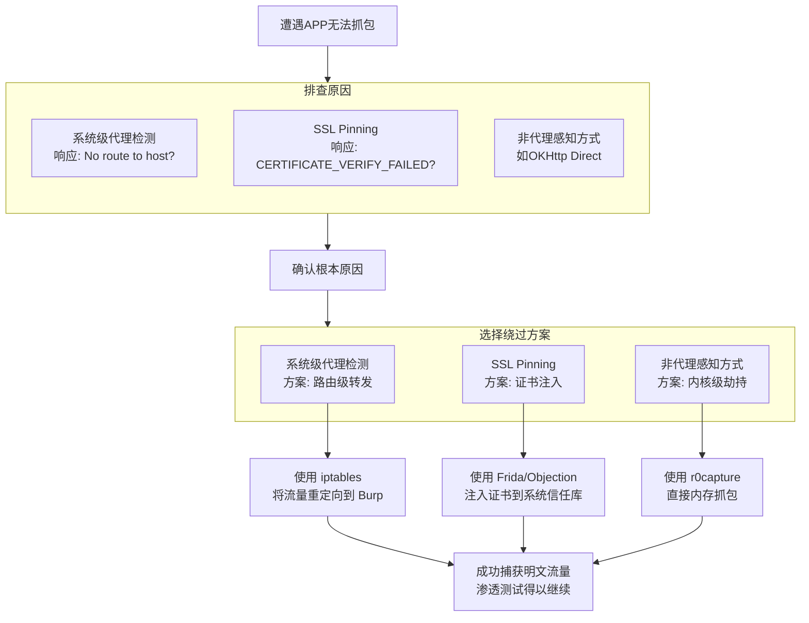

First：
1. APP、小程序
2. 内网渗透
3. CobaltStrike
4. sql注入（一）：常见的
5. 全面了解CSRF
6. JS加密逆向
7. 
8. 免杀码
9. 常见安全设备
10. 流量特征
11. 常见Python库及函数
12. 各个提权原理
13. 基线排查
14. sql注入（二）：不同数据库的语法、表结构
15. 常见安全设备的绕过
16. 安全服务

Second：

1. Python
2. PHP
3. 

