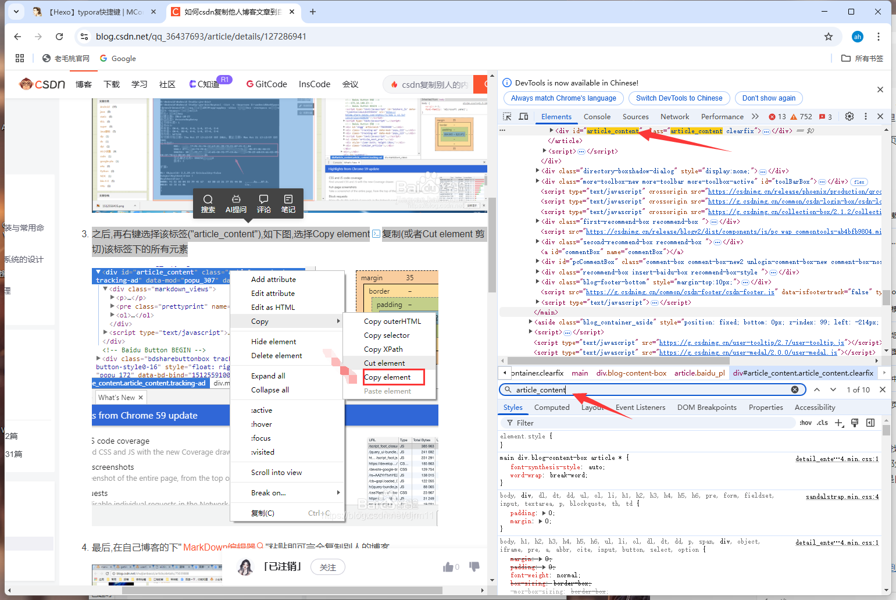

本文介绍使用chrom浏览器，在源码中copy element可以将博客复制下来，直接粘贴到自己的博客里。方便后期的更改。

<!-- more -->

1. 首先,在自己喜欢的博客页面,点击鼠标右键,看到如下图片,点击最后一行`检查`

2. 然后,在右边的源码里边,找到"article_content"标签头,可以看到左侧部分的预览界面被选中的部分就是要复制粘贴文章(包括html部分),检查左侧被选中的部分是否是自己想要的部分.

3. 之后,再右键选择该标签("article_content"),如下图,选择Copy element复制(或者Cut element 剪切)该标签下的所有元素

4. 新建一个 txt 文件，将后缀改为 .html ，把刚复制的 源代码 粘贴到文件中，浏览器打开后如下图，此时复制全文到markdown的软件[Typora](https://www.typora.io/)中

本文参考：

[如何csdn复制他人博客文章到自己博客下](https://blog.csdn.net/qq_36437693/article/details/127286941)
