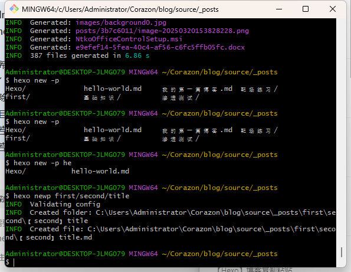

因为我是用了根据路径自动生成分类，但是使用`hexo new -p /path/to/filename title`命令的时候感觉很不方便，因为我希望我可以在同级目录下生成名字和标题一样的`.md`文件和文件夹。但是使用`-p`参数的时候我就得这样：

```bash
hexo new -p 渗透测试/弱口令/【渗透测试】弱口令 【渗透测试】弱口令
```

我得敲两遍标题，而且使用`-p`的时候不显示当前目录下的文件夹有哪些。觉得很不方便。因此我打算为我的hexo实现两个功能：

1. 当我执行：`hexo newp first/second/title`  的时候，会在`_post/first/second/`下生成`【second】title`文件夹和`【second】title.md`文件，文章标题拼接为`【second】title`

2. 在选择路径的时候按`Tab`键时，能像操作系统终端一样： 
   1. 若只有一条路径符合我已经输入的路径，则自动补全。
   2. 若有多个目录符合我已经输入的路径，打印符合要求的所有路径。

经过不断的测试，我满足了我的需求，顿时觉得爽了很多。实现这两个功能的代码如下：

```javascript
const fs = require('fs');
const path = require('path');
const readline = require('readline');
const { promisify } = require('util');

const mkdir = promisify(fs.mkdir);
const writeFile = promisify(fs.writeFile);
const readdir = promisify(fs.readdir);
const readFile = promisify(fs.readFile);

hexo.extend.console.register('newp', 'Create new post with path (e.g., first/second/title)', {
  options: [
    { name: '--auto-complete', desc: 'Enable tab completion' }
  ]
}, async function(args) {
  const log = hexo.log || console.log;
  
  if (args.autoComplete) {
    return this.tabComplete(args);
  }
  
  const fullPath = args._[0];
  if (!fullPath) {
    log.error('Usage: hexo newp <path/levels/title>');
    return;
  }

  // 处理 Windows 路径分隔符问题
  const normalizedPath = fullPath.replace(/\\/g, '/');
  const parts = normalizedPath.split('/');
  const title = parts.pop();
  const category = parts.join('/');
  const lastDir = parts[parts.length - 1] || '';

  // 生成文件夹名和文件名
  const folderName = `【${lastDir}】${title}`;
  const fileName = `${folderName}.md`;
  
  // 创建目录结构 - 确保文件夹和文件在同一层级
  const baseDir = path.join(hexo.source_dir, '_posts', category);
  const folderPath = path.join(baseDir, folderName);
  const filePath = path.join(baseDir, fileName);
  
  try {
    // 创建文件夹（用于存放资源）
    await mkdir(folderPath, { recursive: true });
    
    // 使用模板文件
    const templatePath = path.join(hexo.scaffold_dir, 'post.md');
    let templateContent;
    
    try {
      templateContent = await readFile(templatePath, 'utf8');
    } catch (e) {
      // 如果模板文件不存在，使用默认模板
      templateContent = [
        '---',
        'title: {{ title }}',
        'date: {{ date }}',
        'categories:',
        'tags:',
        '- private',
        'description: 声明：文章中涉及的程序(方法)可能带有攻击性，仅供安全研究与教学之用，读者将其信息做其他用途，由用户承担全部法律及连带责任，文章作者不承担任何法律及连带责任。',
        'top:',
        'comments: true',
        '---'
      ].join('\n');
    }
    
    // 替换模板中的标题
    const content = templateContent
      .replace(/{{ title }}/g, folderName)
      //.replace(/{{ date }}/g, new Date().toISOString());
    
    // 创建 Markdown 文件
    await writeFile(filePath, content);
    
    log.info(`Created folder: ${folderPath}`);
    log.info(`Created file: ${filePath}`);
  } catch (error) {
    log.error(`Error creating post: ${error.message}`);
  }
});

// Tab 补全逻辑保持不变
hexo.extend.console.tabComplete = async function(args) {
  const rl = readline.createInterface({
    input: process.stdin,
    output: process.stdout,
    completer: async (line) => {
      const partial = line.trim().replace(/\\/g, '/');
      const baseDir = path.join(hexo.source_dir, '_posts');
      
      const matches = await this.findMatches(baseDir, partial);
      
      if (matches.length === 1) {
        const completed = matches[0] + '/';
        return [[completed], completed];
      } else if (matches.length > 1) {
        console.log('\n' + matches.join('\n'));
      }
      return [matches, line];
    }
  });

  rl.question('Enter post path: ', (line) => {
    if (line.trim()) {
      hexo.call('newp', { _: [line.trim()] }, () => {
        rl.close();
      });
    } else {
      rl.close();
    }
  });
};

// 路径匹配函数保持不变
hexo.extend.console.findMatches = async function(baseDir, partialPath) {
  const parts = partialPath.split('/');
  let currentDir = baseDir;
  let existingPath = [];
  
  for (const part of parts.slice(0, -1)) {
    if (!part) continue;
    
    const testDir = path.join(currentDir, part);
    try {
      if (!fs.existsSync(testDir)) break;
      const stat = fs.statSync(testDir);
      if (!stat.isDirectory()) break;
      
      currentDir = testDir;
      existingPath.push(part);
    } catch (e) {
      break;
    }
  }
  
  const lastPartial = parts[parts.length - 1] || '';
  let dirContents = [];
  
  try {
    dirContents = await readdir(currentDir, { withFileTypes: true });
  } catch (e) {
    return [];
  }
  
  return dirContents
    .filter(dirent => dirent.isDirectory())
    .map(dirent => dirent.name)
    .filter(name => name.startsWith(lastPartial))
    .map(name => [...existingPath, name].join('/'));
};
```

只需要创建js文件：`\blog\scripts\newp.js`，将代码复制粘贴进去就可以了。

最终效果如下：



