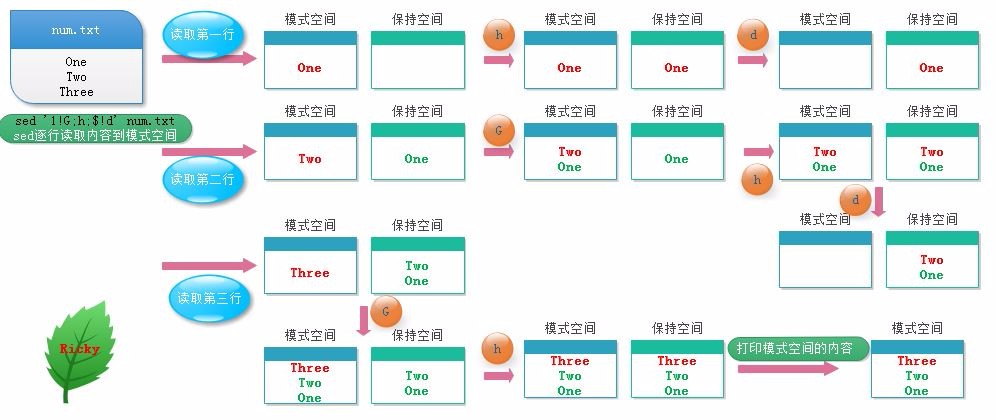

## vim的使用

### 什么是 vim？

Vim是从 vi 发展出来的一个文本编辑器。代码补完、编译及错误跳转等方便编程的功能特别丰富，在程序员中被广泛使用。vim 的官方网站 ([http://www.vim.org](http://www.vim.org/))

vim 键盘图：


基本上vi可以分为三种状态：

- 命令模式（command mode)
- 插入模式（Insert mode)
- 底行模式（last line mode)

<!-- more -->

### vi/vim的三种模式

vi/vim主要分为三种模式，分别是**命令模式（Command mode）**，**输入模式（Insert mode）\**和\**底线命令模式（Last line mode）**。


这三种模式的作用分别是：


#### 输入模式

在命令模式下输入插入命令i、附加命令a 、打开命令o、修改命令c、取代命令r或替换命令s都可以进入文本输入模式。在该模式下，用户输入的任何字符都被Vi当做文件内容保存起来，并将其显示在屏幕上。在文本输入过程中，若想回到命令模式下，按键ESC即可。


#### 命令模式

用户刚刚启动 vi/vim，便进入了命令模式。 任何时候，不管用户处于何种模式，只要按一下ESC键，即可使Vi进入命令模式；

此状态下敲击键盘动作会被Vim识别为命令，输入`:` 可切换到**底线命令模式**，以在最底一行输入命令。

若想要编辑文本：启动Vim，进入了命令模式，按下i，切换到输入模式。


#### 底行模式

在命令模式下按下:（英文冒号）就进入了底行命令模式。

底线命令模式可以输入单个或多个字符的命令，可用的命令非常多。

在底线命令模式中，基本的命令有（已经省略了冒号）：

- q 退出程序
- w 保存文件

按ESC键可随时退出底线命令模式。

### vim基础操作

#### 进入输入模式(Insert mode)


- i: 插入光标前一个字符
- I: 插入行首
- a: 插入光标后一个字符
- A: 插入行未
- o: 向下新开一行,插入行首
- O: 向上新开一行,插入行首

在进入输入模式后， vi 画面的左下角处会出现『–INSERT–』的字样

#### 进入替换模式(Replace mode)

- r : 只会取代光标所在的那一个字符一次
- R: 会一直取代光标所在的文字，直到按下ESC为止

在进入输入模式后， vi 画面的左下角处会出现『–REPLACE–』的字样

#### 命令模式常用命令

##### 移动光标

| 移动光标的方法                                     |                                                              |
| -------------------------------------------------- | ------------------------------------------------------------ |
| h 或 向左箭头键(←)                                 | 光标向左移动一个字符                                         |
| j 或 向下箭头键(↓)                                 | 光标向下移动一个字符                                         |
| k 或 向上箭头键(↑)                                 | 光标向上移动一个字符                                         |
| l 或 向右箭头键(→)                                 | 光标向右移动一个字符                                         |
| 向下移动 30 行，可以使用 “30j” 或 “30↓” 的组合按键 |                                                              |
| [Ctrl] + [f]                                       | 屏幕『向下』移动一页，相当于 [Page Down]按键 (常用)          |
| [Ctrl] + [b]                                       | 屏幕『向上』移动一页，相当于 [Page Up] 按键 (常用)           |
| [Ctrl] + [d]                                       | 屏幕『向下』移动半页                                         |
| [Ctrl] + [u]                                       | 屏幕『向上』移动半页                                         |
| +                                                  | 光标移动到非空格符的下一行                                   |
| -                                                  | 光标移动到非空格符的上一行                                   |
| n                                                  | 表示空格光标向右移动这一行的 n 个字符。例如 20 则光标会向后面移动 20 个字符距离。 |
| 0 或功能键[Home]                                   | 这是数字『 0 』：移动到这一行的最前面字符处 (常用)           |
| $ 或功能键[End]                                    | 移动到这一行的最后面字符处(常用)                             |
| H                                                  | 光标移动到这个屏幕的最上方那一行的第一个字符                 |
| M                                                  | 光标移动到这个屏幕的中央那一行的第一个字符                   |
| L                                                  | 光标移动到这个屏幕的最下方那一行的第一个字符                 |
| G                                                  | 移动到这个文档的最后一行(常用)                               |
| nG                                                 | n 为数字。移动到这个文件的第 n 行。例如 20G 则会移动到这个文件的第 20 行(可配合 :set nu) |
| gg                                                 | 移动到这个文档的第一行，相当于 1G                            |
| n                                                  | n 为数字。光标向下移动 n 行(常用)                            |

##### 删除操作

| 删除操作 | 删除后会添加到剪切板，相当于剪切                             |
| -------- | ------------------------------------------------------------ |
| x, X     | x为向后删除一个字符 (相当于 [del] 按键)， X为向前删除一个字符(相当于 [backspace] ) |
| nx       | n 为数字，连续向后删除 n 个字符。例如10x表示连续删除 10 个字符。 |
| dd       | 删除光标所在的一整行(常用)                                   |
| ndd      | n 为数字。删除光标所在的向下 n 行，例如 20dd 则是删除 20 行  |
| d1G      | 删除光标所在行到首行的所有数据                               |
| dG       | 删除光标所在行到最后一行的所有数据                           |
| d$       | 删除光标所在位置到该行的最后一个字符                         |
| d0       | 删除光标所在位置到该行的最前面一个字符                       |

##### 撤销&复原&重复

| 撤销&复原 |                                        |
| --------- | -------------------------------------- |
| u         | 撤销操作，相对于普通编辑器里面的ctrl+z |
| Ctrl+r    | 恢复操作，相对于普通编辑器里面的ctrl+y |
| .         | 就是小数点！可重复前一个动作           |

##### 复制&粘贴

| 复制&粘贴 |                                                             |
| --------- | ----------------------------------------------------------- |
| yy        | 复制光标所在行                                              |
| nyy       | n 为数字。复制光标所在的向下 n 行，例如 20yy 则是复制 20 行 |
| y1G       | 复制光标所在行到第一行的所有数据                            |
| yG        | 复制光标所在行到最后一行的所有数据                          |
| y0        | 复制光标所在的那个字符到该行行首的所有数据                  |
| y$        | 复制光标所在的那个字符到该行行尾的所有数据                  |
| p, P      | p 为将已复制的数据在光标下一行贴上，P 则为贴在光标上一行！  |

##### 合成行

- J: 将光标所在行与下一行的数据结合成同一行

##### 搜索

| 搜索  |                                                              |
| ----- | ------------------------------------------------------------ |
| /word | 向光标之下寻找一个名称为 word 的字符串。                     |
| ?word | 向光标之上寻找一个字符串名称为 word 的字符串。               |
| n     | 代表重复前一个搜寻的动作，根据前面输入的/word还是?word向下或向上搜索下一个匹配的字符串。 |
| N     | 表示反向搜索，与n的搜索方向相反。                            |

##### 替换

| 替换                                           |                                                              |
| ---------------------------------------------- | ------------------------------------------------------------ |
| :n1,n2s/word1/word2/g                          | 在第 n1 与 n2 行之间寻找word1并替换为word2！比如『:100,200s/vbird/VBIRD/g』表示在100到200行之间将vbird替换为VBIRD |
| `:1,$s/word1/word2/g` 或 `:%s/word1/word2/g`   | $表示最后一行，%s表示所有行。                                |
| `:1,$s/word1/word2/gc` 或 `:%s/word1/word2/gc` | gc中的c表示取代前显示提示字符给用户确认 (confirm) ！         |

##### 底行命令模式的常用操作

| 底行命令模式                                    |                                                              |
| ----------------------------------------------- | ------------------------------------------------------------ |
| :w                                              | 保存编辑数据                                                 |
| :w!                                             | 若文件属性为『只读』时，强制写入该文件。不过，到底能不能写入， 还是跟你对该文件的文件权限有关啊！ |
| :q                                              | 离开 vi                                                      |
| :q!                                             | 若曾修改过文件，又不想储存，使用 ! 为强制离开不储存文件。    |
| 惊叹号 (!) 在 vi 当中，常常具有『强制』的意思～ |                                                              |
| :wq                                             | 储存后离开，若为 :wq! 则为强制储存后离开                     |
| ZZ                                              | 若文件没有更动，则不储存离开，若文件已经被更动过，则储存后离开！ |
| :w [filename]                                   | 另存为                                                       |
| :r [filename]                                   | 将另一个文件『filename』的数据加到光标所在行后面             |
| :n1,n2 w [filename]                             | 将 n1 到 n2 行的内容储存成 filename 这个文件。               |
| :! command                                      | 暂时离开 vi 到指令行模式下执行 command 的显示结果！例如 『:! ls /home』即可在 vi 当中察看 /home 底下以 ls 输出的文件信息！ |
| :set nu                                         | 会在每一行的前缀显示该行的行号                               |
| :set nonu                                       | 取消行号显示                                                 |

示例：

```
将当前路径插入到光标的下一行
:r!pwd
```

#### 可视模式

v 进入字符可视化模式： 文本选择是以字符为单位的。
 V 进入行可视化模式： 文本选择是以行为单位的。
 Ctrl+v 进入块可视化模式 ： 选择一个矩形内的文本。

可视模式下可进行如下操作：

| 可视模式操作 |                                                |
| ------------ | ---------------------------------------------- |
| A            | 在选定的部分后面插入内容                       |
| I            | 在选定的部分前面插入内容                       |
| d            | 删除选定的部分                                 |
| c            | 删除选定的部分并进入插入模式（有批量替换效果） |
| r            | 把选定的部分全部替换为指定的单个字符           |
| `>>`         | 向右缩进一个单位，更适合行可视化模式           |
| `<<`         | 向左缩进一个单位，更适合行可视化模式           |
| `gu`         | 选中区域转为小写                               |
| `gU`         | 选中区域转为大写                               |
| `g~`         | 大小写互调                                     |

可视模式下，选中的区域是由两个端点来界定的（一个在左上角，一个在右下角），在默认情况下只可以控制右下角的端点，而使用`o`按键则可以在左上角和右下角之间切换控制端点。

### VIM快速复习

#### 按:冒号即可进入last line mode

```
:set nu 列出行号
:set nonu	取消行号
:#7 跳到文件中的第7行
/keyword 查找字符  按n向下
?keyword 查找字符  按N向下
:n1,n2/word1/word2/gc  替换指定范围单词，c表示提示
:w 保存文件
:w filename 以指定的文件名另存
:n1,n2 w [filename]	将 n1 到 n2行另存
:r [filename]	读入另一个文件加到光标所在行后面
:! ls /home  在vi当中察看ls输出信息！
:q离开vi
:wq 和 :ZZ 和 :x 保存并退出vi
!强制执行
:% s/^/#/g 来在全部内容的行首添加 # 号注释
:1,10 s/^/#/g 在1~10 行首添加 # 号注释  
```

#### 从command mode进入Insert mode

按i在当前位置编辑
 按a在当前位置的下一个字符编辑
 按o插入新行，从行首开始编辑
 按R(Replace mode)：R会一直取代光标所在的文字，直到按下 ESC为止；(常用)

#### 按ESC键退回command mode

h←j↓k↑l→前面加数字移动指定的行数或字符数
 1、翻页bu上下整页，ud上下半页

```
ctrl+b：上移一页。
ctrl+f：下移一页。
ctrl+u：上移半页。
ctrl+d：下移半页。
```

2、行定位

```
7gg或7G：定位第7行首字符。(可能只在Vim中有效)
G：移动到文章的最后。
7H:当前屏幕的第7行行首
M：当前屏幕中间行的行首
7L:当前屏幕的倒数第7行行首
```

3、当前行定位

```
$：移动到光标所在行的“行尾”。
0或^：移动到光标所在行的“行首”
w：光标跳到下个单词的开头
e：光标跳到下个单词的字尾
b：光标回到上个单词的开头
```

4、编辑

```bash
x：剪切当前字符
7x：剪切从当前位置起7个字符
大写的X，表示从前面一个字符开始往前计算
dd：剪切光标所在行。
7dd：从光标所在行开始剪切7行
d7G	删除光标所在到第7行的所有数据
yw：复制当前单词
7yw：复制从当前位置起7个单词
yy：复制当前行
6yy：从当前行起向下复制6行
y7G	复制游标所在列到第7列的所有数据
p：粘贴
u：撤销
ctrl+r：取消撤销
cw：删除当前单词(从光标位置开始计算)，并进入插入模式
c7w：删除7个单词并进入插入模式
```

#### 多行编辑，vim支持，vi不支持

按ctrl+V进入块模式，上下键选中快，按大写G选择到末尾，上下左右键移动选择位置
 按大写I进去编辑模式，输入要插入的字符，编辑完成按ESC退出
 选中要替换的字符后，按c键全部会删除，然后输入要插入的字符，编辑完成按ESC退出
 选中要替删除的字符后，按delete键，则会全部删除

按shift+V可进入行模式，对指定行操作

### vim练习

1、创建目录/tmp/test，将/etc/man.config复制到该目录下

```
# mkdir -p /tmp/test
# cp /etc/man.config /tmp/test/
# cd /tmp/test/
```

2、用vim编辑man.config文件：

```
vim man.config
```

3、设置显示行号； 移动到第58行，向右移动40个字符，查看双引号内的是什么目录；

```
：set nu
58G 或58gg 
40-> 或40空格 目录为：/dir/bin/foo 
```

4、移动到第一行，并向下查找“bzip2”这个字符串，它在第几行；

```
移动到最后一行，并向上查找该字符串；
gg 或1G
/bzip 137行 ?bzip2
```

5、将50行到100行之间的man更改为MAN，并且 逐个挑选 是否需要修改；

```
若在挑选过程中一直按y，结果会在最后一行出现改变了几个man?
:50,100s/man/MAN/gc 25次替换
```

6、修改完后，突然反悔了，要全部复原，有哪些方法？

```
一直按u键	
或者
:q!强制不保存退出后，再重新打开该文件
```

7、复制65到73这9行的内容（含有MANPATH_MAP），并且粘贴到最后一行之后；

```
65gg或65G到该行后，9yy,G 移动到最后一行，p粘贴
```

8、21行到42行之间开头为#符号的批注数据不要了，如何删除；

```
21G到该行 22dd
```

9、将这个文件另存为man.test.config的文件

```
:w man.test.config
```

10、到第27行，并且删除15个字符，结果出现的第一个字符是什么？

```
27gg 后15x
```

11、在第一行新增一行，在该行内输入“I am a student ”

```
gg到第一行 O输入即可 说明：o是在当前行之后插入一行，O是在当前行之前插入一行
```

12、保存并退出

```
:wq
```


## 正则表达式（待写）


## Linux管道命令

Linux的管道命令是’|’，通过它可以对数据进行连续处理，其示意图如下：


注意：

1）管道命令仅处理标准输出，对于标准错误输出，将忽略

2）管道命令右边命令，必须能够接收标准输入流命令才行，否则传递过程中数据会抛弃。

常用来作为接收数据管道命令有： less,more,head,tail，而ls, cp, mv就不行。

#### wc - 统计字数

可以计算文件的Byte数、字数、或是列数，若不指定文件名称、或是所给予的文件名为"-"，则wc指令会从标准输入设备读取数据。

```
wc [-lwm] [filename]
-l: 统计行数
-w：统计英文单词
-m：统计字符数
python@xxx:~$ wc -l /etc/passwd
49 /etc/passwd
python@xxx:~$ wc -w /etc/passwd
81 /etc/passwd
python@xxx:~$ wc -m /etc/passwd
2696 /etc/passwd
12345678910
```

在默认的情况下，wc将计算指定文件的行数、字数，以及字节数。使用的命令为：

```
$ wc testfile           # testfile文件的统计信息  
3 92 598 testfile       # testfile文件的行数为3、单词数92、字节数598 
12
```

其中，3 个数字分别表示testfile文件的行数、单词数，以及该文件的字节数。

如果想同时统计多个文件的信息，例如同时统计testfile、testfile_1、testfile_2，可使用如下命令：

```
$ wc testfile testfile_1 testfile_2  #统计三个文件的信息  
3 92 598 testfile                    #第一个文件行数为3、单词数92、字节数598  
9 18 78 testfile_1                   #第二个文件的行数为9、单词数18、字节数78  
3 6 32 testfile_2                    #第三个文件的行数为3、单词数6、字节数32  
15 116 708 总用量                    #三个文件总共的行数为15、单词数116、字节数708 
12345
```

#### cut - 列选取命令

```
选项与参数：
-d  ：后面接分隔字符。与 -f 一起使用；
-f  ：依据 -d 的分隔字符将一段信息分割成为数段，用 -f 取出第几段的意思；
-c  ：以字符 (characters) 的单位取出固定字符区间；
1234
```

cut以行为单位，根据分隔符把行分成若干列，这样就可以指定选取哪些列了。

```
cut -d '分隔字符' -f 选取的列数
echo $PATH|cut -d ':' -f 2  	--选取第2列
echo $PATH|cut -d ':' -f 3,5  	--选取第3列和第5列
echo $PATH|cut -d ':' -f 3-5  	--选取第3列到第5列
echo $PATH|cut -d ':' -f 3-   	--选取第3列到最后1列
echo $PATH|cut -d ':' -f 1-3,5	--选取第1到第3列还有第5列
123456
```

只显示/etc/passwd的用户和shell：

```
#cat /etc/passwd | cut -d ':' -f 1,7 
root:/bin/bash
daemon:/bin/sh
bin:/bin/sh
1234
```

#### grep - 行选取命令

grep一般格式为：

```
grep [-cinv] '查找的字符串' filename
1
```

在grep命令中输入字符串参数时，最好引号或双引号括起来。例如：`grep 'a' 1.txt`。

常用选项说明：

| 选项 | 含义                                     |
| ---- | ---------------------------------------- |
| -v   | 显示不包含匹配文本的所有行（相当于求反） |
| -n   | 显示匹配行及行号                         |
| -i   | 忽略大小写                               |
| -c   | 计算找到的行数                           |

grep搜索内容串可以是正则表达式，常用正则表达式：

| 参数                                                        | 含义                                                         |
| ----------------------------------------------------------- | ------------------------------------------------------------ |
| ^a                                                          | 行首,搜寻以 m 开头的行；grep -n ‘^a’ 1.txt                   |
| ke$          | 行尾,搜寻以 ke 结束的行；grep -n ‘ke$’ 1.txt |                                                              |
| [Ss]igna[Ll]                                                | 匹配 [] 里中一系列字符中的一个；搜寻匹配单词signal、signaL、Signal、SignaL的行；grep -n ‘[Ss]igna[Ll]’ 1.txt |
| .                                                           | .匹配一个非换行符的字符；grep -n ‘e.e’ 1.txt可以匹配 eee，eae，eve，但是不匹配 ee，eaae； |
| *                                                           | 匹配零个或多个先前字符                                       |
| [^]                                                         | 匹配一个不在指定范围内的字符                                 |
| `\(..\)`                                                    | 标记匹配字符                                                 |
| \                                                           | 锚定单词的开始                                               |
| `\<`                                                        | 锚定单词的开头                                               |
| `\>`                                                        | 锚定单词的结束                                               |
| `x\{m\}`                                                    | 重复字符x，m次                                               |
| `x\{m,\}`                                                   | 重复字符x,至少m次                                            |
| `x\{m,n\}`                                                  | 重复字符x，至少m次，不多于n次                                |
| \w                                                          | 匹配文字和数字字符，也就是[A-Za-z0-9]                        |
| \b                                                          | 单词锁定符                                                   |

实例：
 显示所有以“h”结尾的行
 grep h$
 匹配所有以“a”开头且以“e”结尾的，中间包含2个字符的单词
 grep ‘<a…e>’
 显示所有包含一个”y”或”h”字符的行
 grep [yh]
 显示不包含字母a~k 且后紧跟“pple”的单词

```
grep [^a-k]pple
```

从系统词典中选择所有以“c”开头且以“o”结尾的单词
 `grep '\<c.*o\>'`
 找出一个文件中或者输出中找到包含`*`的行
 `grep '\*'`
 显示所有包含每个字符串至少有20个连续字母的单词的行
 `grep [a-Z]\{20,\}`

#### sort - 排序

**语法：**

```
sort [-fbMnrtuk] [file or stdin]
1
```

**参数说明**：

- -f ：忽略大小写的差异，例如 A 与 a 视为编码相同；
- -b ：忽略最前面的空格符部分；
- -M ：以月份的名字来排序，例如 JAN, DEC 等等的排序方法；
- -n ：使用『纯数字』进行排序(默认是以文字型态来排序的)；
- -r ：反向排序；
- -u ：就是 uniq ，相同的数据中，仅出现一行代表；
- -t ：分隔符，默认是用 [tab] 键来分隔；
- -k ：以哪个区间 (field) 来进行排序

默认是以第一个字符升序排序:

```
# cat /etc/passwd | sort 
adm:x:3:4:adm:/var/adm:/sbin/nologin
avahi-autoipd:x:100:156:avahi-autoipd:/var/lib/avahi-autoipd:/sbin/nologin
avahi:x:70:70:Avahi daemon:/:/sbin/nologin
bin:x:1:1:bin:/bin:/sbin/nologin
......
123456
```

以第3列排序：

```
[root@www ~]# cat /etc/passwd | sort -t ':' -k 3
root:x:0:0:root:/root:/bin/bash
uucp:x:10:14:uucp:/var/spool/uucp:/sbin/nologin
operator:x:11:0:operator:/root:/sbin/nologin
bin:x:1:1:bin:/bin:/sbin/nologin
games:x:12:100:games:/usr/games:/sbin/nologin
123456
```

使用数字排序：

```
cat /etc/passwd | sort -t ':' -k 3n
root:x:0:0:root:/root:/bin/bash
daemon:x:1:1:daemon:/usr/sbin:/bin/sh
bin:x:2:2:bin:/bin:/bin/sh
1234
```

倒序排序：

```
cat /etc/passwd | sort -t ':' -k 3nr
nobody:x:65534:65534:nobody:/nonexistent:/bin/sh
ntp:x:106:113::/home/ntp:/bin/false
messagebus:x:105:109::/var/run/dbus:/bin/false
sshd:x:104:65534::/var/run/sshd:/usr/sbin/nologin
或者
cat /etc/passwd | sort -t ':' -k 3 -nr
1234567
```

先以第六个域的第2个字符到第4个字符进行正向排序，再基于第一个域进行反向排序：

```
cat /etc/passwd |  sort -t ':' -k 6.2,6.4 -k 1r      
sync:x:4:65534:sync:/bin:/bin/sync
proxy:x:13:13:proxy:/bin:/bin/sh
bin:x:2:2:bin:/bin:/bin/sh
sys:x:3:3:sys:/dev:/bin/sh
12345
```

查看/etc/passwd有多少个shell:

方法对/etc/passwd的第七个域排序并去重，然后统计行数：

```
[root@VM_0_9_centos ~]# cat /etc/passwd |  sort -t':' -k 7 -u
root:x:0:0:root:/root:/bin/bash
syslog:x:996:994::/home/syslog:/bin/false
sync:x:5:0:sync:/sbin:/bin/sync
halt:x:7:0:halt:/sbin:/sbin/halt
bin:x:1:1:bin:/bin:/sbin/nologin
shutdown:x:6:0:shutdown:/sbin:/sbin/shutdown
[root@VM_0_9_centos ~]# cat /etc/passwd |  sort -t':' -k 7 -u|wc -l
6
123456789
```

#### uniq - 去重

```
选项与参数：
-i   ：忽略大小写字符的不同；
-c  ：进行计数
-u  ：只显示唯一的行
1234
```

该命令用于排完序之后，对排序结果进行去重

```
python@xxx:~$ last | cut -d ' ' -f 1  | sort | uniq

haha
python
reboot
wtmp
python@xxx:~$ last | cut -d ' ' -f 1  | sort | uniq -c
      1 
      2 haha
     22 python
      7 reboot
      1 wtmp
123456789101112
```

排序文件，默认是去重：

```
#cat words | sort |uniq
friend
hello
world
1234
```

排序之后删除了重复行，同时在行首位置输出该行重复的次数：

```
#sort testfile | uniq -c
1 friend
3 hello
2 world
1234
```

仅显示存在重复的行，并在行首显示该行重复的次数：

```
#sort testfile | uniq -dc
3 hello
2 world
123
```

仅显示不重复的行：

```
sort testfile | uniq -u
friend
12
```

#### tee - 同时输出多个文件

从标准输入设备读取数据，将其内容输出到标准输出设备，同时保存成文件。

一般情况下用重定向实现，需要同时输出多个文件时可以使用该命令。

**参数**：

- -a或–append 　附加到既有文件的后面，而非覆盖它．

将输出同时保存到多个文件中，同时将输出内容显示到控制台：

```
python@xxx:~/test$ echo "hello world"|tee f1 f2 
hello world
python@xxx:~/test$ cat f1
hello world
python@xxx:~/test$ echo "hello world"|tee f1 f2 -a
hello world
python@xxx:~/test$ cat f1
hello world
hello world
123456789
```

#### tr - 替换指定的字符

不指定参数时，即表示替换指定的字符为另一个字符，支持指定的字符集合。

**参数说明：**

- -d, --delete：删除指定的字符
- -s, --squeeze-repeats：缩减连续重复的字符成指定的单个字符

字符集合的范围：

- \NNN 八进制值的字符 NNN (1 to 3 为八进制值的字符)
- \ 反斜杠
- \a Ctrl-G 铃声
- \b Ctrl-H 退格符
- \f Ctrl-L 走行换页
- \n Ctrl-J 新行
- \r Ctrl-M 回车
- \t Ctrl-I tab键
- \v Ctrl-X 水平制表符
- CHAR1-CHAR2 ：字符范围从 CHAR1 到 CHAR2 的指定，范围的指定以 ASCII 码的次序为基础，只能由小到大，不能由大到小。
- [CHAR*] ：这是 SET2 专用的设定，功能是重复指定的字符到与 SET1 相同长度为止
- [CHAR*REPEAT] ：这也是 SET2 专用的设定，功能是重复指定的字符到设定的 REPEAT 次数为止(REPEAT 的数字采 8 进位制计算，以 0 为开始)
- [:alnum:] ：所有字母字符与数字
- [:alpha:] ：所有字母字符
- [:blank:] ：所有水平空格
- [:cntrl:] ：所有控制字符
- [:digit:] ：所有数字
- [:graph:] ：所有可打印的字符(不包含空格符)
- [:lower:] ：所有小写字母
- [:print:] ：所有可打印的字符(包含空格符)
- [:punct:] ：所有标点字符
- [:space:] ：所有水平与垂直空格符
- [:upper:] ：所有大写字母
- [:xdigit:] ：所有 16 进位制的数字
- [=CHAR=] ：所有符合指定的字符(等号里的 CHAR，代表你可自订的字符)

将文件testfile中的小写字母全部转换成大写字母：

```
cat testfile |tr a-z A-Z 
或
cat testfile |tr [:lower:] [:upper:] 
123
```

缩减连续重复的字符成指定的单个字符：

```
python@xxx:~/test$ cat t
dddddddsssssdd
eeeeeeeeee
aaaaaaaaaaaaaa
vvvvvvvvvvvvvv
python@xxx:~/test$ cat t|tr -s 'se'
dddddddsdd
e
aaaaaaaaaaaaaa
vvvvvvvvvvvvvv
python@xxx:~/test$ cat t|tr -s 'sdeav'
dsd
e
a
v
123456789101112131415
```

删除指定的字符：

```
python@xxx:~/test$ cat t|tr -d 'dv'
sssss
eeeeeeeeee
aaaaaaaaaaaaaa
1234
```

#### join - 文件按行连接

将两个文件中指定栏位相同的行连接起来。即按照两个文件中共同拥有的某一列，将对应的行拼接成一行。

注意：在使用join之前所处理的文件要事先经过排序。

```
$ cat testfile_1
Hello 95 #例如，本例中第一列为姓名，第二列为数额  
Linux 85  
test 30  
cmd@hdd-desktop:~$ cat testfile_2
Hello 2005 #例如，本例中第一列为姓名，第二列为年份  
Linux 2009  
test 2006 
12345678
```

使用join命令，将两个文件连接：

```
$ join testfile_1 testfile_2 #连接testfile_1、testfile_2中的内容  
Hello 95 2005 #连接后显示的内容  
Linux 85 2009  
test 30 2006 
1234
```

两个文件互换，输出结果的变化：

```
$ join testfile_2 testfile_1 #改变文件顺序连接两个文件  
Hello 2005 95 #连接后显示的内容  
Linux 2009 85  
test 2006 30 
1234
```

**参数**：

- -a<1或2> 除了显示原来的输出内容之外，还显示指令文件中没有相同栏位的行。
- -e<字符串> 若[文件1]与[文件2]中找不到指定的栏位，则在输出中填入选项中的字符串。
- -i或–igore-case 比较栏位内容时，忽略大小写的差异。
- -o<格式> 按照指定的格式来显示结果。
- -t<字符> 使用栏位的分隔字符。
- -v<1或2> 跟-a相同，但是只显示文件中没有相同栏位的行。
- -1<栏位> 连接[文件1]指定的栏位。
- -2<栏位> 连接[文件2]指定的栏位。

#### paste-将多个文件对应行链接在一起

paste 指令会把每个文件以列对列的方式，一列列地加以合并。

语法：

```
paste [-s][-d <间隔字符>][文件...]
1
```

**参数**：

- -d<间隔字符>或–delimiters=<间隔字符> 　用指定的间隔字符取代跳格字符。
- -s或–serial 　串列进行而非平行处理。
- [文件…] 指定操作的文件路径

使用paste指令将文件"file"、“testfile”、"testfile1"进行合并，输入如下命令：

```
$ cat file                  #file文件的内容  
xiongdan 200  
lihaihui 233  
lymlrl 231  
$ cat testfile              #testfile文件的内容  
liangyuanm  ss  
$ cat testfile1             #testfile1文件的内容  
huanggai 56  
zhixi 73 
$ paste file testfile testfile1
xiongdan 200    liangyuanm ss   huanggai 56
lihaihui 233            zhixi 73
lymlrl 231
$ paste -d ':' file testfile testfile1
xiongdan 200:liangyuanm ss:huanggai 56
lihaihui 233::zhixi 73
lymlrl 231::
1234567891011121314151617
```

参数"-s"可以将一个文件中的多行数据合并为一行进行显示：

```
$ paste -s file             #合并指定文件的多行数据
xiongdan 200 lihaihui 233 lymlrl 231 
12
```

如果将文件位置改为-，表示接收标准输入：

```
$ cat file |paste testfile1 -
huanggai 56     xiongdan 200
zhixi 73        lihaihui 233
        lymlrl 231
1234
```

#### split - 文件切割

split命令用于将一个文件分割成数个。

该指令将大文件分割成较小的文件，在默认情况下将按照每1000行切割成一个小文件。

语法：

```
split [-bl] file prefix
-b: 以大小切割
-l：以行数切割
prefix：切割后文件的前缀
1234
```

**参数说明**：

- -<行数> : 指定每多少行切成一个小文件
- -b<字节> : 指定每多少字节切成一个小文件
- -C<字节> : 与参数"-b"相似，但是在切 割时将尽量维持每行的完整性
- [输出文件名] : 设置切割后文件的前置文件名， split会自动在前置文件名后再加上编号

使用指令"split"将文件"README"每6行切割成一个文件，输入如下命令：

```
$ split -6 README       #将README文件每六行分割成一个文件 
$ ls                                #执行ls指令  
#获得当前目录结构
README xaa xad xag xab xae xah xac xaf xai
1234
```

以上命令执行后，指令"split"会将原来的大文件"README"切割成多个以"x"开头的小文件。而在这些小文件中，每个文件都只有6行内容。

以大小切割：

```
$ ls -lh disease.dmp
-rwxr-xr-x 1 root root 122M Jul  4  2013 disease.dmp
$ split -b 50m disease.dmp disease.dmp
$ ls -lh disease.dmp*
-rwxr-xr-x 1 root root 122M Jul  4  2013 disease.dmp
-rw-r--r-- 1 root root  50M Jan  9 16:10 disease.dmpaa
-rw-r--r-- 1 root root  50M Jan  9 16:10 disease.dmpab
-rw-r--r-- 1 root root  22M Jan  9 16:10 disease.dmpac
12345678
```

#### xargs - 参数代换

不是所有的命令都支持管道，如ls，对于不支持管道的命令，可以通过xargs让其有管道命令的效果，如下所示：

```
# find /sbin -perm +7000 | xargs ls -l
-rwsr-x--- 1 root ecryptfs 19896 Feb 23  2012 /sbin/mount.ecryptfs_private
-rwsr-xr-x 1 root root     75496 Jan  9  2013 /sbin/mount.nfs
-rwsr-xr-x 1 root root     75504 Jan  9  2013 /sbin/mount.nfs4
-rwxr-sr-x 1 root root      8544 Feb 22  2012 /sbin/netreport
-rwsr-xr-x 1 root root     14112 Nov  2  2010 /sbin/pam_timestamp_check
-rwsr-xr-x 1 root root     75504 Jan  9  2013 /sbin/umount.nfs
-rwsr-xr-x 1 root root     75504 Jan  9  2013 /sbin/umount.nfs4
-rwsr-xr-x 1 root root     19768 Nov  2  2010 /sbin/unix_chkpwd
123456789
```

如果没有xargs，ls -l的结果将不是前面find的标准输出，因为ls不支持管道命令。

xargs 用作替换工具，读取输入数据重新格式化后输出。

定义一个测试文件，内有多行文本数据：

```
# cat test.txt
a b c d e f g
h i j k l m n
o p q
r s t
u v w x y z
123456
```

多行输入单行输出：

```
# cat test.txt | xargs
a b c d e f g h i j k l m n o p q r s t u v w x y z
12
```

-n 选项多行输出：

```
# cat test.txt | xargs -n3
a b c
d e f
g h i
j k l
m n o
p q r
s t u
v w x
y z
12345678910
```

-d 选项可以自定义一个定界符：

```
# echo "nameXnameXnameXname" | xargs -dX
name name name name
12
```

结合 -n 选项使用：

```
# echo "nameXnameXnameXname" | xargs -dX -n2
name name
name name
123
```

读取 stdin，将格式化后的参数传递给命令:

```
# cat sk.sh
#!/bin/bash
#sk.sh命令内容，打印出所有参数。
echo $*
# cat arg.txt
aaa
bbb
ccc
# cat arg.txt | xargs -I {} ./sk.sh -p {} -l
-p aaa -l
-p bbb -l
-p ccc -l
123456789101112
```

选项`-I`指定一个替换字符串 {}，这个字符串在 xargs 扩展时会被替换掉。

复制所有图片文件到 /data/images 目录下：

```
ls *.jpg | xargs -n1 -I {} cp {} /data/images
1
```

选项`-n` 后面加次数，表示命令在执行的时候一次用的argument的个数，默认是用所有的。

**xargs 结合 find 使用**

用 rm 删除太多的文件时候，可能得到一个错误信息：**/bin/rm Argument list too long.** 用 xargs 去避免这个问题：

```
find . -type f -name "*.log" -print0 | xargs -0 rm -f
1
```

xargs -0 将 \0 作为定界符。

统计一个源代码目录中所有 php 文件的行数：

```
find . -type f -name "*.php" -print0 | xargs -0 wc -l
1
```

查找所有的 jpg 文件，并且压缩它们：

```
find . -type f -name "*.jpg" -print | xargs tar -czvf images.tar.gz
1
```

批量下载：

```
# cat url-list.txt | xargs wget -c
1
```

wget的`-c`选项表示断点续传。


## 文本编辑命令


### cut命令

```bash
选项与参数：
-d  ：后面接分隔字符。与 -f 一起使用；
-f  ：依据 -d 的分隔字符将一段信息分割成为数段，用 -f 取出第几段的意思；
-c  ：以字符 (characters) 的单位取出固定字符区间；
```

cut以行为单位，根据分隔符把行分成若干列，这样就可以指定选取哪些列了。

```bash
cut -d '分隔字符' -f 选取的列数
echo $PATH|cut -d ':' -f 2  	--选取第2列
echo $PATH|cut -d ':' -f 3,5  	--选取第3列和第5列
echo $PATH|cut -d ':' -f 3-5  	--选取第3列到第5列
echo $PATH|cut -d ':' -f 3-   	--选取第3列到最后1列
echo $PATH|cut -d ':' -f 1-3,5	--选取第1到第3列还有第5列
```

只显示/etc/passwd的用户和shell：

```bash
#cat /etc/passwd | cut -d ':' -f 1,7 
root:/bin/bash
daemon:/bin/sh
bin:/bin/sh
```


### sed命令

sed 可依照脚本的指令来处理、编辑文本文件。

Sed 主要用来自动编辑一个或多个文件、简化对文件的反复操作、编写转换程序等。

语法:

```bash
sed [-e<script>][-f<script文件>][文本文件]
```

**参数说明**：

- `-e <script>`以指定的script来处理输入的文本文件。
- `-f<script文件>`以指定的script文件来处理输入的文本文件。
- `-n`仅显示script处理后的结果，一般跟p动作搭配使用。
- `-i`使用处理后的结果修改文件。

**动作说明**：

- a：在指定行后面插入内容
- i：在指定行前面插入内容
- d：删除指定行
- c ：替换指定行
- p ：打印指定行的数据，通常需要跟`-n`选项搭配使用
- s ：替换指定字符，兼容vim的替换语法，例如 1,20s/old/new/g

#### 元字符集

sed支持一般的正则表达式，下面是支持的正则语法：
 `^`行的开始 如：/^sed/匹配所有以sed开头的行。
 `$`行的结束 如：/sed$/匹配所有以sed结尾的行。
 `.`匹配一个非换行符的任意字符 如：/s.d/匹配s后接一个任意字符，然后是d。
 `*`匹配零或多个字符 如：/*sed/匹配所有模板是一个或多个空格后紧跟sed的行。
 `[]`匹配一个指定范围内的字符，如`/[Ss]ed/`匹配sed和Sed。
 `[^]`匹配一个不在指定范围内的字符，如：`/[^A-RT-Z]ed/`匹配不包含A-R和T-Z的一个字母开头，紧跟ed的行。
 `\(..\)`保存匹配的字符，如s/(love)able/\1rs，loveable被替换成lovers。
 `&`保存搜索字符用来替换其他字符，如`s/love/**&**/`，love这成`**love**`。
 `\<`单词的开始，如:/<love/匹配包含以love开头的单词的行。
 `\>`单词的结束，如/love>/匹配包含以love结尾的单词的行。
 `x\+`重复字符x，至少1次，如：`/o\+/`匹配至少有1个o的行。
 `x\{m\}`重复字符x，m次，如：`/o\{5\}/`匹配包含5个o的行。
 `x\{m,\}`重复字符x,至少m次，如：`/o\{5,\}/`匹配至少有5个o的行。
 `x\{m,n\}`重复字符x，至少m次，不多于n次，如：`/o\{5,10\}/`匹配5-10个o的行。

#### a|i:在指定行位置添加行

```bash
[root@rocky8:Corazon]# cat a
LINUX!  
 Linux is a free unix-type opterating system.  
 This is a linux testfile!  
 Linux test 

[root@rocky8:Corazon]# sed -e 2a\newline a
LINUX!  
 Linux is a free unix-type opterating system.  
newline
 This is a linux testfile!  
 Linux test
```

默认情况下`-e`参数可以省略：

```bash
[root@rocky8:Corazon]# cat a | sed '2a\newline'
LINUX!  
 Linux is a free unix-type opterating system.  
newline
 This is a linux testfile!  
 Linux test 
[root@rocky8:~]# sed 2a\newline a
NUX!  
 Linux is a free unix-type opterating system.  
newline
 This is a linux testfile!  
 Linux test
[root@rocky8:Corazon]# sed '2a newline' a
LINUX!  
 Linux is a free unix-type opterating system.  
newline
 This is a linux testfile!  
 Linux test
```


在第二行之前添加一行：

```bash
[root@rocky8:Corazon]# sed '2i newline' a
LINUX!  
newline
 Linux is a free unix-type opterating system.  
 This is a linux testfile!  
 Linux test
```

最后一行加入 `# This is a test`:

```bash
[root@rocky8:Corazon]# sed '$a # This is a test' a
LINUX!  
 Linux is a free unix-type opterating system.  
 This is a linux testfile!  
 Linux test 

# This is a test
```

同时添加多行：

```
[root@rocky8:Corazon]# cat a|sed '2a\newline1\
> newline2'
LINUX!  
 Linux is a free unix-type opterating system.  
newline1
newline2
 This is a linux testfile!  
 Linux test
```

#### d:删除指定行

将 /etc/passwd 的内容列出行号，并将第 2~5 行删除！

```bash
[root@rocky8:~]# nl /etc/passwd|sed '2,5d'
     1	root:x:0:0:root:/root:/bin/bash
     6	sync:x:5:0:sync:/sbin:/bin/sync
     7	shutdown:x:6:0:shutdown:/sbin:/sbin/shutdown
.....(后面省略).....
```

只删除第2行：

```bash
nl /etc/passwd | sed '2d' 
```

删除第3到最后一行：

```bash
nl /etc/passwd | sed '3,$d' 
```

删除/etc/passwd所有包含`/sbin/nologin`的行，其他行输出：

```bash
[root@rocky8:~]# nl /etc/passwd|sed '/\/sbin\/nologin/d'
     1	root:x:0:0:root:/root:/bin/bash
     6	sync:x:5:0:sync:/sbin:/bin/sync
     7	shutdown:x:6:0:shutdown:/sbin:/sbin/shutdown
     8	halt:x:7:0:halt:/sbin:/sbin/halt
    25	zah:x:1000:1000:Zah:/home/zah:/bin/bash
    26	Cora:x:1002:1002::/home/Cora:/bin/bash
    27	Corazon:x:1003:1003::/home/Corazon:/bin/bash
```

#### c:替换指定行

将第2-5行的内容替换成为『No 2-5 number』：

```bash
[root@rocky8:~]# nl /etc/passwd|sed '2,5c No 2-5 number'
     1	root:x:0:0:root:/root:/bin/bash
No 2-5 number
     6	sync:x:5:0:sync:/sbin:/bin/sync
```

#### p:仅显示指定行

不加`-n`选项时，除了输出匹配行，还同时会输出所有行，所以需要加`-n`选项。

仅列出 /etc/passwd 文件内的第 5-7 行：

```bash
[root@rocky8:~]# nl /etc/passwd|sed -n '5,7p'
     5	lp:x:4:7:lp:/var/spool/lpd:/sbin/nologin
     6	sync:x:5:0:sync:/sbin:/bin/sync
     7	shutdown:x:6:0:shutdown:/sbin:/sbin/shutdown
```

搜索 /etc/passwd有root关键字的行：

```bash
[root@rocky8:~]# cat /etc/passwd|sed -n '/root/p'
root:x:0:0:root:/root:/bin/bash
operator:x:11:0:operator:/root:/sbin/nologin
[root@rocky8:~]# sed -n '/root/p' /etc/passwd
root:x:0:0:root:/root:/bin/bash
operator:x:11:0:operator:/root:/sbin/nologin
```

打印/etc/passwd有以root和bin开头之间的行：

```bash
[root@rocky8:~]# sed -n '/^root/,/^bin/p' /etc/passwd
root:x:0:0:root:/root:/bin/bash
bin:x:1:1:bin:/bin:/sbin/nologin
```

打印从第五行开始到第一个包含以`/usr/games`开始的行之间的所有行：

```bash
[root@rocky8:~]# nl /etc/passwd | sed -n '5,\/usr\/games/p'
     5	lp:x:4:7:lp:/var/spool/lpd:/sbin/nologin
     6	sync:x:5:0:sync:/sbin:/bin/sync
     7	shutdown:x:6:0:shutdown:/sbin:/sbin/shutdown
     8	halt:x:7:0:halt:/sbin:/sbin/halt
     9	mail:x:8:12:mail:/var/spool/mail:/sbin/nologin
    10	operator:x:11:0:operator:/root:/sbin/nologin
    11	games:x:12:100:games:/usr/games:/sbin/nologin
```

#### s:字符串替换

语法：

```
sed 's/要被取代的字串/新的字串/g'
```

不论什么字符，紧跟着s命令的都被认为是新的分隔符.

`sed 's#10#100#g'`表示把所有10替换成100，“#”在这里是分隔符，代替了默认的“/”分隔符。

提取本机所有的ip地址：

```bash
[root@rocky8:~]# ifconfig | grep 'inet '
        inet 10.0.0.191  netmask 255.255.255.0  broadcast 10.0.0.255
        inet 127.0.0.1  netmask 255.0.0.0
[root@rocky8:~]# ifconfig | grep 'inet '|sed 's/^[^0-9]*\([0-9\.]*\).*$/\1/g'
10.0.0.191
127.0.0.1
```

对于以root和bin开头之间的行，每行的末尾添加sed test：

```bash
[root@rocky8:~]# cat /etc/passwd | sed '/^root/,/^bin/s/$/--sed test/'
root:x:0:0:root:/root:/bin/bash--sed test
daemon:x:2:2:daemon:/sbin:/sbin/nologin--sed test
bin:x:1:1:bin:/bin:/sbin/nologin--sed test
adm:x:3:4:adm:/var/adm:/sbin/nologin
......
```

#### y:单字符替换

跟s一样也用于替换，不过s替换的是整体，y替换的是每一字母对应的单个字母

把data中的第一行至第三行中的a替换成A，b替换成B，c替换成C：

```bash
sed '1,3y/abc/ABC/' data 
```

示例：

```bash
[root@rocky8:~]# echo "123" | sed 'y/13/34/'
324
[root@rocky8:~]# echo "axxbxxcxx" | sed 'y/abc/123/'
1xx2xx3xx
```

<font class="notice">注：单个字符转换用y，字符串转换用`'s/str1/str2/g'`</font>


#### `hHgG`模式空间与保持空间

首先介绍一下模式空间和保持空间:

> **（H、h、G、g、x）**
> **模式空间：**[sed](https://so.csdn.net/so/search?q=sed&spm=1001.2101.3001.7020)处理文本内容行的一个临时缓冲区，模式空间中的内容会主动打印到标准输出，并自动清空模式空间
>
> **保持空间：**sed处理文本内容行的另一个临时缓冲区，不同的是保持空间内容不会主动清空，也不会主动打印到标准输出，而是需要[sed命令](https://so.csdn.net/so/search?q=sed命令&spm=1001.2101.3001.7020)来进行处理

模式空间与保持空间的关系:

> **模式空间：**相当于流水线，文本行再模式空间中进行处理；
> **保持空间：**相当于仓库，在模式空间对数据进行处理时，可以把数据临时存储到保持空间；作为模式空间的一个辅助临时缓冲区，但又是相互独立，可以进行交互，命令可以寻址模式空间但是不能寻址保持空间。可以使用高级命令h,H,g,G与模式空间进行交互。

实际上， 保持空间是模式空间一个临时存放数据的缓冲区，协助模式空间进行数据处理。

相关命令的作用：

> **d**     Delete pattern space.  Start next cycle.
>        删除pattern space的内容，开始下一个循环
>
> **h H**   Copy/append pattern space to hold space.
>        复制/追加pattern space的内容到hold space.（复制会覆盖原内容）
>
> **g G**   Copy/append hold space to pattern space.
>        复制/追加hold space的内容到pattern space. （复制会覆盖原内容）
>
> **x**    Exchange the contents of the  hold  and  pattern spaces.
>        交换hold space和pattern space的内容.

h命令是将当前模式空间中内容覆盖至保持空间，H命令是将当前模式空间中的内容追加至保持空间

g命令是将当前保持空间中内容覆盖至模式空间，G命令是将当前保持空间中的内容追加至模式空间

模拟tac命令：

```bash
[root@rocky8:~]# cat num
One
Two
Three
[root@rocky8:~]# tac num
Three
Two
One
[root@rocky8:~]# sed '1!G;h;$!d' num
Three
Two
One
```

1!G第1行不 执行“G”命令，从第2行开始执行。

$!d，最后一行不删除（保留最后1行）（只有最后一行不删）

原理图：



递增序列：

```
[root@rocky8:~]# seq 3|sed 'H;g'

1

1
2

1
2
3
[root@rocky8:~]# seq 3|sed '1h;1!H;g'
1
1
2
1
2
3
```

#### 多次指定`-e`选项进行多点编辑

删除/etc/passwd第三行到末尾的数据，并把bash替换为blueshell：

```bash
[root@rocky8:~]# nl /etc/passwd | sed -e '3,$d' -e 's/bash/blueshell/'
     1	root:x:0:0:root:/root:/bin/blueshell
     2	daemon:x:2:2:daemon:/sbin:/sbin/nologin
```

删除一个文件以#开头的行和空行：

```bash
[root@rocky8:~]# cat abc

b
a

# aaa

ddd

# sss
eeee


[root@rocky8:~]# sed -e '/^#/d' -e '/^$/d' abc
b
a
ddd
eeee
```

也可以通过`;`实现

```bash
[root@rocky8:~]# nl /etc/passwd|sed '3,$d;s/bash/blueshell/' 
     1	root:x:0:0:root:/root:/bin/blueshell
     2	daemon:x:2:2:daemon:/sbin:/sbin/nologin
[root@rocky8:~]# sed '/^#/d;/^$/d' abc
b
a
ddd
eeee
```

#### 选项`-i`直接修改文件内容

默认情况下sed命令仅仅只是将处理结果显示在控制台，加`-i`选项则会修改文件内容。

将 regular_express.txt 内每一行结尾若为 . 则换成 !

```bash
[root@rocky8:~]# cat re
taobao.
google.
taobao.
facebook.
zhihu-
weibo-
[root@rocky8:~]# sed -i 's/\.$/\!/' re
[root@rocky8:~]# cat re
taobao!
google!
taobao!
facebook!
zhihu-
weibo-
```

### awk命令

AWK是一种处理文本文件的语言，是一个强大的文本分析工具。

之所以叫AWK是因为其取了三位创始人 Alfred Aho，Peter Weinberger, 和 Brian Kernighan 的 Family Name 的首字符。

语法：

```bash
awk [选项参数] 'script' var=value file(s)
或
awk [选项参数] -f scriptfile var=value file(s)
```

**选项参数说明：**

- -F fs or --field-separator fs
  指定输入文件折分隔符，fs是一个字符串或者是一个正则表达式，如-F:。
- -v var=value or --asign var=value
  赋值一个用户定义变量。
- -f scripfile or --file scriptfile
  从脚本文件中读取awk命令。

#### 基本用法

```bash
awk '{[pattern] action}' file
```

每行按空格或TAB分割，使用`print`输出文本中的1、4列：

```bash
[root@rocky8:~]# cat log
2 this is a test
3 Are you like awk
This's a test
10 There are orange,apple,mongo
[root@rocky8:~]# awk '{print $1,$4}' log
2 a
3 like
This's 
10 orange,apple,mongo
```

使用`printf`格式化输出：

```bash
[root@rocky8:~]# awk '{printf "%-8s %-10s\n",$1,$4}' log
2        a         
3        like      
This's             
10       orange,apple,mongo
```

##### `-F`指定分割字符

```bash
awk -F  #-F相当于内置变量FS, 指定分割字
```

使用:分割,取/etc/passwd文件每个用户对应shell：

```bash
[root@rocky8:~]# awk -F: '{print $1,$7}' /etc/passwd
root /bin/bash
daemon /sbin/nologin
bin /sbin/nologin
adm /sbin/nologin
lp /sbin/nologin
sync /bin/sync
......
```

同时使用:和/l两个分隔符分割/etc/passwd文件

```bash
[root@rocky8:~]# awk -F '[:\/]' '{print $1,$7}'  /etc/passwd
awk: warning: escape sequence `\/' treated as plain `/'
root root
daemon sbin
bin bin
......
```

##### `-v`设置变量

```bash
awk -v  # 设置变量
```

例子：

```bash
[root@rocky8:~]# cat log
2 this is a test
3 Are you like awk
This's a test
10 There are orange,apple,mongo
[root@rocky8:~]# awk -va=1 '{print $1,$1+a}' log
2 3
3 4
This's 1
10 11
[root@rocky8:~]# awk -va=1 -vb=s '{print $1,$1+a,$1b}' log
2 3 2s
3 4 3s
This's 1 This'ss
10 11 10s
```

##### `-f`指定awk脚本

```bash
awk -f {awk脚本} {文件名}
```

脚本模块：

- BEGIN{ 这里面放的是执行前的语句 }
- END {这里面放的是处理完所有的行后要执行的语句 }
- {这里面放的是处理每一行时要执行的语句}

假设有这么一个文件（学生成绩表）：

```bash
[root@rocky8:~]# cat score
Marry   2143 78 84 77
Jack    2321 66 78 45
Tom     2122 48 77 71
Mike    2537 87 97 95
Bob     2415 40 57 62
```

awk脚本如下：

```bash
[root@rocky8:~]# cat cal.awk
#!/bin/awk -f
#运行前
BEGIN {
    math = 0
    english = 0
    computer = 0
 
    printf "NAME    NO.   MATH  ENGLISH  COMPUTER   TOTAL\n"
    printf "---------------------------------------------\n"
}
#运行中
{
    math+=$3
    english+=$4
    computer+=$5
    printf "%-6s %-6s %4d %8d %8d %8d\n", $1,$2,$3,$4,$5,$3+$4+$5
}
#运行后
END {
    printf "---------------------------------------------\n"
    printf "  TOTAL:%10d %8d %8d \n", math, english, computer
    printf "AVERAGE:%10.2f %8.2f %8.2f\n", math/NR, english/NR, computer/NR
}
```

<font class="notice">注：END{}中的NR表示已经读出的记录数，就是行号，从1开始</font>

我们来看一下执行结果：

```bash
[root@rocky8:~]# awk -f cal.awk score
NAME    NO.   MATH  ENGLISH  COMPUTER   TOTAL
---------------------------------------------
Marry  2143     78       84       77      239
Jack   2321     66       78       45      189
Tom    2122     48       77       71      196
Mike   2537     87       97       95      279
Bob    2415     40       57       62      159
---------------------------------------------
  TOTAL:       319      393      350 
AVERAGE:     63.80    78.60    70.00
```

#### AWK工作原理

AWK 工作流程可分为三个部分：

- 读输入文件之前执行的代码段（由BEGIN关键字标识）。
- 主循环执行输入文件的代码段。
- 读输入文件之后的代码段（由END关键字标识）。

命令结构:

```bash
awk 'BEGIN{ commands } pattern{ commands } END{ commands }'
```

下面的流程图描述出了 AWK 的工作流程：


- 1、通过关键字 BEGIN 执行 BEGIN 块的内容，即 BEGIN 后花括号 **{}** 的内容。
- 2、完成 BEGIN 块的执行，开始执行body块。
- 3、读入有 **\n** 换行符分割的记录。
- 4、将记录按指定的域分隔符划分域，填充域，**$0** 则表示所有域(即一行内容)，\*\*1表示第一个域，∗∗n表示第 n 个域。
- 5、依次执行各 BODY 块，pattern 部分匹配该行内容成功后，才会执行 awk-commands 的内容。
- 6、循环读取并执行各行直到文件结束，完成body块执行。
- 7、开始 END 块执行，END 块可以输出最终结果。

##### 运算符

| 运算符                  | 描述                             |
| ----------------------- | -------------------------------- |
| = += -= *= /= %= ^= **= | 赋值                             |
| ?:                      | C条件表达式                      |
| \|\|                    | 逻辑或                           |
| &&                      | 逻辑与                           |
| ~ 和 !~                 | 匹配正则表达式和不匹配正则表达式 |
| < <= > >= != ==         | 关系运算符                       |
| 空格                    | 连接                             |
| + -                     | 加，减                           |
| * / %                   | 乘，除与求余                     |
| + - !                   | 一元加，减和逻辑非               |
| ^ ***                   | 求幂                             |
| ++ –                    | 增加或减少，作为前缀或后缀       |
| $                       | 字段引用                         |
| in                      | 数组成员                         |

**过滤第一列大于2的行**

```bash
[root@rocky8:~]# awk '$1>2' log
3 Are you like awk
This's a test
10 There are orange,apple,mongo
```

**过滤第一列等于2的行**

```bash
[root@rocky8:~]# awk '$1==2 {print $1,$3}' log 
2 is
```

**过滤第一列大于2并且第二列等于’Are’的行**

```bash
[root@rocky8:~]# awk '$1>2 && $2=="Are" {print $1,$2,$3}' log
3 Are you
```

**内建变量**

| 变量        | 描述                                                       |
| ----------- | ---------------------------------------------------------- |
| $n          | 当前记录的第n个字段，字段间由FS分隔                        |
| $0          | 完整的输入记录                                             |
| ARGC        | 命令行参数的数目                                           |
| ARGIND      | 命令行中当前文件的位置(从0开始算)                          |
| ARGV        | 包含命令行参数的数组                                       |
| CONVFMT     | 数字转换格式(默认值为%.6g)ENVIRON环境变量关联数组          |
| ERRNO       | 最后一个系统错误的描述                                     |
| FIELDWIDTHS | 字段宽度列表(用空格键分隔)                                 |
| FILENAME    | 当前文件名                                                 |
| FNR         | 各文件分别计数的行号                                       |
| FS          | 字段分隔符(默认是任何空格)                                 |
| IGNORECASE  | 如果为真，则进行忽略大小写的匹配                           |
| NF          | 一条记录的字段的数目                                       |
| NR          | 已经读出的记录数，就是行号，从1开始                        |
| OFMT        | 数字的输出格式(默认值是%.6g)                               |
| OFS         | 输出记录分隔符（输出换行符），输出时用指定的符号代替换行符 |
| ORS         | 输出记录分隔符(默认值是一个换行符)                         |
| RLENGTH     | 由match函数所匹配的字符串的长度                            |
| RS          | 记录分隔符(默认是一个换行符)                               |
| RSTART      | 由match函数所匹配的字符串的第一个位置                      |
| SUBSEP      | 数组下标分隔符(默认值是/034)                               |

格式化变量说明：

- %s 输出字符串
- %i 输出整数
- %f 输出浮点数

%-5s 格式为左对齐且宽度为5的字符串代替（-表示左对齐），不使用则是又对齐。
 %-4.2f 格式为左对齐宽度为4，保留两位小数。

```bash
[root@rocky8:~]# awk 'BEGIN{printf "%8s %8s %8s %8s %8s %8s %8s\n","FILENAME","ARGC","FNR","FS","NF","NR","OFS";printf "---------------------------------------------\n"} {printf "%8s %8s %8s %8s %8s %8s %8s\n",FILENAME,ARGC,FNR,FS,NF,NR,OFS}'  log
FILENAME     ARGC      FNR       FS       NF       NR      OFS
---------------------------------------------
     log        2        1                 5        1         
     log        2        2                 5        2         
     log        2        3                 3        3         
     log        2        4                 4        4          

[root@rocky8:~]# awk -F: 'BEGIN{printf "%4s %4s %4s %4s %4s %4s %4s %4s %4s\n","FILENAME","ARGC","FNR","FS","NF","NR","OFS","ORS","RS";printf "---------------------------------------------\n"} {printf "%4s %4s %4s %4s %4s %4s %4s %4s %4s\n",FILENAME,ARGC,FNR,FS,NF,NR,OFS,ORS,RS}'  log
FILENAME ARGC  FNR   FS   NF   NR  OFS  ORS   RS
---------------------------------------------
 log    2    1    :    1    1         
    

 log    2    2    :    1    2         
    

 log    2    3    :    1    3         
    

 log    2    4    :    1    4         
    

```

##### 输出顺序号 NR, 匹配文本行号

```bash
[root@rocky8:~]# awk '{print NR,FNR,$1,$2,$3}' log
1 1 2 this is
2 2 3 Are you
3 3 This's a test
4 4 10 There are
```

##### 指定输出分割符

```
python@ubuntu:~/test$ cat log.txt 
2 this is a test
3 Are you like awk
This's a test
10 There are orange,apple,mongo
python@ubuntu:~/test$ awk '{print $1,$2,$5}' OFS=" $ "  log.txt
2 $ this $ test
3 $ Are $ awk
This's $ a $ 
10 $ There $ 
12345678910
```

##### 忽略大小写

```
$ awk 'BEGIN{IGNORECASE=1} /this/' log.txt
---------------------------------------------
2 this is a test
This's a test
1234
```

#### RS,ORS,FS,OFS区别与联系


学习awk时，一定要记得动手去实践，只有在实践中才能发现问题，以下就我在学习中和实践中的经验，总结一下RS,ORS,FS,OFS的区别和联系。

**一，RS与ORS**

1，RS是记录[分隔符](https://so.csdn.net/so/search?q=分隔符&spm=1001.2101.3001.7020)，默认的分隔符是\n，具体用法看下

```bash
[root@rocky8:~]# cat test1
111 222
333 444
555 666
```

 

2，RS默认分割符\n

```bash
[root@rocky8:~]# awk '{print $0}' test1  //awk 'BEGIN{RS="\n"}{print $0}' test1 这二个是一样的
111 222
333 444
555 666
```

 

其实你可以把**上面test1文件里的内容理解为，111 222\n333 444\n555 6666，利用\n进行分割**。看下一个例子

3，自定义RS分割符

```bash
[root@rocky8:~]# echo "111 222|333 444|555 666"|awk 'BEGIN{RS="|"}{print $0,RT}'
111 222 |
333 444 |
555 666

```

 

结合上面一个例子，就很容易理解RS的用法了。

4，RS也可能是正则表达式

```bash
[root@rocky8:~]# echo "111 222a333 444b555 666"|awk 'BEGIN{RS="[a-z]+"}{print $1,RS,RT}'
111 [a-z]+ a
333 [a-z]+ b
555 [a-z]+
```

 

从例3和例4，我们可以发现一点，**当RT是利用RS匹配出来的内容。如果RS是某个固定的值时，RT就是RS的内容**。

5，RS为空时

```bash
[root@rocky8:~]# cat -n test2
     1	111 222
     2	
     3	333 444
     4	333 444
     5	
     6	
     7	555 666
[root@rocky8:~]# awk 'BEGIN{RS=""}{print $0}' test2
111 222
333 444
333 444
555 666
[root@rocky8:~]# awk 'BEGIN{RS=""}{print "<",$0,">"}' test2
< 111 222 >
< 333 444       //这一行和下面一行，是一行 
333 444 >
< 555 666 >
```

 

6，ORS记录输出分符符，默认值是\n

**把ORS理解成RS反过程，这样更容易记忆和理解**，看下面的例子。

```bash
[root@rocky8:~]# awk 'BEGIN{ORS="\n"}{print $0}' test1 //awk '{print $0}' test1二者是一样的
111 222
333 444
555 666
[root@rocky8:~]# awk 'BEGIN{ORS="|"}{print $0}' test1 
111 222|333 444|555 666|[root@rocky8:~]# 
```

**二，FS与OFS**（不理解）

1，FS指定列分割符

```bash
[root@rocky8:~]# echo "111|222|333"|awk '{print $1}' 
111|222|333
[root@rocky8:~]# echo "111|222|333"|awk 'BEGIN{FS="|"}{print $1}' 
111
```

2，FS也可以用正则

```bash
[root@rocky8:~]# echo "111||222|333"|awk 'BEGIN{FS="[|]+"}{print $1}'  
111
```

3，FS为空的时候（不理解为啥要NF++）

```bash
[root@rocky8:~]# echo "111|222|333"|awk 'BEGIN{FS=""}{NF++;print $0}'
1 1 1 | 2 2 2 | 3 3 3 
```

**当FS为空的时候，awk会把一行中的每个字符，当成一列来处理**。

4，RS被设定成非\n时，\n会成FS分割符中的一个

```bash
[root@rocky8:~]# cat test1
111 222
333 444
555 666
[root@rocky8:~]# awk 'BEGIN{RS="444";}{print $2,$3}' test1
222 333
666
```

 

**222和333之间是有一个\n的，当RS设定成444后，222和333被认定成同一行的二列了，其实按常规思想是二行的一列才对**。

5，OFS列输出分隔符

```bash
[root@rocky8:~]# awk 'BEGIN{OFS="|";}{print $1,$2}' test1
111|222
333|444
555|666
[root@rocky8:~]# awk 'BEGIN{OFS="|";}{print $1 OFS $2}' test1  
111|222
333|444
555|666
```

 

**test1只有二列，如果100列，都写出来太麻烦了吧。**

```bash
[root@rocky8:~]# awk 'BEGIN{OFS="|";}{print $0}' test1  
111 222
333 444
555 666
[root@rocky8:~]# awk 'BEGIN{OFS="|";}{NF=NF;print $0}' test1 
111|222
333|444
555|666
```

为什么第二种方法中的OFS生效呢？个人觉得，**awk觉查到列有所变化时，就会让OFS生效**，没变化直接输出了。

此部分转自：**海底苍鹰：**[awk中RS,ORS,FS,OFS区别与联系](http://blog.51yip.com/shell/1151.html)


#### 正则字符串匹配

**~ 表示模式开始。// 中是模式。**

输出第二列包含 “th”，并打印第二列与第四列：

```bash
[root@rocky8:~]# awk '$2 ~ /th/ {print $2,$4}' log 
this a
```

输出包含"re"的行：

```bash
[root@rocky8:~]# awk '/re/ {print $0}' log 
3 Are you like awk
10 There are orange,apple,mongo
```

**!表示取反**

输出第二列不包含 “th”，并打印第二列与第四列：

```bash
[root@rocky8:~]# awk '$2 !~ /th/ {print $0}' log 
3 Are you like awk
This's a test
10 There are orange,apple,mongo
```

输出不包含"re"的行：

```bash
[root@rocky8:~]# awk '!/re/ {print $0}' log 
2 this is a test
This's a test
```

#### 一些实例

**计算文件大小**

```
[root@rocky8:~]# ls -l | awk '{sum+=$5}END{print sum}'
1066
```

**从文件中找出长度大于80的行**

```bash
awk 'length>80' log
```

```bash
[root@rocky8:~]# seq 100|sed ":a;N;s/\n//g;ta" >> log
[root@rocky8:~]# cat log
2 this is a test
3 Are you like awk
This's a test
10 There are orange,apple,mongo
123456789101112131415161718192021222324252627282930313233343536373839404142434445464748495051525354555657585960616263646566676869707172737475767778798081828384858687888990919293949596979899100
[root@rocky8:~]# awk 'length>80' log
123456789101112131415161718192021222324252627282930313233343536373839404142434445464748495051525354555657585960616263646566676869707172737475767778798081828384858687888990919293949596979899100
```

**打印九九乘法表**

```bash
seq 9 | sed 'H;g' | awk -v RS='' '{for(i=1;i<=NF;i++)printf("%dx%d=%d%s", i, NR, i*NR, i==NR?"\n":"\t")}'
```

**访问日志分析**

日志格式

```bash
[root@rocky8:~]# head access.log -n1
42.236.10.75 "changtou.xiaoxiaoming.xyz" [14/Oct/2019:12:47:18 +0800] "GET /logo/8@3x.png HTTP/1.1" 200 26053 "https://changtou.xiaoxiaoming.xyz/" "Mozilla/5.0 (Linux; U; Android 8.1.0; zh-CN; EML-AL00 Build/HUAWEIEML-AL00) AppleWebKit/537.36 (KHTML, like Gecko) Version/4.0 Chrome/57.0.2987.108 baidu.sogo.uc.UCBrowser/11.9.4.974 UWS/2.13.1.48 Mobile Safari/537.36 AliApp(DingTalk/4.5.11) com.alibaba.android.rimet/10487439 Channel/227200 language/zh-CN" "42.236.10.75" rt="0.000" uct="-" uht="-" urt="-"
```

示例：

```bash
1.数据清洗
awk '($6 ~ /.html/) && ($8 ~ /200/)  {print $0}' access.log > clean.log

2.统计PV
[root@rocky8:~]# awk '{print $0}'  clean.log | wc -l
700
[root@rocky8:~]# cut -d ' ' -f 1 clean.log|wc -l    
700

3:UV
[root@rocky8:~]# awk '{print $1}'  clean.log |sort|uniq| wc -l
155
[root@rocky8:~]# cut -d ' ' -f 1 clean.log|sort|uniq| wc -l
155

4:获取每天访问网站最多的前10名用户
awk '{print $1}' clean.log|sort|uniq -c|sort -k 1nr|head
或
cut -d ' ' -f 1 clean.log|sort|uniq -c|sort -k 1nr|head
```

### awk编程

#### 条件语句IF&ELSE

IF 条件语句语法格式如下：

```bash
if (condition)
    action
```

也可以使用花括号来执行一组操作：

```bash
if (condition)
{
    action-1
    action-2
    .
    .
    action-n
}
```

判断数字是奇数还是偶数：

```bash
[root@rocky8:~]# awk 'BEGIN {num = 10; if (num % 2 == 0) printf "%d 是偶数\n", num }'
10 是偶数
```

IF - ELSE 条件语句语法格式如下：

```bash
if (condition)
    action-1
else
    action-2
1234
```

在条件语句 condition 为 true 时只需 action-1，否则执行 action-2。

```bash
[root@rocky8:~]# awk 'BEGIN {
>     num = 11; 
>     if (num % 2 == 0) printf "%d 是偶数\n", num; 
>     else printf "%d 是奇数\n", num 
> }'
11 是奇数
[root@rocky8:~]# awk 'BEGIN {num = 11; if (num % 2 == 0) printf "%d 是偶数\n", num; else printf "%d 是奇数\n", num }'
11 是奇数
```

可以创建多个 IF - ELSE 格式的判断语句来实现多个条件的判断：

```bash
$ awk 'BEGIN {
a=30;
if (a==10)
  print "a = 10";
else if (a == 20)
  print "a = 20";
else if (a == 30)
  print "a = 30";
}'
```

输出结果：

```bash
[root@rocky8:~]# awk 'BEGIN {
> a=30;
> if (a==10)
>   print "a = 10";
> else if (a == 20)
>   print "a = 20";
> else if (a == 30)
>   print "a = 30";
> }'
a = 30
```

#### 循环语句For&While

For 循环的语法如下：

```bash
for (initialisation; condition; increment/decrement)
    action
```

下面的例子使用 For 循环输出数字 1 至 5：

```bash
python@ubuntu:~/test$ awk 'BEGIN { for (i = 1; i <= 5; ++i) print i }'
1
2
3
4
5
```

While 循环的语法如下：

```bash
while (condition)
    action
```

下面是使用 While 循环输出数字 1 到 5 的例子：

```bash
python@ubuntu:~/test$ awk 'BEGIN {i = 1; while (i < 6) { print i; ++i } }'
1
2
3
4
5
```

在下面的示例子中，当计算的和大于 50 的时候使用 break 结束循环：

```bash
$ awk 'BEGIN {
   sum = 0; for (i = 0; i < 20; ++i) { 
      sum += i; if (sum > 50) break; else print "Sum =", sum 
   } 
}'
```

输出结果为：

```bash
python@ubuntu:~/test$ awk 'BEGIN {
>    sum = 0; for (i = 0; i < 20; ++i) { 
>       sum += i; if (sum > 50) break; else print "Sum =", sum 
>    } 
> }'
Sum = 0
Sum = 1
Sum = 3
Sum = 6
Sum = 10
Sum = 15
Sum = 21
Sum = 28
Sum = 36
Sum = 45
```

Continue 语句用于在循环体内部结束本次循环，从而直接进入下一次循环迭代。

下面的例子输出 1 到 20 之间的偶数：

```bash
python@ubuntu:~/test$ awk 'BEGIN {for (i = 1; i <= 20; ++i) {if (i % 2 == 0) print i ; else continue} }'
2
4
6
8
10
12
14
16
18
20
```

Exit 用于结束脚本程序的执行。

该函数接受一个整数作为参数表示 AWK 进程结束状态。 如果没有提供该参数，其默认状态为 0。

下面例子中当和大于 50 时结束 AWK 程序。

```bash
$ awk 'BEGIN {
   sum = 0; for (i = 0; i < 20; ++i) {
      sum += i; if (sum > 50) exit(10); else print "Sum =", sum 
   } 
}'
```

输出结果为：

```bash
python@ubuntu:~/test$ awk 'BEGIN {
>    sum = 0; for (i = 0; i < 20; ++i) {
>       sum += i; if (sum > 50) exit(10); else print "Sum =", sum 
>    } 
> }'
Sum = 0
Sum = 1
Sum = 3
Sum = 6
Sum = 10
Sum = 15
Sum = 21
Sum = 28
Sum = 36
Sum = 45
python@ubuntu:~/test$ echo $?
10
```

#### awk数组

AWK的数组底层数据结构是散列表，索引可以是数字或字符串。

数组使用的语法格式：

```bash
array_name[index]=value
```

创建数组并访问数组元素：

```bash
$ awk 'BEGIN {
sites["taobao"]="www.taobao.com";
sites["google"]="www.google.com"
print sites["taobao"] "\n" sites["google"]
}'
```

删除数组元素语法格式：

```bash
delete array_name[index]
```

下面的例子中，数组中的 google 元素被删除（删除命令没有输出）：

```bash
$ awk 'BEGIN {
sites["taobao"]="www.taobao.com";
sites["google"]="www.google.com"
delete sites["google"];
print sites["google"]
}'
```

AWK 本身不支持多维数组，不过我们可以很容易地使用一维数组模拟实现多维数组。

如下示例为一个 3x3 的三维数组：

```bash
100 200 300
400 500 600
700 800 900
```

以上实例中，`array[0][0]` 存储 100，`array[0][1]` 存储 200 ，依次类推。为了在 `array[0][0]` 处存储 100, 可以使用字符串0,0 作为索引： array[“0,0”] = 100。

下面是模拟二维数组的例子：

```bash
$ awk 'BEGIN {
array["0,0"] = 100;
array["0,1"] = 200;
array["0,2"] = 300;
array["1,0"] = 400;
array["1,1"] = 500;
array["1,2"] = 600;
# 输出数组元素
print "array[0,0] = " array["0,0"];
print "array[0,1] = " array["0,1"];
print "array[0,2] = " array["0,2"];
print "array[1,0] = " array["1,0"];
print "array[1,1] = " array["1,1"];
print "array[1,2] = " array["1,2"];
}'
```

执行上面的命令可以得到如下结果：

```bash
array[0,0] = 100
array[0,1] = 200
array[0,2] = 300
array[1,0] = 400
array[1,1] = 500
array[1,2] = 600
```

在数组上可以执行很多操作，比如，使用 asort 完成数组元素的排序，或者使用 asorti 实现数组索引的排序等等。

#### AWK 用户自定义函数

自定义函数的语法格式为：

```bash
function function_name(argument1, argument2, ...)
{
    function body
}
```

以下实例实现了两个简单函数，它们分别返回两个数值中的最小值和最大值。

文件 functions.awk 代码如下：

```bash
# 返回最小值
function find_min(num1, num2)
{
  if (num1 < num2)
    return num1
  return num2
}

# 返回最大值
function find_max(num1, num2)
{
  if (num1 > num2)
    return num1
  return num2
}

# 主函数
function main(num1, num2)
{
  # 查找最小值
  result = find_min(10, 20)
  print "Minimum =", result

  # 查找最大值
  result = find_max(10, 20)
  print "Maximum =", result
}

# 脚本从这里开始执行
BEGIN {
  main(10, 20)
}
```

执行 functions.awk 文件，可以得到如下的结果：

```bash
$ awk -f functions.awk 
Minimum = 10
Maximum = 20
```

#### AWK 内置函数

AWK 内置函数主要有以下几种：

- 算数函数
- 字符串函数
- 时间函数
- 位操作函数
- 其它函数

#### 算数函数

| **函数名**      | **说明**                                                     | **实例**                                                     |
| --------------- | ------------------------------------------------------------ | ------------------------------------------------------------ |
| atan2( y, x )   | 返回 y/x 的反正切。                                          | `$ awk 'BEGIN { PI = 3.14159265 x = -10 y = 10 result = atan2 (y,x) * 180 / PI; printf "The arc tangent for (x=%f, y=%f) is %f degrees\n", x, y,  result }'`输出结果为：`The arc tangent for (x=-10.000000, y=10.000000) is 135.000000 degrees` |
| cos( x )        | 返回 x 的余弦；x 是弧度。                                    | `$ awk 'BEGIN { PI = 3.14159265 param = 60 result = cos(param * PI /  180.0); printf "The cosine of %f degrees is %f.\n", param, result }'`输出结果为：`The cosine of 60.000000 degrees is 0.500000.` |
| sin( x )        | 返回 x 的正弦；x 是弧度。                                    | `$ awk 'BEGIN { PI = 3.14159265 param = 30.0 result = sin(param * PI /180) printf "The sine of %f degrees is %f.\n", param, result }'`输出结果为：`The sine of 30.000000 degrees is 0.500000.` |
| exp( x )        | 返回 x 幂函数。                                              | `$ awk 'BEGIN { param = 5 result = exp(param); printf "The exponential value of %f is %f.\n", param, result }'`输出结果为：`The exponential value of 5.000000 is 148.413159.` |
| log( x )        | 返回 x 的自然对数。                                          | `$ awk 'BEGIN { param = 5.5 result = log (param) printf "log(%f) = %f\n", param, result }'`输出结果为：`log(5.500000) = 1.704748` |
| sqrt( x )       | 返回 x 平方根。                                              | `$ awk 'BEGIN { param = 1024.0 result = sqrt(param) printf "sqrt(%f) = %f\n", param, result }'`输出结果为：`sqrt(1024.000000) = 32.000000` |
| int( x )        | 返回 x 的截断至整数的值。                                    | `$ awk 'BEGIN { param = 5.12345 result = int(param) print "Truncated value =", result }'`输出结果为：`Truncated value = 5` |
| rand( )         | 返回任意数字 n，其中 0 <= n < 1。                            | `$ awk 'BEGIN { print "Random num1 =" , rand() print "Random num2 =" , rand() print "Random num3 =" , rand() }'`输出结果为：`Random num1 = 0.237788 Random num2 = 0.291066 Random num3 = 0.845814` |
| srand( [Expr] ) | 将 rand 函数的种子值设置为 Expr 参数的值，或如果省略 Expr 参数则使用某天的时间。返回先前的种子值。 | `$ awk 'BEGIN { param = 10 printf "srand() = %d\n", srand() printf "srand(%d) = %d\n", param, srand(param) }'`输出结果为：`srand() = 1 srand(10) = 1417959587` |

##### 字符串函数

| **函数**                            | **说明**                                                     | **实例**                                                     |
| ----------------------------------- | ------------------------------------------------------------ | ------------------------------------------------------------ |
| gsub( Ere, Repl, [ In ] )           | gsub 是全局替换( global substitution )的缩写。除了正则表达式所有具体值被替代这点，它和 sub 函数完全一样地执行。 | `$ awk 'BEGIN { str = "Hello, World" print "String before replacement = "  str gsub("World", "Jerry", str) print "String after replacement = " str  }'`输出结果为：`String before replacement = Hello, World String after replacement = Hello, Jerry` |
| sub(regex,sub,string)               | sub 函数执行一次子串替换。它将第一次出现的子串用 regex 替换。第三个参数是可选的，默认为 $0。 | `$ awk 'BEGIN { str = "Hello, World" print "String before replacement = "  str sub("World", "Jerry", str) print "String after replacement = " str  }'`输出结果为：`String before replacement = Hello, World String after replacement = Hello, Jerry` |
| substr(str, start, l)               | substr 函数返回 str 字符串中从第 start 个字符开始长度为 l 的子串。如果没有指定 l 的值，返回 str 从第 start 个字符开始的后缀子串。 | `$ awk 'BEGIN { str = "Hello, World !!!" subs = substr(str, 1, 5) print "Substring = " subs }'`输出结果为：`Substring = Hello` |
| index( String1, String2 )           | 在由 String1 参数指定的字符串（其中有出现 String2 指定的参数）中，返回位置，从 1 开始编号。如果 String2 参数不在 String1 参数中出现，则返回 0（零）。 | `$ awk 'BEGIN { str = "One Two Three" subs = "Two" ret = index(str, subs)  printf "Substring \"%s\" found at %d location.\n", subs, ret }'`输出结果为：`Substring "Two" found at 5 location.` |
| length [(String)]                   | 返回 String 参数指定的字符串的长度（字符形式）。如果未给出 String 参数，则返回整个记录的长度（$0 记录变量）。 | `$ awk 'BEGIN { str = "Hello, World !!!" print "Length = ", length(str) }'`输出结果为：`Substring "Two" found at 5 location.` |
| blength [(String)]                  | 返回 String 参数指定的字符串的长度（以字节为单位）。如果未给出 String 参数，则返回整个记录的长度（$0 记录变量）。 |                                                              |
| substr( String, M, [ N ] )          | 返回具有 N 参数指定的字符数量子串。子串从 String 参数指定的字符串取得，其字符以 M 参数指定的位置开始。M 参数指定为将 String  参数中的第一个字符作为编号 1。如果未指定 N 参数，则子串的长度将是 M 参数指定的位置到 String 参数的末尾 的长度。 | `$ awk 'BEGIN { str = "Hello, World !!!" subs = substr(str, 1, 5) print "Substring = " subs }'`输出结果为：`Substring = Hello` |
| match( String, Ere )                | 在 String 参数指定的字符串（Ere 参数指定的扩展正则表达式出现在其中）中返回位置（字符形式），从 1 开始编号，或如果 Ere  参数不出现，则返回 0（零）。RSTART 特殊变量设置为返回值。RLENGTH  特殊变量设置为匹配的字符串的长度，或如果未找到任何匹配，则设置为 -1（负一）。 | `$  awk 'BEGIN { str = "One Two Three" subs = "Two" ret = match(str, subs)  printf "Substring \"%s\" found at %d location.\n", subs, ret }'`输出结果为：`Substring "Two" found at 5 location.` |
| split( String, A, [Ere] )           | 将 String 参数指定的参数分割为数组元素 A[1], A[2], . . ., A[n]，并返回 n 变量的值。此分隔可以通过 Ere  参数指定的扩展正则表达式进行，或用当前字段分隔符（FS 特殊变量）来进行（如果没有给出 Ere  参数）。除非上下文指明特定的元素还应具有一个数字值，否则 A 数组中的元素用字符串值来创建。 | `$ awk 'BEGIN { str = "One,Two,Three,Four" split(str, arr, ",") print  "Array contains following values" for (i in arr) { print arr[i] } }'`输出结果为：`Array contains following values One Two Three Four` |
| tolower( String )                   | 返回 String 参数指定的字符串，字符串中每个大写字符将更改为小写。大写和小写的映射由当前语言环境的 LC_CTYPE 范畴定义。 | `$ awk 'BEGIN { str = "HELLO, WORLD !!!" print "Lowercase string = " tolower(str) }'`输出结果为：`Lowercase string = hello, world !!!` |
| toupper( String )                   | 返回 String 参数指定的字符串，字符串中每个小写字符将更改为大写。大写和小写的映射由当前语言环境的 LC_CTYPE 范畴定义。 | `$ awk 'BEGIN { str = "hello, world !!!" print "Uppercase string = " toupper(str) }'`输出结果为：`Uppercase string = HELLO, WORLD !!!` |
| sprintf(Format, Expr, Expr, . . . ) | 根据 Format 参数指定的 printf 子例程格式字符串来格式化 Expr 参数指定的表达式并返回最后生成的字符串。 | `$ awk 'BEGIN { str = sprintf("%s", "Hello, World !!!") print str }'`输出结果为：`Hello, World !!!` |
| strtonum(str)                       | strtonum 将字符串 str 转换为数值。 如果字符串以 0 开始，则将其当作十进制数；如果字符串以 0x 或 0X 开始，则将其当作十六进制数；否则，将其当作浮点数。 | `$ awk 'BEGIN { print "Decimal num = " strtonum("123") print "Octal num = " strtonum("0123") print "Hexadecimal num = " strtonum("0x123") }'`输出结果为：`Decimal num = 123 Octal num = 83 Hexadecimal num = 291` |

**注：****Ere** 部分可以是正则表达式。

**1、gsub、sub 使用**

```bash
$ awk 'BEGIN{info="this is a test2012test!";gsub(/[0-9]+/,"||",info);print info}'
this is a test||test!
```

**2、查找字符串（index 使用）**

使用了三元运算符: **表达式 ? 动作1 : 动作2**

```bash
$ awk 'BEGIN{info="this is a test2012test!";print index(info,"11111")?"ok":"no found";}'
no found
$ awk 'BEGIN{info="this is a test2012test!";print index(info,"is")?"ok":"no found";}'
ok
$ awk 'BEGIN{info="this is a test2012test!";print index(info,"test")?"ok":"no found";}'
ok
```

**3、正则表达式匹配查找(match 使用）**

```bash
$ awk 'BEGIN{info="this is a test2012test!";print match(info,/[0-9]+/)?"ok":"no found";}'
ok
```

**4、截取字符串(substr使用）**

从第 4 个 字符开始，截取 10 个长度字符串。

```bash
$ awk 'BEGIN{info="this is a test2012test!";print substr(info,4,10);}'
s is a tes
```

**5、字符串分割（split使用）**

```bash
$ awk 'BEGIN{info="this is a test";split(info,tA," ");print length(tA);for(k in tA){print k,tA[k];}}'
4
2 is
3 a
4 test
1 this
```

分割 info，将 info 字符串使用空格切分为动态数组 tA。注意 awk for …in 循环，是一个无序的循环。 并不是从数组下标 1…n ，因此使用时候需要特别注意。

##### 时间函数

| **函数名**                         | **说明**                                                     | **实例**                                                     |
| ---------------------------------- | ------------------------------------------------------------ | ------------------------------------------------------------ |
| mktime( YYYY MM DD HH MM SS[ DST]) | 生成时间格式                                                 | `$ awk 'BEGIN { print "Number of seconds since the Epoch = " mktime("2014 12 14 30 20 10") }'`输出结果为：`Number of seconds since the Epoch = 1418604610` |
| strftime([format [, timestamp]])   | 格式化时间输出，将时间戳转为时间字符串 具体格式，见下表.     | `$ awk 'BEGIN { print strftime("Time = %m/%d/%Y %H:%M:%S", systime()) }'`输出结果为：`Time = 12/14/2014 22:08:42` |
| systime()                          | 得到时间戳,返回从1970年1月1日开始到当前时间(不计闰年)的整秒数 | `awk 'BEGIN{now=systime();print now}'`输出结果为：`1343210982` |

strftime 日期和时间格式说明符:

| 序号 | 描述                                                         |
| ---- | ------------------------------------------------------------ |
| %a   | 星期缩写(Mon-Sun)。                                          |
| %A   | 星期全称（Monday-Sunday）。                                  |
| %b   | 月份缩写（Jan）。                                            |
| %B   | 月份全称（January）。                                        |
| %c   | 本地日期与时间。                                             |
| %C   | 年份中的世纪部分，其值为年份整除100。                        |
| %d   | 十进制日期(01-31)                                            |
| %D   | 等价于 %m/%d/%y.                                             |
| %e   | 日期，如果只有一位数字则用空格补齐                           |
| %F   | 等价于 %Y-%m-%d，这也是 ISO 8601 标准日期格式。              |
| %g   | ISO8610 标准周所在的年份模除 100（00-99)。比如，1993 年 1 月 1 日属于 1992 年的第 53 周。所以，虽然它是 1993 年第 1 天，但是其　ISO8601 标准周所在年份却是 1992。同样，尽管 1973 年 12 月 31 日属于 1973 年但是它却属于  1994 年的第一周。所以 1973 年 12 月 31 日的 ISO8610　标准周所在的年是 1974 而不是 1973。 |
| %G   | ISO 标准周所在年份的全称。                                   |
| %h   | 等价于 %b.                                                   |
| %H   | 用十进制表示的 24 小时格式的小时(00-23)                      |
| %I   | 用十进制表示的 12 小时格式的小时（00-12）                    |
| %j   | 一年中的第几天（001-366）                                    |
| %m   | 月份（01-12）                                                |
| %M   | 分钟数（00-59)                                               |
| %n   | 换行符 (ASCII LF)                                            |
| %p   | 十二进制表示法（AM/PM）                                      |
| %r   | 十二进制表示法的时间（等价于 %I:%M:%S %p）。                 |
| %R   | 等价于 %H:%M。                                               |
| %S   | 时间的秒数值（00-60）                                        |
| %t   | 制表符 (tab)                                                 |
| %T   | 等价于 %H:%M:%S。                                            |
| %u   | 以数字表示的星期(1-7),1 表示星期一。                         |
| %U   | 一年中的第几个星期（第一个星期天作为第一周的开始），00-53    |
| %V   | 一年中的第几个星期（第一个星期一作为第一周的开始），01-53。  |
| %w   | 以数字表示的星期（0-6），0表示星期日 。                      |
| %W   | 十进制表示的一年中的第几个星期（第一个星期一作为第一周的开始），00-53。 |
| %x   | 本地日期表示                                                 |
| %X   | 本地时间表示                                                 |
| %y   | 年份模除 100。                                               |
| %Y   | 十进制表示的完整年份。                                       |
| %z   | 时区，表示格式为+HHMM（例如，格式要求生成的 RFC 822或者 RFC 1036 时间头） |
| %Z   | 时区名称或缩写，如果时区待定则无输出。                       |

##### 位操作函数

| **函数名** | **说明**     | **实例**                                                     |
| ---------- | ------------ | ------------------------------------------------------------ |
| and        | 位与操作。   | `$ awk 'BEGIN { num1 = 10 num2 = 6 printf "(%d AND %d) = %d\n", num1, num2, and(num1, num2) }'`输出结果为：`(10 AND 6) = 2` |
| compl      | 按位求补。   | `$ awk 'BEGIN { num1 = 10 printf "compl(%d) = %d\n", num1, compl(num1) }'`输出结果为：`compl(10) = 9007199254740981` |
| lshift     | 左移位操作   | `$ awk 'BEGIN { num1 = 10 printf "lshift(%d) by 1 = %d\n", num1, lshift(num1, 1) }'`输出结果为：`lshift(10) by 1 = 20` |
| rshift     | 右移位操作   | `$ awk 'BEGIN { num1 = 10 printf "rshift(%d) by 1 = %d\n", num1, rshift(num1, 1) }'`输出结果为：`rshift(10) by 1 = 5` |
| or         | 按位或操作   | `$ awk 'BEGIN { num1 = 10 num2 = 6 printf "(%d OR %d) = %d\n", num1, num2, or(num1, num2) }'`输出结果为：`(10 OR 6) = 14` |
| xor        | 按位异或操作 | `$ awk 'BEGIN { num1 = 10 num2 = 6 printf "(%d XOR %d) = %d\n", num1, num2, xor(num1, num2) }'`输出结果为：`(10 bitwise xor 6) = 12` |

##### 其他函数

| **函数名**  | **说明**                                                     | **实例**                                                     |
| ----------- | ------------------------------------------------------------ | ------------------------------------------------------------ |
| close(expr) | 关闭管道的文件                                               | `$ awk 'BEGIN { cmd = "tr [a-z] [A-Z]" print "hello, world !!!" |& cmd close(cmd, "to") cmd |& getline out print out; close(cmd); }'`输出结果为：`HELLO, WORLD !!!`第一条语句 cmd = “tr [a-z] [A-Z]” 在　AWK 中建立了一个双向的通信通道。第二条语句 print 为 tr  命令提供输入。&\| 表示双向通信。第三条语句 close(cmd, “to”) 完成执行后关闭 to 进程。第四条语句 cmd  \|& getline out 使用 getline 函数将输出存储到 out 变量中。接下来的输出语句打印输出的内容，最后 close  函数关闭 cmd。 |
| delete      | 用于从数组中删除元素                                         | `$ awk 'BEGIN { arr[0] = "One" arr[1] = "Two" arr[2] = "Three" arr[3] =  "Four" print "Array elements before delete operation:" for (i in arr) {  print arr[i] } delete arr[0] delete arr[1] print "Array elements after  delete operation:" for (i in arr) { print arr[i] } }'`输出结果为：`Array elements before delete operation: One Two Three Four Array elements after delete operation: Three Four` |
| exit        | 终止脚本执行，它可以接受可选的参数 expr 传递 AWK 返回状态。  | `$ awk 'BEGIN { print "Hello, World !!!" exit 10 print "AWK never executes this statement." }'`输出结果为：`Hello, World !!!` |
| flush       | 刷新打开文件或管道的缓冲区                                   |                                                              |
| getline     | 读入下一行                                                   | 使用 getline 从文件 marks.txt 中读入一行并输出：`$ awk '{getline; print $0}' marks.txt`，AWK 从文件 marks.txt 中读入一行存储到变量 0 中。在下一条语句中，我们使用 getline 读入下一行。因此AWK读入第二行并存储到 0 中。最后，AWK 使用 print 输出第二行的内容。这个过程一直到文件结束。 |
| next        | 停止处理当前记录，并且进入到下一条记录的处理过程。           | 当模式串匹配成功后程序并不执行任何操作：`$ awk '{if ($0 ~/Shyam/) next; print $0}' marks.txt` |
| nextfile    | 停止处理当前文件，从下一个文件第一个记录开始处理。           | 首先创建两个文件。 file1.txt 内容如下:`file1:str1 file1:str2 file1:str3 file1:str4`文件 file2.txt 内容如下：`file2:str1 file2:str2 file2:str3 file2:str4`现在我们来测试 nextfile 函数。`$ awk '{ if ($0 ~ /file1:str2/) nextfile; print $0 }' file1.txt file2.txt`输出结果为：`file1:str1 file2:str1 file2:str2 file2:str3 file2:str4` |
| return      | 从用户自定义的函数中返回值。请注意，如果没有指定返回值，那么的返回值是未定义的。 | 创建文件 functions.awk，内容如下：`function addition(num1, num2) { result = num1 + num2 return result } BEGIN { res = addition(10, 20) print "10 + 20 = " res }`执行该文件：`$ awk -f functions.awk 10 + 20 = 30` |
| system      | 执行特定的命令然后返回其退出状态。返回值为 0 表示命令执行成功；非 0 表示命令执行失败。 | `$ awk 'BEGIN { ret = system("date"); print "Return value = " ret }'`输出结果为：`Sun Dec 21 23:16:07 IST 2014 Return value = 0` |


本文参考：

[linux三剑客sed之模式空间与保持空间](https://blog.csdn.net/Jerry00713/article/details/123867016)
