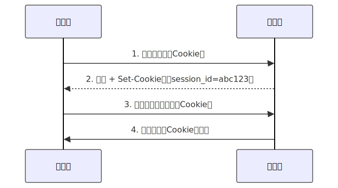

好的，我们来详细解析一下 Cookie、Session 和 Token，它们是 Web 开发中用于管理用户状态和身份认证的核心概念。

**核心目标：** 都是为了解决 HTTP 协议**无状态**（Stateless）的问题。HTTP 协议本身不会记住你上一次的请求信息，而网站需要知道“你是谁”以及“你之前做了什么”（比如是否登录、购物车内容等）。

------

## 1. Cookie

- **作用：**
  - **客户端状态存储：** 在**用户浏览器（客户端）** 存储少量数据（键值对）。
  - **会话管理：** 最常见的用途是存储 Session ID（会话标识符），让服务器能识别用户。
  - **个性化：** 存储用户偏好设置（如语言、主题）。
  - **跟踪：** 记录用户行为（常用于广告和分析）。
- **原理：**
  1. **服务器创建：** 当服务器需要向客户端设置数据时（比如用户登录成功后），会在 HTTP 响应头中包含一个 `Set-Cookie` 头。
     - 例如：`Set-Cookie: session_id=abc123; Path=/; HttpOnly; Secure; SameSite=Lax`
  2. **浏览器存储：** 浏览器接收到响应后，会将这些键值对及其属性（如有效期 `Expires`/`Max-Age`、作用域 `Domain`、路径 `Path`、安全标志 `Secure`、`HttpOnly`、`SameSite`）存储在本地（通常是一个文件中）。
  3. **自动发送：** 之后，每当浏览器向**匹配该 Cookie 作用域（Domain 和 Path）** 的服务器发送请求时，都会**自动**在 HTTP 请求头中包含一个 `Cookie` 头。
     - 例如：`Cookie: session_id=abc123; user_pref=dark_mode`
  4. **服务器读取：** 服务器从请求头中读取 `Cookie` 信息，获取所需的数据（如 Session ID）。
- **特点：**
  - **存储在客户端。**
  - 有大小限制（通常每个域名下 4KB 左右，数量也有限制）。
  - 可以设置有效期（会话期 Cookie 在浏览器关闭时失效；持久性 Cookie 在指定时间后失效）。
  - **安全问题：** 易受 XSS（跨站脚本攻击）窃取（尤其非 HttpOnly 的 Cookie）和 CSRF（跨站请求伪造）攻击（需配合 `SameSite` 属性和 CSRF Token 防御）。
  - `HttpOnly` 属性可阻止 JavaScript 访问，增强安全性（防 XSS 窃取敏感 Cookie）。
  - `Secure` 属性要求只能通过 HTTPS 发送。
  - `SameSite` 属性（Strict/Lax/None）控制 Cookie 是否在跨站点请求中发送，是防御 CSRF 的重要手段。
- **主要用途：** 作为 Session ID 的存储载体，存储非敏感的用户偏好设置。

------

## 2. Session

- **作用：**
  - **服务端状态管理：** 在**服务器端**存储与特定用户相关的状态信息。
  - **用户会话：** 核心是维护一个用户在一次“会话”（通常从登录到退出或超时）期间的临时数据，如登录状态、用户 ID、购物车内容、权限信息等。
- **原理：**
  1. **创建 Session：** 当用户首次访问服务器或执行特定操作（如登录）时，服务器端应用程序会为该用户创建一个唯一的 **Session ID**。
  2. **存储 Session 数据：** 服务器将 Session ID 关联的用户数据（Session 数据）存储在服务器端（内存、文件、数据库如 Redis 或 Memcached - 推荐）。
  3. **发送 Session ID 给客户端：** 服务器通过 HTTP 响应将 Session ID 发送给客户端浏览器。**最常用、最安全的方式是通过 Cookie（设置 `Set-Cookie` 头）**。也可以使用 URL 重写（将 Session ID 附加在 URL 后）或隐藏表单域，但都不如 Cookie 方便和安全。
  4. **客户端回传 Session ID：** 浏览器在后续请求中（通过 Cookie 或其他方式）将 Session ID 发送回服务器。
  5. **服务器查找 Session：** 服务器接收到 Session ID 后，使用它在自己的存储中查找对应的 Session 数据，从而识别用户并获取其状态信息。
- **特点：**
  - **Session 数据存储在服务器端。** 这是与 Cookie 最本质的区别。
  - 客户端通常只存储一个 Session ID（通常通过 Cookie 存储）。
  - 服务器端存储容量更大，可以存储更复杂的数据（用户对象、列表等）。
  - **更安全：** 敏感数据（如用户 ID、权限）不会直接暴露给客户端，只有 Session ID 在传输。但仍需防范 Session ID 被盗用（需配合 HTTPS、HttpOnly Cookie、合理的 Session 过期策略）。
  - **服务器开销：** 需要服务器资源（内存、数据库）来存储和管理 Session 数据。在分布式/集群环境下，需要共享 Session 存储（如 Redis）以保证一致性。
  - Session 通常有生命周期（空闲超时、绝对超时），超时后数据会被清除。
- **主要用途：** 管理用户登录状态、维护用户会话期间的核心数据。

------

## 3. Token (通常指 JWT - JSON Web Token)

- **作用：**
  - **无状态身份认证/授权凭证：** 作为客户端持有的、可自包含的凭证，用于证明用户的身份和权限。
  - **信息交换：** 在各方之间安全地传输信息（Claims - 声明）。
- **原理 (以 JWT 为例)：**
  1. **认证：** 用户提供凭证（如用户名密码）给认证服务器。
  2. **服务器验证并生成 Token：** 认证服务器验证凭证有效后，**不存储会话状态**，而是生成一个 Token（如 JWT）。JWT 包含三部分：
     - **Header：** 算法（如 HS256, RS256）和类型（`JWT`）。
     - **Payload：** 包含声明（Claims） - 关于实体（用户）的声明（如用户 ID、用户名、角色、权限）和附加数据（如签发者 `iss`、过期时间 `exp`、生效时间 `nbf`）。
     - **Signature：** 使用 Header 指定的算法、服务器持有的密钥（Secret）或私钥（Private Key），对 `base64UrlEncode(header) + "." + base64UrlEncode(payload)` 进行签名。**签名保证了 Token 的完整性和来源可信（防篡改）。**
  3. **发送 Token 给客户端：** 认证服务器将生成的 Token（通常是一个长字符串）返回给客户端（通常在 HTTP 响应体或 Header 中）。
  4. **客户端存储 Token：** 客户端（浏览器、APP）保存这个 Token（常用方式：LocalStorage, SessionStorage, Cookie, 内存）。
  5. **携带 Token 请求资源：** 客户端在后续访问受保护资源（API）时，在 HTTP 请求头（通常是 `Authorization: Bearer `）或请求体/URL 中携带这个 Token。
  6. **服务器验证 Token：** 资源服务器（API Server）收到请求后：
     - 检查 Token 结构（Header.Payload.Signature）。
     - 验证签名（使用对应的密钥或公钥）以确认 Token 未被篡改且来源可信。
     - 解析 Payload，读取其中的声明（Claims）。
     - 检查声明是否有效（如过期时间 `exp`、生效时间 `nbf`、目标受众 `aud` 是否匹配）。
     - 根据 Payload 中的用户身份（如用户 ID）和权限信息（如角色）决定是否授权访问请求的资源。
     - **关键：服务器不需要在本地存储任何会话信息！** 它完全依赖 Token 自身包含的信息和签名验证结果来判断请求的有效性。
- **特点：**
  - **无状态：** 服务器不需要存储会话信息（Session Store），这是与 Session 的最大区别。服务器只需验证 Token 的有效性和签名。大大简化了服务器架构，易于水平扩展。
  - **自包含：** Token（如 JWT）的 Payload 包含了用户信息和声明，服务器无需额外查询数据库（除必要权限检查外）。
  - **存储在客户端：** Token 由客户端持有和传输。
  - **跨域友好：** 天然适合跨域（CORS）和分布式微服务架构（API Gateway + 多个微服务）。
  - **灵活性：** 可以携带各种自定义声明（Claims），支持细粒度授权（如 OAuth2 的 Access Token/Refresh Token）。
  - **安全问题：**
    - **客户端存储风险：** 存储在 LocalStorage/SessionStorage 易受 XSS 攻击窃取。存储在 Cookie 需严格设置 `HttpOnly`, `Secure`, `SameSite`。
    - **Token 泄露 = 身份被盗：** 一旦 Token 被盗，攻击者可以在有效期内冒充用户。需使用 HTTPS、设置较短的过期时间、使用 Refresh Token 机制来更新 Access Token。
    - **无法主动失效（单点登录除外）：** 在 Token 自然过期前（或 Refresh Token 过期前），服务器无法主动使其失效（除非维护一个很小的黑名单，违背无状态初衷）。这是无状态带来的主要挑战。
- **主要用途：** RESTful API 认证授权、单点登录（SSO）、移动应用认证、微服务间认证。

------

## 总结与关键区别

| 特性           | Cookie                                 | Session                               | Token (e.g., JWT)                               |
| -------------- | -------------------------------------- | ------------------------------------- | ----------------------------------------------- |
| **存储位置**   | **客户端** (浏览器)                    | **服务器端** (内存、数据库如 Redis)   | **客户端** (LocalStorage, Cookie, 内存等)       |
| **存储内容**   | 键值对数据 (通常包含 Session ID)       | 用户会话状态数据 (关联到 Session ID)  | 自包含的凭证 (包含身份/权限声明和签名 - JWT)    |
| **核心作用**   | 客户端存储、传递标识符 (如 Session ID) | **服务器端状态管理**                  | **无状态认证/授权凭证**                         |
| **状态管理**   | 客户端存储机制                         | **有状态** (服务器维护会话状态)       | **无状态** (服务器不存储会话状态)               |
| **安全性**     | 较低 (易受 XSS/CSRF，需属性防护)       | 较高 (敏感数据在服务器端)             | 中等 (依赖客户端存储安全、签名算法强度、有效期) |
| **扩展性**     | 无影响                                 | 复杂 (集群/分布式需共享 Session 存储) | **优秀** (天然适合分布式/微服务)                |
| **跨域支持**   | 受限 (需配合 CORS 和 `SameSite` 策略)  | 同 Cookie                             | **良好** (适合 API 跨域调用)                    |
| **主要载体**   | HTTP Header `Cookie` / `Set-Cookie`    | Session ID (通常通过 Cookie 传递)     | HTTP Header `Authorization: Bearer <token>`     |
| **失效控制**   | 浏览器控制 (过期时间) 或 服务器覆写    | 服务器控制 (超时、主动销毁)           | 依赖 Token 内置过期时间 (`exp`)，主动失效困难   |
| **典型场景**   | 存储 Session ID、用户偏好              | 用户登录状态、会话数据管理            | API 认证、单点登录 (SSO)、移动应用认证          |
| **服务器压力** | 无                                     | 有 (需存储和管理 Session 数据)        | 无 (验证 Token 计算开销通常小于 Session 查询)   |

**演进关系：**

1. **Cookie 是基础载体：** 最初用于在客户端存储少量数据。
2. **Session 解决状态问题：** 利用 Cookie 存储 Session ID，在服务器端维护用户状态，更安全（敏感数据不在客户端）。
3. **Token 解决扩展性问题：** 为了适应分布式、无状态架构（如 RESTful API、微服务），将认证信息（Claims）和签名直接放入 Token  中由客户端持有，服务器无需存储会话状态，通过密码学验证 Token 的有效性和内容即可。Session ID 变成了自包含的 Token。

**选择建议：**

- **传统 Web 应用 (服务器渲染页面)：** **Session (通过 Cookie 存储 Session ID)** 仍然是主流和相对简单的选择，对状态管理需求强。
- **现代 Web 应用 (前后端分离 - SPA)、移动应用 API、微服务架构：** **Token (尤其是 JWT)** 是更优选择，提供无状态、易扩展、跨域友好的特性。需注意客户端存储安全和失效问题。
- **Cookie 的角色：** 在任何方案中，Cookie 仍然是最常用、最安全的在浏览器端存储 Session ID 或 Token 的机制（配合 `HttpOnly`, `Secure`, `SameSite` 属性）。Token 也可以存储在 LocalStorage/SessionStorage，但需更严格防范 XSS。

理解这三者的原理和区别，对于设计安全、可扩展的 Web 应用和 API 至关重要。

本文参考：
