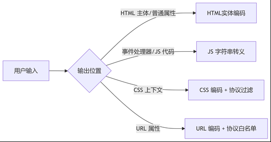

## xss原理：

XSS 的本质在于 Web 应用程序对用户输入数据的“信任过度”和“输出处理不当”。攻击者利用这一点，将恶意的 JavaScript 代码（或能够触发脚本执行的 HTML 标签/属性） 作为输入数据提交给 Web 应用。当应用在未对这些输入进行充分净化（Sanitization）和转义（Escaping） 的情况下，直接将它们输出到其他用户的浏览器页面中时，这些恶意脚本就会被受害者的浏览器解析并执行。

## xss危害：

1. 最常见的危害窃取受害者的 Cookie，通过 document.cookie 读取并发送给攻击者服务器
2. 窃取 DOM 内容，Token、用户个人敏感信息（用户名、密码、身份证等）， 
3. 劫持用户会话，通过 JavaScript 自动提交表单，发起CSRF攻击，执行任意操作，如更改密码、转账
4. 重定向用户：将受害者浏览器重定向到钓鱼网站或恶意软件下载站点
6.	刷流量，执行弹窗广告，传播蠕虫病毒

## xss分类：

•	反射型 XSS： 恶意脚本包含在请求（通常是 URL 参数）中，服务器立即将其“反射”回响应页面。受害者需要点击攻击者精心构造的恶意链接。黑盒测试中通过修改 URL 参数、POST 数据并观察响应是否原样输出且未过滤来发现。常用于钓鱼攻击。
•	存储型 XSS： 危害最大、传播最广。恶意脚本被提交并永久存储在服务器端（如数据库、文件系统、评论内容）。每当其他用户访问显示该存储内容的页面时，脚本就会自动执行。黑盒测试中寻找所有用户可控且持久化显示的数据输入点。
•	DOM 型 XSS： 恶意脚本的注入和执行完全在客户端的 JavaScript 代码（DOM 操作）中完成，不经过服务器端处理。服务器返回的可能是“干净”的 HTML/JS，但客户端 JS 代码（如 document.write, innerHTML, eval, location.hash 处理不当）将用户输入（如 URL 片段 # 后的部分）动态写入了 DOM 并导致执行。黑盒测试需分析页面 JS 逻辑或模糊测试 URL 片段、postMessage 等客户端输入源。

## xss预防：

1. Web 应用中任何接受用户输入并将其动态输出到返回页面上的地方，都有可能是注入点。用户生成内容展示区（评论/帖子/用户名）、关键词回显（搜索框结果页）、错误参数反射（错误消息页面）、URL 参数动态渲染、甚至HTTP 头部显示（如管理后台展示 User-Agent）都有可能是XSS注入点

2. 使用html实体编码，这种方法不会影响用户体验，但是这种编码必须严格应用在用户输入被输出到HTML文档主体或HTML普通属性值的上下文。而非事件处理器、script标签内容、CSS、URL属性）

3. 对特殊字符进行正则转义，如< > & " ' /；字符串转义。   过滤html标签和js函数，如script、onclick、javascript，标签黑名单，协议禁用；    

4. 内容安全策略CSP（Content Security Policy，简称CSP），它的本质是一种白名单，它通过只允许浏览器只执行或渲染来自白名单的资源（脚本、样式、图片、字体、连接、框架、对象等），用于检测和预防某些前端攻击，包括跨站脚本（XSS）和数据注入攻击。攻击者构造的js代码就没什么东西鸟他了。

   

5. 在Cookie 中设置 HttpOnly 属性（依然 可以通过请求劫持获取cookie）

6. Waf

## xss绕过：

1. 大小写

2. 双写

3. 拼凑，如：`<scr<script>ipt>`

4. `反引号代替单双引号

5. 无效字符填充代替空格，如 `/`，`|`，`&` 

6. 内联注释：如：`/*!<script>*/`

7. 特殊标签和HTML5新增标签

8. 拆分跨站

9. 编码和、双重编码：ASCII码、十进制、十六进制、unicode，如：javas&#x63ript

10. 嵌套编码：base64+URL

11. UTF-7攻击

12. 伪协议与协议混淆（注释符截断、大小写、url编码）

13. DOM污染链

    ```js
    // 原型链污染
    Object.prototype.onload = ()=>alert(1);
    document.write('');
    ```

14. XSS + 请求劫持绕过httponly

## XSS测试字典

```

```


本文参考：
