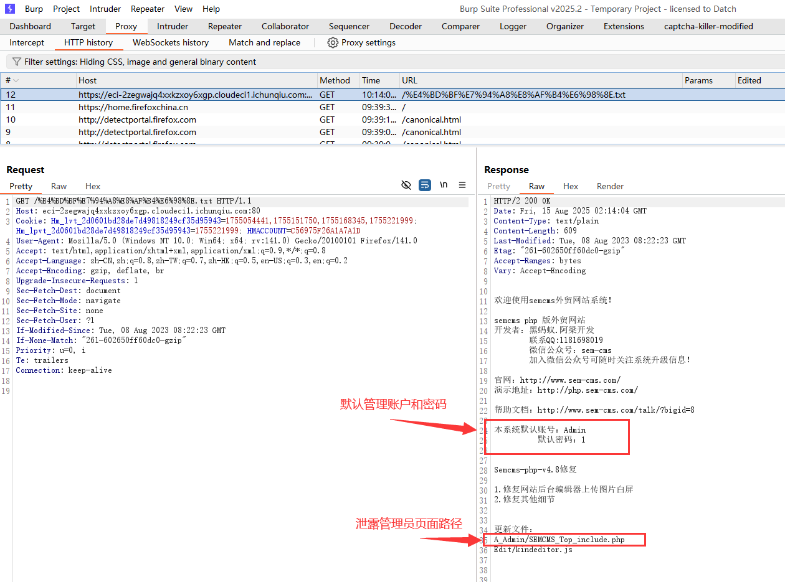
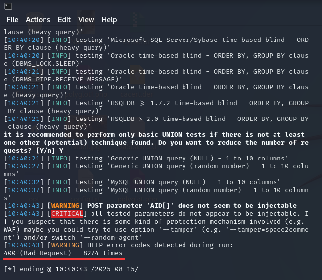
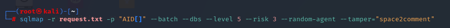
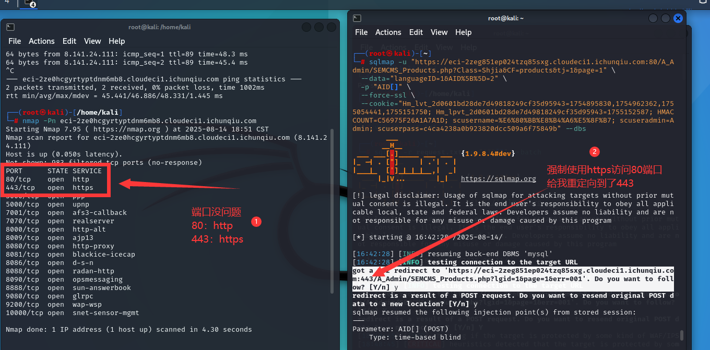

i春秋靶场，编号：CVE-2023-50563。在使用sqlmap跑注入点的时候，将burpsuite的包直接复制到request.txt，由于host没有指定443端口导致sqlmap使用http协议向80端口发起请求，而服务器禁止http请求，导致注入失败。

## 渗透过程

1. 御剑尝试扫描敏感文件和后台，发现敏感路径和文件

​	

2. 访问install，将localhost修改为127.0.0.1后可以安装管理后台，并显示默认账户密码和管理员页面路径。

3. 我安装失败，用的第二种方式。在`使用说明.txt`中存在管理员账户密码泄露和默认管理员页面路径

4. 前端没有使用UTF-8编码导致乱码：

   

5. 使用burpsuite可以查看原文：

   

6. 访问/A_Admin路径找到管理员后台页面

   

7. 经过不断测试（文件上传、目录遍历、SQL注入）发现 POST请求存在时间盲注漏洞，以  产品管理 ==> 批量上架 为例

   

8. 选中某一个发包，发给重放器。使用`) AND (SELECT 6149 FROM (SELECT(SLEEP(5)))pMLn) AND (1646=1646`测试，发现SQL注入。

   

9. 将包复制粘贴至request.txt用sqlmap跑：

   

10. 结果返回400，没有找到注入点

    

11. 以为没找到注入点，尝试`--level 5`  `--risk 3` 

    

12. 全部返回400，以为后端有防护

    

13. 尝试`--random-agent`  `--tamper="space2comment"` 绕过技术

    

14. 依然全部返回400

    

15. 想起来http访问的时候，前端也会返回400，可能服务端拒绝使用http访问，但sqlmap使用了http协议发起了请求

    

16. 使用`--force-ssl`强制使用https协议发起请求

    

17. 成功找到注入点并获取数据库：


## 原理

1. 服务器开启的协议和端口是正常的。80开放http，443开放https

   

2. sqlmap请求体中host字段没有指定端口，导致sqlmap使用http协议向80端口发起请求

   

   

3. 使用其他方式也能注入成功。重要的是使用https协议

   1. 指定443端口

      ```
      Host: eci-2zegwajq4xxkzxoy6xgp.cloudeci1.ichunqiu.com:443
      ```

   2. 使用https协议

      ```
      POST https://eci-2ze0hcgyrtyptdnm6mb8.cloudeci1.ichunqiu.com/A_Admin/SEMCMS_Products.php?Class=Shjia&CF=products&tj=1&page=1 HTTP/1.1
      ```


本文参考：
