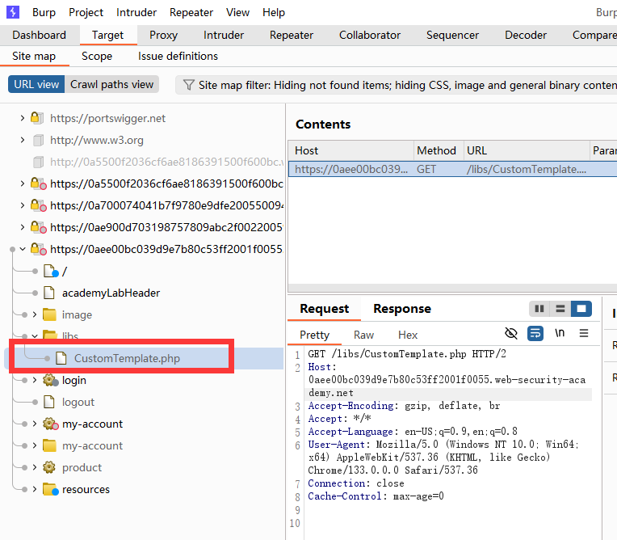

## 不安全的反序列化

在本节中，我们将介绍什么是不安全的反序列化，并描述不安全的反序列化如何可能使网站遭受严重攻击。我们将重点介绍典型场景，并使用 PHP、Ruby 和 Java 反序列化的具体示例演示一些广泛适用的技术。我们还将介绍一些可以避免自己的网站出现不安全反序列化漏洞的方法。

## 什么是序列化？

序列化是将复杂的数据结构（如对象及其字段）转换为 "flatter" 格式的过程，这种格式可以作为连续的字节流发送和接收。数据序列化使以下工作变得更加简单：

- 将复杂数据写入进程间内存、文件或数据库
- 通过网络、应用程序不同组件之间或 API 调用等方式发送复杂数据

最重要的是，在序列化对象时，其状态也会被持久化。换句话说，对象的属性及其赋值都会被保留下来。

### 序列化与反序列化

反序列化是将字节流还原为原始对象的全功能复制品的过程，其状态与序列化时完全相同。然后，网站的逻辑就可以与这个反序列化对象交互，就像与其他对象交互一样。

许多编程语言都为序列化提供本地支持。具体如何序列化对象取决于语言。有些语言将对象序列化为二进制格式，而其他语言则使用不同的字符串格式，其可读性也各不相同。请注意，原始对象的所有属性都会存储在序列化数据流中，包括任何私有字段。要防止某个字段被序列化，必须在类声明中将其明确标记为 "transient" 字段。

请注意，在使用不同的编程语言时，序列化可能被称为 marshalling（Ruby）或 pickling（Python）。这些术语在此处与 "serialization" 同义。

## 什么是不安全的反序列化？

不安全的反序列化是指网站对用户可控数据进行反序列化。这有可能使攻击者操纵序列化对象，从而将有害数据传递到应用程序代码中。

甚至有可能将序列化后的对象替换为完全不同类的对象。令人担忧的是，网站可用的任何类的对象都会被反序列化和实例化，而不管预期的是哪个类。因此，不安全的反序列化有时被称为 “对象注入 ”漏洞。

一个意外类的对象可能会导致异常。不过，此时破坏可能已经造成。许多基于反序列化的攻击都是在反序列化完成之前完成的。这意味着，即使网站本身的功能不直接与恶意对象交互，反序列化过程本身也可能发起攻击。因此，逻辑基于强类型语言的网站也容易受到这些技术的攻击。

## 不安全的反序列化漏洞是如何产生的？

不安全的反序列化通常是因为人们普遍缺乏对反序列化用户可控数据的危险性的认识。理想情况下，用户输入根本不应该被反序列化。

不过，有时网站所有者会认为自己很安全，因为他们对反序列化数据实施了某种形式的额外检查。这种方法往往是无效的，因为几乎不可能实施验证或消毒来应对每一种可能发生的情况。这些检查从根本上说也是有缺陷的，因为它们依赖于在数据被反序列化后对其进行检查，而在许多情况下，这已经太晚了，无法阻止攻击。

由于通常认为反序列化对象是可信的，因此也可能出现漏洞。特别是在使用二进制序列化格式的语言时，开发人员可能会认为用户无法有效地读取或操作数据。然而，虽然可能需要付出更多努力，但攻击者利用二进制序列化对象的可能性与利用基于字符串格式的对象的可能性一样大。

现代网站中存在大量依赖关系，这也使得基于反序列化的攻击成为可能。一个典型的网站可能实现了许多不同的库，每个库都有自己的依赖关系。这就形成了一个庞大的类和方法池，很难对其进行安全管理。由于攻击者可以创建任何这些类的实例，因此很难预测在恶意数据上可以调用哪些方法。如果攻击者能够将一长串意想不到的方法调用串联起来，将数据传递到与初始源完全无关的汇中，情况就更是如此。因此，要预测恶意数据流并堵住每个潜在漏洞几乎是不可能的。

简而言之，可以说不可能安全地反序列化不受信任的输入。

## 不安全的反序列化会产生什么影响？

不安全的反序列化可能会造成非常严重的影响，因为它为大量增加的攻击面提供了一个切入点。它允许攻击者以有害的方式重复使用现有的应用程序代码，导致许多其他漏洞，通常是远程代码执行。

即使在不可能执行远程代码的情况下，不安全的反序列化也会导致权限升级、任意文件访问和拒绝服务攻击。

## 如何利用不安全的反序列化漏洞

现在您已经熟悉了序列化和反序列化的基础知识，我们可以看看如何利用不安全的反序列化漏洞。

## 利用不安全的反序列化漏洞

在本节中，我们将以 PHP、Ruby 和 Java 反序列化为例，教您如何利用一些常见情况。我们希望展示利用不安全的反序列化实际上比许多人想象的要容易得多。如果您能够使用预构建的小工具链，甚至在黑盒测试中可以做到这一点。

我们还将指导您创建自己的基于反序列化的高严重性攻击。虽然这些攻击通常需要源代码访问权限，但一旦理解了基本概念，学习起来也会比想象中容易。我们将特别介绍以下主题：

- 如何识别不安全的反序列化 LABS
- 修改网站期望的序列化对象 LABS
- 向危险的网站功能传递恶意数据 LABS
- 注入任意对象类型
- 串联方法调用以控制进入危险水槽小工具的数据流 LABS
- 手动创建自己的高级漏洞利用程序 LABS
- PHAR 反序列化

> **Note**
>
> 尽管许多实验和示例都基于 PHP，但大多数开发技术对其他语言也同样适用。

### 如何识别不安全的反序列化

不管是白盒测试还是黑盒测试，识别不安全的反序列化都相对简单。

在审计过程中，你应该查看所有传入网站的数据，并尝试识别任何看起来像序列化数据的东西。如果了解不同语言使用的格式，序列化数据就能比较容易地识别出来。在本节中，我们将展示 PHP 和 Java 序列化的示例。一旦识别出序列化数据，就可以测试是否能够控制它。

> **Tip**
>
> 对于 Burp Suite Professional 的用户，Burp Scanner 会自动标记任何看起来包含序列化对象的 HTTP 消息。

### PHP 序列化格式

PHP 使用的大多是人类可读的字符串格式，字母代表数据类型，数字代表每个条目的长度。例如，用户对象的属性为

```php
$user->name = "carlos";
$user->isLoggedIn = true;
```

序列化后，该对象的外观可能如下所示：

```
O:4:"User":2:{s:4:"name":s:6:"carlos";s:10:"isLoggedIn":b:1;}
```

这可以解释为：

- `O:4: "User"` - 具有 4 个字符类名 `"User"` 的对象
- `2` - 该对象有 2 个属性
- `s:4: "name"` - 第一个属性的键是 4 个字符的字符串 `“name”`。
- `s:6: "carlos"` - 第一个属性的值是 6 个字符的字符串 `“carlos”`。
- `s:10: "isLoggedIn"` - 第二个属性的键是 10 个字符的字符串 “isLoggedIn”。
- `b:1` - 第二个属性的值是布尔值 `true`

PHP 序列化的本地方法是 `serialize() `和 `unserialize()`。如果可以访问源代码，就应该先在代码中查找 `unserialize()`，然后进一步研究。

### Java 序列化格式

有些语言（如 Java）使用二进制序列化格式。这种格式更难读取，但如果知道如何识别一些蛛丝马迹，还是可以识别序列化数据的。例如，序列化的 Java 对象总是以相同的字节开始，在十六进制中编码为 `aced`，在 Base64 中编码为 `rO0`。

任何实现了 `java.io.Serializable` 接口的类都可以被序列化和反序列化。如果您可以访问源代码，请注意任何使用 `readObject()` 方法的代码，该方法用于从 `InputStream` 中读取和反序列化数据。

### 操作序列化对象

利用某些反序列化漏洞就像更改序列化对象中的一个属性一样简单。由于对象状态是持久化的，因此可以通过研究序列化数据来识别和编辑有趣的属性值。然后，您就可以通过网站的反序列化过程将恶意对象传入网站。这是基本反序列化漏洞利用的第一步。

一般来说，在操作序列化对象时有两种方法。一种是直接编辑字节流形式的对象，另一种是用相应的语言编写简短的脚本，自己创建新对象并将其序列化。在处理二进制序列化格式时，后一种方法通常更为简便。

#### 修改对象属性

在篡改数据时，只要攻击者保留了一个有效的序列化对象，反序列化过程就会创建一个带有修改后属性值的服务器端对象。

举个简单的例子，一个网站使用序列化的 `User` 对象在 cookie 中存储用户会话数据。如果攻击者在 HTTP 请求中发现了这个序列化对象，他们可能会对其进行解码，发现以下字节流：

```
O:4:"User":2:{s:8:"username";s:6:"carlos";s:7:"isAdmin";b:0;}
```

`isAdmin` 属性是一个明显的关注点。攻击者只需将该属性的布尔值改为 `1`（true），重新编码对象，然后用修改后的值覆盖当前 cookie 即可。单独来看，这不会产生任何影响。但是，假设网站使用此 cookie 来检查当前用户是否有访问某些管理功能的权限：

```php
$user = unserialize($_COOKIE);
if ($user->isAdmin === true) {
// allow access to admin interface
}
```

这段有漏洞的代码会根据 cookie 中的数据（包括攻击者修改过的 `isAdmin` 属性）实例化一个`User`对象。在任何时候都不会检查序列化对象的真实性。然后，这些数据会被传递到条件语句中，在这种情况下，就可以轻松实现权限升级。

这种简单的情况在实际应用中并不常见。不过，以这种方式编辑属性值，展示了获取不安全反序列化所暴露的大量攻击面的第一步。

#### Lab：修改序列化对象

本实验使用了基于序列化的会话机制，因此存在权限升级漏洞。要解决该实验问题，请编辑会话 cookie 中的序列化对象，利用此漏洞获得管理权限。然后删除用户 carlos。

- 使用自己的凭据登录。请注意，登录后的 `GET /my-account` 请求包含一个会话 cookie，它似乎是 URL 和 Base64 编码的。
- 使用 Burp 的 Inspector 面板研究请求的解码形式。请注意，cookie 实际上是一个序列化的 PHP 对象。admin 属性包含 b:0，表示布尔值 false。将此请求发送到 Burp Repeater。
- 在 Burp Repeater 中，使用检查器再次检查 cookie，并将 admin 属性的值更改为 b:1。点击 “应用更改”。修改后的对象将自动重新编码并更新到请求中。
- 发送请求。请注意，响应中现在包含了一个指向 /admin 管理面板的链接，表明您已使用管理员权限访问了该页面。
- 将请求路径改为 /admin，然后重新发送。注意 /admin 页面包含删除特定用户账户的链接。
- 将请求路径更改为 /admin/delete?username=carlos，然后发送请求以解决实验室问题。

#### 修改数据类型

我们已经看到了如何修改序列化对象中的属性值，但也有可能提供意想不到的数据类型。

由于在比较不同数据类型时使用了松散比较运算符 (==)，基于 PHP 的逻辑特别容易受到这种操作的影响。例如，如果在整数和字符串之间进行松散比较，PHP 会尝试将字符串转换为整数，这意味着 5 == “5” 的值为 true。


## 如何防止不安全的反序列化漏洞

一般来说，除非绝对必要，否则应避免对用户输入进行反序列化。在许多情况下，反序列化可能带来的高严重性漏洞，以及防范这些漏洞的难度，都超过了反序列化的好处。

由于在比较不同数据类型时使用了松散比较运算符 (==)，基于 PHP 的逻辑特别容易受到这种操作的影响。例如，如果在整数和字符串之间进行松散比较，PHP 会尝试将字符串转换为整数，这意味着 5 == “5” 的值为 true。

由于在比较不同数据类型时使用了松散比较运算符 (`==`)，基于 PHP 的逻辑特别容易受到这种操作的影响。例如，如果在整数和字符串之间进行松散比较，PHP 会尝试将字符串转换为整数，这意味着 `5 == “5”` 的值为 `true`。

不同寻常的是，这也适用于任何以数字开头的字母数字字符串。在这种情况下，PHP 将根据开头的数字有效地将整个字符串转换为整数值。字符串的其余部分将被完全忽略。因此，`5 == "5 of something"` 实际上被视为 `5 == 5`。

同样，在 PHP 7.x 及更早版本中，比较 `0 == "Example string"` 的结果为 `true`，因为 PHP 将整个字符串视为整数 `0`。

考虑将这种松散的比较运算符与来自反序列化对象的用户可控数据结合使用的情况。这有可能导致危险的逻辑缺陷。

```php
$login = unserialize($_COOKIE)
if ($login['password'] == $password) {
// log in successfully
}
```

假设攻击者修改了密码属性，使其包含整数 `0`，而不是预期的字符串。只要存储的密码不是以数字开头，该条件就会始终返回 `true`，从而实现身份验证绕过。请注意，这只是因为反序列化保留了数据类型。如果代码直接从请求中获取密码，`0` 将被转换为字符串，条件将返回 `false`。

> **Note**
>
> 在 PHP 8 及以后的版本中，0 == “Example string ”比较结果为 false，因为在比较过程中字符串不再隐式转换为 0。因此，在这些版本的 PHP 中无法使用此漏洞。
>
> 比较以数字开头的字母数字字符串的行为在 PHP 8 中保持不变。因此，5 == `“5 of something ”`仍被视为 `5 == 5`。

请注意，在修改任何序列化对象格式中的数据类型时，一定要记得更新序列化数据中的任何类型标签和长度指示符。否则，序列化对象将被损坏，无法进行反序列化。

#### Lab： 修改序列化数据类型

本实验使用了基于序列化的会话机制，因此容易发生身份验证绕过。要解决该实验问题，请编辑会话 cookie 中的序列化对象，以访问`administrator`账户。然后删除用户 `carlos`。

- 使用自己的凭据登录。在 Burp 中，打开登录后的 `GET /my-account` 请求，并使用检查器检查会话 cookie，以显示序列化的 PHP 对象。将此请求发送到 Burp Repeater。

- 在 Burp Repeater 中，使用检查器面板对会话 cookie 进行如下修改：

  - 将用户名属性的长度更新为 13。

  - 将用户名改为管理员。

  - 将访问令牌更改为整数 0。 由于这不再是字符串，因此还需要删除值周围的双引号。

  - 将 s 替换为 i，更新访问令牌的数据类型标签。

结果应该是这样的:

```
O:4:"User":2:{s:8:"username";s:13:"administrator";s:12:"access_token";i:0;}
```


- 单击 “应用更改”。修改后的对象将自动重新编码并更新到请求中。
- 发送请求。请注意，响应中现在包含一个指向 `/admin` 管理面板的链接，表明您已成功以管理员用户身份访问该页面。
- 将请求路径改为 `/admin`，然后重新发送。注意` /admin` 页面包含删除特定用户账户的链接。
- 将请求路径更改为` /admin/delete?username=carlos`，然后发送请求以解决实验室问题。

在直接处理二进制格式时，我们建议使用 BApp 商店提供的 Hackvertor 扩展。使用 Hackvertor，你可以将序列化数据修改为字符串，它会自动更新二进制数据，并相应调整偏移量。这样可以节省大量的手动操作。

## 使用应用程序功能

除了简单地检查属性值外，网站功能还可能对来自反序列化对象的数据执行危险操作。在这种情况下，您可以利用不安全的反序列化传递非预期数据，并利用相关功能进行破坏。

例如，作为网站 “删除用户 ”功能的一部分，用户的个人资料图片是通过访问 `$user->image_location` 属性中的文件路径来删除的。如果该 `$user` 是通过序列化对象创建的，攻击者就可以通过将 `image_location` 设置为任意文件路径的修改后传入来利用这一漏洞。删除自己的用户账户后，也会删除这个任意文件。

#### Lab： 使用应用程序功能利用不安全的反序列化

本实验室使用基于序列化的会话机制。某个功能会对序列化对象中提供的数据调用一个危险的方法。要解决这个实验问题，请编辑会话 cookie 中的序列化对象，并用它删除`Carlos`主目录中的 `morale.txt` 文件。

1. 登录自己的账户。在 “我的账户 ”页面，注意到有删除账户的选项，可向 /my-account/delete 发送 POST 请求。
2. 向 Burp Repeater 发送包含会话 cookie 的请求。
3. 在 Burp Repeater 中，使用检查器面板研究会话 cookie。注意到序列化对象有一个 avatar_link 属性，其中包含头像的文件路径。
4. 编辑序列化数据，使 avatar_link 指向 /home/carlos/morale.txt。记住要更新长度指示符。修改后的属性应如下所示：

```
s:11:"avatar_link";s:23:"/home/carlos/morale.txt"
```

5. 点击 “应用更改”。修改后的对象将自动重新编码并更新到请求中。

6. 将请求行改为 POST /my-account/delete 并发送请求。您的账户将被删除，同时删除的还有卡洛斯的 morale.txt 文件。

这个示例依赖于攻击者通过用户可访问的功能手动调用危险方法。但是，如果利用漏洞自动将数据传递到危险方法中，不安全的反序列化就会变得更加有趣。使用 “magic methods ”可以实现这一点。

## Magic methods

魔法方法是无需显式调用的方法的特殊子集。相反，每当发生特定事件或情况时，它们就会被自动调用。魔法方法是各种语言中面向对象编程的常见特征。有时会在方法名称的前缀或周围加上双引号来表示它们。

开发人员可以在类中添加魔法方法，以便预先确定在相应事件或场景发生时应执行哪些代码。调用魔法方法的具体时间和原因因方法而异。PHP 中最常见的例子之一是 `__construct()`，它在类的对象实例化时被调用，类似于 Python 的 `__init__` 。通常，构造函数魔法方法包含初始化实例属性的代码。不过，开发人员可以自定义魔法方法，以执行他们想要的任何代码。

魔法方法被广泛使用，其本身并不代表漏洞。但是，当执行这些方法的代码处理攻击者可控制的数据（例如来自反序列化对象的数据）时，它们就会变得危险。攻击者可以利用这一点，在满足相应条件时自动调用反序列化数据上的方法。

最重要的是，有些语言在反序列化过程中会自动调用魔法方法。例如，PHP 的 `unserialize()` 方法会查找并调用对象的 `__wakeup()` 魔法方法。

在 Java 反序列化中，`ObjectInputStream.readObject()` 方法也是如此，该方法用于从初始字节流中读取数据，本质上类似于 “重新初始化 ”序列化对象的构造函数。不过，可序列化类也可以按如下方式声明自己的 `readObject()` 方法：

```java
private void readObject(ObjectInputStream in) throws IOException, ClassNotFoundException
{
    // implementation
}
```

以这种方式声明的 `readObject()` 方法就像一个魔法方法，在反序列化过程中会被调用。这样，类就能更紧密地控制自己字段的反序列化。

你应该密切关注任何包含这类神奇方法的类。它们允许你在对象完全反序列化之前将数据从序列化对象传递到网站代码中。这是创建更高级漏洞的起点。

## 注入任意对象

正如我们所见，偶尔可以通过简单编辑网站提供的对象来利用不安全的反序列化。然而，注入任意对象类型会带来更多可能性。

在面向对象编程中，对象可用的方法由其类决定。因此，如果攻击者能操纵作为序列化数据传入的对象类别，就能影响反序列化后甚至反序列化过程中执行的代码。

反序列化方法通常不会检查它们正在反序列化的对象。这意味着你可以传入网站可用的任何可序列化类的对象，而该对象将被反序列化。这实际上允许攻击者创建任意类的实例。这个对象不是预期的类并不重要。意外的对象类型可能会导致应用程序逻辑出现异常，但恶意对象届时已经实例化了。

如果攻击者可以访问源代码，他们就可以详细研究所有可用的类。要构建一个简单的漏洞，攻击者可以查找包含反序列化魔法方法的类，然后检查其中是否有对可控数据执行危险操作的类。然后，攻击者就可以传入该类的序列化对象，使用其魔法方法进行攻击。

#### Lab： PHP 中的任意对象注入

本实验使用基于序列化的会话机制，因此容易受到任意对象注入的攻击。要解决该实验问题，请创建并注入一个恶意序列化对象，以删除 Carlos home 目录中的 morale.txt 文件。您需要获得源代码访问权限才能解决本实验。

1. 登录自己的账户，注意会话 cookie 包含一个序列化的 PHP 对象。
2. 在网站地图中，注意到网站引用了 `/libs/CustomTemplate.php` 文件。右键单击该文件，选择 “发送到中继器”。



3. 在 Burp Repeater 中，注意在请求行的文件名后添加一个斜杠 (`~`) 就能读取源代码。

```php
<?php

class CustomTemplate {
    private $template_file_path;
    private $lock_file_path;

    public function __construct($template_file_path) {
        $this->template_file_path = $template_file_path;
        $this->lock_file_path = $template_file_path . ".lock";
    }

    private function isTemplateLocked() {
        return file_exists($this->lock_file_path);
    }

    public function getTemplate() {
        return file_get_contents($this->template_file_path);
    }

    public function saveTemplate($template) {
        if (!isTemplateLocked()) {
            if (file_put_contents($this->lock_file_path, "") === false) {
                throw new Exception("Could not write to " . $this->lock_file_path);
            }
            if (file_put_contents($this->template_file_path, $template) === false) {
                throw new Exception("Could not write to " . $this->template_file_path);
            }
        }
    }

    function __destruct() {
        // Carlos thought this would be a good idea
        if (file_exists($this->lock_file_path)) {
            unlink($this->lock_file_path);
        }
    }
}

?>
```

4. 在源代码中，请注意 `CustomTemplate` 类包含 `__destruct()` 魔法方法。这将调用 `lock_file_path` 属性上的 `unlink()` 方法，从而删除该路径上的文件。

5. 在 Burp 解码器中，使用序列化 PHP 数据的正确语法创建一个 `CustomTemplate` 对象，并将 `lock_file_path` 属性设置为 `/home/carlos/morale.txt`。确保使用正确的数据类型标签和长度指示符。最终对象应如下所示：

```
O:14:"CustomTemplate":1:{s:14:"lock_file_path";s:23:"/home/carlos/morale.txt";}
```

6. 对该对象进行 Base64 和 URL 编码，并将其保存到剪贴板。

7. 向 Burp Repeater 发送包含会话 cookie 的请求。

8. 在 Burp Repeater 中，用剪贴板中修改后的 cookie 替换会话 cookie。

9. 发送请求。魔法方法 `__destruct()` 会被自动调用，并删除 Carlos 的文件。


包含这些反序列化魔法方法的类还可用于发起更复杂的攻击，其中涉及一长串方法调用，即所谓的 “小工具链”。

## 小工具链

小工具 "是应用程序中存在的代码片段，可帮助攻击者实现特定目标。单个小工具可能不会直接对用户输入进行任何有害操作。但是，攻击者的目标可能只是调用一个方法，将用户输入传递到另一个小工具中。通过以这种方式将多个小工具串联在一起，攻击者就有可能将其输入传递到一个危险的 “下沉小工具 ”中，从而造成最大的破坏。

重要的是要明白，与其他一些类型的漏洞利用不同，小工具链不是攻击者构建的链式方法的有效payload。所有代码都已存在于网站上。攻击者唯一能控制的是传入小工具链的数据。这通常是通过在反序列化过程中调用的魔法方法来实现的，有时也称为 “启动小工具”。

在外网，许多不安全的反序列化漏洞只能通过使用小工具链来利用。这有时可能是简单的一步或两步链，但构建高严重性攻击可能需要更复杂的对象实例化和方法调用序列。因此，能够构建小工具链是成功利用不安全反序列化的关键因素之一。

### 使用预制小工具链

手动识别小工具链可能是一个相当艰巨的过程，而且在没有源代码访问权限的情况下几乎是不可能的。幸运的是，有几种使用预建小工具链的方法可以先试试。

有几种工具可以提供一系列预先发现的链，这些链已在其他网站上被成功利用。即使您没有访问源代码的权限，也可以使用这些工具来识别和利用不安全的反序列化漏洞，所需的工作量相对较小。之所以能采用这种方法，是因为广泛使用了包含可利用小工具链的库。例如，如果 Java 的 Apache Commons Collections 库中的小工具链可以在一个网站上被利用，那么任何其他实现该库的网站也可以使用相同的小工具链进行利用。

#### ysoserial

ysoserial "就是这样一个 Java 反序列化工具。它可以让你从提供的小工具链中选择一个你认为目标应用程序正在使用的库，然后传入你想执行的命令。然后，它会根据所选链创建一个合适的序列化对象。这仍然需要一定的尝试和错误，但比手动构建自己的小工具链要省力得多。

> **Note**
> 在 Java 16 及以上版本中，您需要设置一系列命令行参数，以便 Java 运行 ysoserial。例如
>
> ```java
> java -jar ysoserial-all.jar \
>    --add-opens=java.xml/com.sun.org.apache.xalan.internal.xsltc.trax=ALL-UNNAMED \
>    --add-opens=java.xml/com.sun.org.apache.xalan.internal.xsltc.runtime=ALL-UNNAMED \
>    --add-opens=java.base/java.net=ALL-UNNAMED \
>    --add-opens=java.base/java.util=ALL-UNNAMED \
>    [payload] '[command]'
> ```

#### Lab：使用Apache Commons利用Java 反序列化

本实验室使用基于序列化的会话机制，并加载 Apache Commons Collections 库。虽然您没有源代码访问权限，但仍可使用预构建的小工具链来利用本实验室。

要解决该实验室问题，请使用第三方工具生成一个包含远程代码执行有效载荷的恶意序列化对象。然后，将此对象传入网站，删除卡洛斯主目录中的 `morale.txt` 文件。


本文参考：
