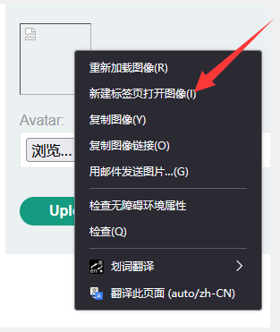
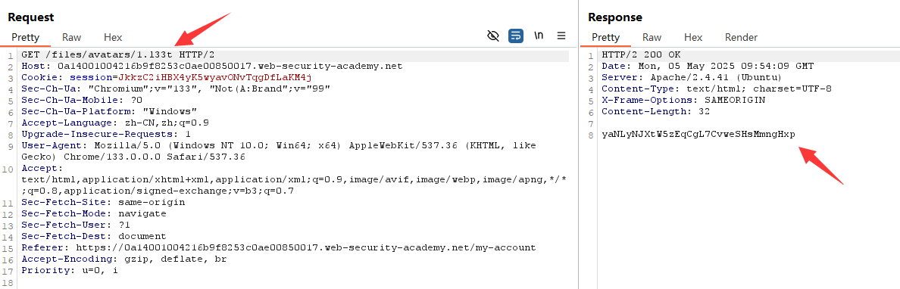

## 原理与危害

文件上传漏洞是指网络服务器允许用户上传文件到其文件系统，而未对文件名、类型、内容或大小等进行充分验证。这就可能导致允许攻击者上传有潜在危险的文件，甚至可能包括支持远程代码执行的服务器端脚本文件。

在某些情况下，上传文件本身就足以造成破坏。其他攻击可能涉及对文件的后续 HTTP 请求，通常是为了触发服务器执行文件。

<!-- more -->

## 文件上传漏洞的影响

文件上传漏洞的影响通常取决于两个关键因素：

- 网站未能正确验证文件的哪个方面，无论是文件大小、类型还是内容等。
- 文件上传成功后，对文件施加了哪些限制。

在最坏的情况下，文件类型没有得到正确验证，服务器配置允许某些类型的文件（如 .php 和 .jsp）作为代码执行。在这种情况下，攻击者有可能上传一个服务器端代码文件，该文件可作为 web shell 使用，就可以完全控制服务器。

如果文件名没有得到正确验证，攻击者只需上传同名文件，就能覆盖关键文件。如果服务器还存在目录遍历漏洞，这就意味着攻击者甚至可以将文件上传到意想不到的位置，比如覆盖服务器的系统文件。

如果不能确保文件大小在预期的阈值范围内，还可能导致某种形式的拒绝服务（DoS）攻击，即攻击者填满可用磁盘空间。

## 文件上传漏洞是如何产生的

因为文件上传漏洞巨大的危害性，网站很少会对允许用户上传的文件不加任何限制。更常见的情况是，开发人员实施他们认为强大的验证，但这种验证要么存在固有缺陷，要么很容易被绕过。

例如，它们可能试图将危险文件类型列入黑名单，但在检查文件扩展名时却没有考虑到解析差异。与任何黑名单一样，黑名单也很容易不小心遗漏更隐蔽的文件类型，而这些文件类型可能仍然具有危险性。

在其他情况下，网站可能会尝试通过验证属性来检查文件类型，而这些属性很容易被使用 Burp Proxy 或 Repeater 等工具的攻击者操纵。

最后，即使是强大的验证措施，在构成网站的主机和目录网络中的应用也可能不一致，从而导致可被利用的差异。

## 网络服务器如何处理静态文件请求

在了解如何利用文件上传漏洞之前，您必须对服务器如何处理静态文件请求有一个基本的了解。

过去，网站几乎完全由静态文件组成，当用户提出请求时，网站就会向用户提供静态文件。因此，每个请求的路径都可以与服务器文件系统中的目录和文件层次结构进行 1:1  的映射。如今，网站越来越动态化，请求的路径往往与文件系统没有任何直接关系。不过，网络服务器仍然要处理一些静态文件的请求，包括样式表、图像等。

处理这些静态文件的流程大致相同。服务器会解析请求中的路径，以确定文件扩展名。然后，服务器根据扩展名和 MIME 类型之间的预配置映射列表来确定请求的文件类型。接下来会发生什么取决于文件类型和服务器配置。

+ 如果该文件类型不可执行，如图像或静态 HTML 页面，服务器可能只会在 HTTP 响应中向客户端发送文件内容。
+ 如果文件类型是可执行的，如 PHP 文件，且服务器被配置为执行此类文件，那么在运行脚本之前，服务器会根据 HTTP 请求中的头和参数来分配变量。由此产生的输出结果会在 HTTP 响应中发送给客户端。
+ 如果文件类型是可执行的，但服务器未配置为执行该类型的文件，则通常会响应错误。不过，在某些情况下，文件内容仍会以纯文本形式提供给客户端。这种错误配置偶尔会被利用来泄露源代码和其他敏感信息。


`Content-Type` 响应头可提供服务器认为它已提供的文件类型的线索。如果应用程序代码没有明确设置该标头，它通常包含文件扩展名/MIME 类型映射的结果。



## 利用不受限制的文件上传部署网络外壳

从安全角度来看，最糟糕的情况是网站允许您上传服务器端脚本（如 PHP、Java 或 Python 文件），并将其配置为代码执行。这样，在服务器上创建自己的网络外壳就变得轻而易举了。

> Web shell
>
> Web shell是一种恶意脚本，攻击者只需向正确的端点发送 HTTP 请求，就能在远程网络服务器上执行任意命令

如果你能成功上传Web shell，你实际上就拥有了对服务器的完全控制权。这意味着你可以读写任意文件、外泄敏感数据，甚至利用服务器对内部基础架构和网络外的其他服务器进行透视攻击。例如，可以使用下面的 PHP 单行程序从服务器的文件系统中读取任意文件：

```php
<?php echo file_get_contents('/path/to/target/file'); ?>
```

一旦上传，发送对该恶意文件的请求就会在响应中返回目标文件的内容。

#### Lab: 通过Web shell 上传远程执行代码

本实验室包含一个易受攻击的图片上传功能。在将用户上传的文件存储到服务器文件系统之前，它没有对这些文件执行任何验证。

要解决该实验问题，请上传一个基本的`PHP web shell`，并使用它来外泄文件 `/home/carlos/secret` 的内容。使用实验室横幅中提供的按钮提交此秘密。

要解决该实验问题，请上传一个基本的 `PHP web shell`，并使用它来外泄文件 `/home/carlos/secret` 的内容。使用实验室横幅中提供的按钮提交此秘密。

您可以使用以下凭据登录自己的账户： `wiener:peter`

1. 登录题目给的账户后，可以上传头像


2. 上传1.php文件

```php
<?php echo file_get_contents('/home/carlos/secret'); ?>
```


3. 打开图像



总结：前端无防护、后端无防护、服务器具备执行条件。

## 利用文件上传验证的缺陷

在网络中，你不太可能发现一个网站像我们在上一个实验室中看到的那样，对文件上传攻击没有任何防护措施。但是，有了防御措施，并不意味着它们就是强大的。有时，你仍然可以利用这些机制中的漏洞来获取网络外壳，从而远程执行代码。

### 文件类型验证存在缺陷

在提交 HTML 表单时，浏览器通常会在 `POST `请求中发送所提供的数据，内容类型为  `application/x-www-form-url-encoded`。这对于发送简单的文本（如姓名或地址）很合适。但它不适合发送大量二进制数据，如整个图像文件或 PDF 文档。在这种情况下，首选内容类型为 `multipart/form-data`。

考虑一个包含上传图片、提供图片说明和输入用户名等字段的表单。提交这样的表单后，可能会得到类似下面的请求：

```python
POST /images HTTP/1.1
    Host: normal-website.com
    Content-Length: 12345
    Content-Type: multipart/form-data; boundary=---------------------------012345678901234567890123456

    ---------------------------012345678901234567890123456
    Content-Disposition: form-data; name="image"; filename="example.jpg"
    Content-Type: image/jpeg

    [...binary content of example.jpg...]

    ---------------------------012345678901234567890123456
    Content-Disposition: form-data; name="description"

    This is an interesting description of my image.

    ---------------------------012345678901234567890123456
    Content-Disposition: form-data; name="username"

    wiener
    ---------------------------012345678901234567890123456--
```

正如你所看到的，消息正文被分割成不同的部分，分别用于表单的每个输入。每个部分都包含一个 `Content-Disposition`  标头，它提供了与输入字段相关的一些基本信息。这些单独的部分还包含自己的 `Content-Type` 标头，告诉服务器使用此输入提交的数据的  MIME 类型。

网站尝试验证文件上传的一种方法是检查特定于输入的 Content-Type 标头是否与预期的 MIME  类型相匹配。例如，如果服务器只接收图像文件，它可能只允许图像/jpeg 和图像/png  等类型。当服务器默认信任该标头的值时，就会出现问题。如果不执行进一步的验证来检查文件内容是否真的与假定的 MIME 类型相匹配，就可以使用  Burp Repeater 等工具轻松绕过这一防御。

#### Lab: 绕过内容类型限制上传网络外壳

本实验室包含一个易受攻击的图片上传功能。它试图防止用户上传意外的文件类型，但需要依靠检查用户可控输入来验证。

要解决该实验问题，请上传一个基本的 `PHP web shell`，并使用它来外泄文件 `/home/carlos/secret` 的内容。使用实验室横幅中提供的按钮提交此秘密。

您可以使用以下凭据登录自己的账户： `wiener:peter`

1. 上传PHP代码发现进行了前端防护


2. 将Content-Type修改为符合规定的内容，php代码不变，即可上传成功


3. 访问账户的头像通关


总结：前端防护，限制上传的文件类型，通过Burp Suitte 修改文件名绕过检测。后端无防护，服务器具备执行条件。

### 防止在用户可访问的目录中执行文件

虽然从一开始就防止上传危险文件类型显然更好，但第二道防线阻止服务器执行任何漏网脚本。

为谨慎起见，服务器通常只运行其 MIME 类型已明确配置为可执行的脚本。否则，它们可能只会返回某种错误信息，或者在某些情况下，以纯文本形式提供文件内容：

```python
GET /static/exploit.php?command=id HTTP/1.1
    Host: normal-website.com


    HTTP/1.1 200 OK
    Content-Type: text/plain
    Content-Length: 39

    <?php echo system($_GET['command']); ?>
```

这种行为本身可能很有趣，因为它提供了一种泄漏源代码的方法，但它使任何创建网络 shell 的尝试都化为乌有。

这种配置通常因目录而异。上传用户提供文件的目录可能比文件系统中其他位置的控制要严格得多，因为其他位置被认为是最终用户无法访问的。如果你能找到一种方法，将脚本上传到另一个不应该包含用户提供文件的目录，那么服务器终究可能会执行你的脚本。

<font class=notice>注意：网络服务器通常使用`multipart/form-data`请求中的文件名字段来确定文件的名称和保存位置。</font>

#### Lab：通过路径遍历上传网络 shell

该实验室包含一个易受攻击的图片上传功能。服务器被配置为防止执行用户提供的文件，但可通过利用次要漏洞（文件路径遍历）绕过此限制。要解决该实验问题，请上传一个基本的 `PHP web shell`，并使用它来外泄文件 `/home/carlos/secret` 的内容。使用实验室横幅中提供的按钮提交此秘密。您可以使用以下凭据登录自己的账户： `wiener:peter`

+ 按照以往的方式访问自己上传的php代码，服务器直接将php代码以文本方式返回


+ 修改`filename`目录遍历语句被服务器清理


+ 使用url编码上传成功


+ 访问即可


您还应注意，尽管您可能会将所有请求发送到同一域名，但这通常指向某种反向代理服务器，如负载平衡器。您的请求通常会由其他服务器在幕后处理，这些服务器的配置也可能不同。

### 危险文件类型黑名单不足

防止用户上传恶意脚本的一个比较明显的方法是将 `.php`  等潜在危险的文件扩展名列入黑名单。黑名单的做法本质上是有缺陷的，因为很难明确阻止每一个可能用于执行代码的文件扩展名。有时可以通过使用较不知名的、仍可执行的替代文件扩展名（如 `.php5`、`.shtml` 等）来绕过此类黑名单。针对这种防护，可以尝试以下几种方式进行绕过：

- 使用不常见的后缀名：`php5,pht,phpt,phtml,php3,php4,php5,php6`
- 使用大小写：`.pHp`
- 重写服务器配置文件：apache的`.htaccess`或者IIS的`web.config`
- 使用多扩展名，譬如`example.php.jpg`，这种方式依赖于服务器如何解析文件，如果服务器**从前往后解析，并且解析到第一个扩展名就停止解析**，则该文件会被当作`example.php`存储
- 添加尾随字符，有些组件可能会过滤或忽视文件名末尾的空格或小数点，譬如`example.php.`或`example.php ` (末尾有一个空格)
- 尝试使用url编码，譬如：`example%2ephp`
- 再文件扩展名前添加分号或者url编码的空字符，譬如：`example.php;jpg`或`example.php%00.jpg`
- 使用多字节Unicode字符，譬如Unicode字符序列：`xC0 xAE`，`xC4 xAE`，`xC0 x2E`再utf-8编码下可能转化为`x2E`，然后转化为ASCII字符使用

#### 覆盖服务器配置

正如我们在上一节所讨论的，除非经过配置，否则服务器通常不会执行文件。例如，若允许 Apache 服务器执行客户端请求的 PHP 文件，开发人员需要在 `/etc/apache2/apache2.conf` 文件中添加以下指令：

```bash
LoadModule php_module /usr/lib/apache2/modules/libphp.so
    AddType application/x-httpd-php .php
```

许多服务器还允许开发人员在个别目录中创建特殊配置文件，以覆盖或添加一个或多个全局设置。例如，Apache 服务器会从名为 `.htaccess` 的文件中加载特定目录的配置（如果有的话）。

同样，开发人员可以使用 `web.config` 文件对 IIS 服务器进行特定目录配置。这可能包括以下指令，在本例中，这些指令允许向用户提供 JSON 文件：

```
<staticContent>
    <mimeMap fileExtension=".json" mimeType="application/json" />
    </staticContent>
```

网络服务器会使用这类配置文件，但通常不允许使用 HTTP 请求访问它们。不过，你偶尔会发现服务器无法阻止你上传自己的恶意配置文件。在这种情况下，即使你需要的文件扩展名被列入了黑名单，你也可以欺骗服务器将任意的自定义文件扩展名映射到可执行的 MIME 类型。

##### Lab：通过扩展黑名单绕过网络外壳上传

本实验室包含一个易受攻击的图片上传功能。某些文件扩展名被列入了黑名单，但由于该黑名单配置中的一个基本缺陷，这一防御可被绕过。要解决该实验问题，请上传一个基本的 PHP web shell，然后使用它渗出文件 /home/carlos/secret 的内容。使用实验横幅中提供的按钮提交此秘密。您可以使用以下凭据登录自己的账户：wiener:peter。



 You need to upload two different files to solve this lab.  



+ 直接上传php文件失败，服务采用了黑名单防护机制


+ 尝试上传Apache的配置文件`htaccess`，将文件扩展名 **`.l33t`** 关联到PHP解析器，，提醒上传成功


+ 再试上传恶意文件成功


+ 访问即可获得密码



**代码解释：**

```
AddType application/x-httpd-php .l33t
```

- **`AddType`**：Apache指令，用于将特定文件扩展名映射到对应的MIME类型。
- **`application/x-httpd-php`**：PHP脚本的MIME类型，告诉服务器使用PHP解析器处理该文件。
- **`.l33t`**：自定义的文件扩展名（通常用于替代常见的 `.php`）。

**作用：**

1. **PHP解析**：所有以 `.l33t` 结尾的文件会被Apache视为PHP脚本，**其中的PHP代码会被服务器解析执行**。
2. **隐藏技术栈**：通过非标准扩展名（如 `.l33t`）隐藏网站使用的PHP技术，增加攻击者识别难度（但实际安全提升有限，需配合其他措施）。

#### 混淆文件扩展名

即使是最详尽的黑名单，也有可能被经典的混淆技术绕过。假设验证代码对大小写敏感，无法识别 exploit.pHp 实际上是 .php  文件。如果随后将文件扩展名映射到 MIME 类型的代码对大小写不敏感，这种差异就会使恶意 PHP 文件偷偷通过验证，最终被服务器执行。

您还可以使用以下技术实现类似的效果：

- 提供多种扩展名。根据解析文件名所使用的算法，以下文件可能被解释为 PHP 文件或 JPG 图像：exploit.php.jpg
- 添加尾部字符。某些组件会删除或忽略尾部空格、点等类似字符： exploit.php.jpg。
- 尝试使用 URL 编码（或双 URL 编码）来处理点、正斜线和反斜线。如果在验证文件扩展名时未对该值进行解码，但随后在服务器端进行了解码，这样也可以上传恶意文件，否则会被阻止： exploit%2Ephp在文件扩展名前添加分号或 URL 编码的空字节字符。
- 如果验证是用 PHP 或 Java 等高级语言编写的，但服务器使用 C/C++  等低级函数处理文件，这可能会导致文件名末尾的处理不一致：exploit.asp;.jpg 或 exploit.asp%00.jpg尝试使用多字节 unicode 字符，这些字符可能在 unicode 转换或规范化后被转换为空字节和点。
- 如果文件名被解析为 UTF-8 字符串，xC0  x2E、xC4 xAE 或 xC0 xAE 等序列可能会被转换为 x2E，但在路径中使用前又会被转换为 ASCII 字符。

其他防御措施包括删除或替换危险的扩展名，以防止文件被执行。如果这种转换不是递归应用的，你可以将禁止的字符串定位在这样一种方式，即删除它仍然会留下一个有效的文件扩展名。例如，如果从以下文件名中删除 .php 会发生什么情况：

```
exploit.p.phphp
```

这只是混淆文件扩展名的众多方法中的一小部分。

##### Lab：通过混淆文件扩展名上传网络外壳

该实验室包含一个易受攻击的图片上传功能。某些文件扩展名被列入了黑名单，但可以使用经典的混淆技术绕过这一防御。要解决该实验问题，请上传一个基本的 PHP web shell，然后用它来外泄文件 /home/carlos/secret 的内容。使用实验室横幅中提供的按钮提交此秘密。您可以使用以下凭据登录自己的账户：wiener:peter

+ 直接上传失败，提示只能传JPG和PNG


+ ~~啊，这就过啦~~   添加后缀，文件的后缀并没有变，考虑添加空字节


+ 这就可以了


- 访问就可以得到密码




+ `%00` 是 **URL编码的空字符（Null Character）**，对应 ASCII 码中的 `0x00`。它在计算机系统中通常表示字符串的**结束符**，但在不同场景下可能引发安全问题或功能异常。
+ 旧版PHP（5.3之前）存在空字节阶段漏洞，PHP>=5.3版本中已将其修复
+ 如 PHP 的 `basename()` 会自动过滤空字符。
+ 在路径遍历在也可以利用 `%00` 截断路径，访问非授权文件（如 `../../secret.log%00`）。
+ 大多数 Web 服务器并不是在一开始安装成功后就能执行文件的，像 Apache，要执行 PHP 脚本，需要在 `/etc/apache2/apache2.conf` 配置文件中添加如下指令加载 php 模块，以及当访问后缀名为 `.php` 的文件时，作为 php 脚本执行。：

> LoadModule php_module /usr/lib/apache2/modules/libphp.so
>     AddType application/x-httpd-php .php


+ 不止 Apache，Nginx 和 IIS 也都是要做一些配置才能执行脚本。

  + 除了 apache2.conf 这个系统级的配置文件，Apache 服务器允许在每个目录下放置一个 `.htaccess` 文件，在该文件中添加的指令可以覆盖和补充 apache2.conf 的配置。如果应用程序允许上传 `.htaccess` ，那么就能利用它绕过安全防护，执行代码。

  + IIS 服务器也有一个类似的配置文件，名为 `web.config`，它的指令示例：

    + //.json 文件被当成 json 发送给客户端。 
      
      > <staticContent>
      >     <mimeMap fileExtension=".json" mimeType="application/json" />
      >     </staticContent>
      
      




### 文件内容验证存在缺陷

更安全的服务器会尝试验证文件内容是否与预期相符，而不是隐含地信任请求中指定的 `Content-Type`。

在图像上传功能中，服务器可能会尝试验证图像的某些固有属性，如尺寸。例如，如果您尝试上传一个 PHP 脚本，它根本不会有任何尺寸。因此，服务器会推断它不可能是图像，并相应地拒绝上传。

同样，某些文件类型的页眉或页脚可能总是包含特定的字节序列。这些序列就像指纹或签名一样，可用于确定文件内容是否与预期类型相符。例如，JPEG 文件总是以 `FF D8 FF` 字节开始。

这是验证文件类型的一种更稳健的方法，但即便如此也并非万无一失。使用 ExifTool 等特殊工具（Exiftool 工具在 kali 系统中已默认安装），可以轻而易举地创建一个在元数据中包含恶意代码的多格式 JPEG 文件。

#### Lab: 通过多语言网络外壳上传远程执行代码

本实验室包含一个易受攻击的图片上传功能。虽然它会检查文件内容以验证其是否为真正的图片，但仍有可能上传并执行服务器端代码。要解决该实验问题，请上传一个基本的 PHP web shell，然后用它来外泄文件 /home/carlos/secret 的内容。使用实验室横幅中提供的按钮提交此秘密。您可以使用以下凭据登录自己的账户：wiener:peter

这道题web应用对上传的文件头做了校验，如果没有识别到预期的特征码就会报错，这种情况下，可以通过exiftool或其他工具来修改文件元数据，插入脚本生成多态jpeg文件进行绕过 exiftool命令：

+ 不管是直接上传php脚本，还是尝试其他在之前实验室里用过的技术都已经不行了。


+ 创建一个多语 PHP/JPG 文件，该文件从根本上说是一个普通图像，但在元数据中包含了 PHP 有效载荷。一种简单的方法是下载并从命令行运行 ExifTool，将 PHP 有效载荷添加到图片的注释字段，以 .php 扩展名保存图片，然后上传。如下所示：

```php
exiftool -Comment="<?php echo 'START ' . file_get_contents('/home/carlos/secret') . ' END'; ?>" NiuBi.jpg -o polyglot.php
```


+ 将`polyglot` 上传


+ ~~访问就行啦~~   我靠咋不行，网上的都是jpg，应该是文件格式的问题吧，再用jpg试一下


+ 果然可以了。。。网络的世界真是奇妙




- exiftool命令的含义
  - **`exiftool`**：一个用于读写文件元数据（如EXIF信息）的命令行工具，常用于处理图片的拍摄参数、注释等。
  - **`-Comment="<?php echo 'START ' . file_get_contents('/home/carlos/secret') . ' END'; ?>"`**
    - 将JPEG图片的**注释字段（Comment）**修改为一段PHP代码。
    - 代码功能：读取服务器上**`/home/carlos/secret`**文件的内容，并包裹在`START`和`END`之间输出。
  - **`-o polyglot.php`：**将处理后的文件输出为**`polyglot.php`**。生成的文件既是合法图片（保留原JPEG数据），又是PHP脚本（因扩展名为`.php`且包含可执行代码）。
- 此题上传的文件为 `polyglot.php` ，当然大部分服务器是不能上传php文件的，但是如果能采用某些方法将jpg解析为php，这段代码依然是可以执行的





1. **元数据结构的本质差异**：
   - **JPG（JPEG）**：
     使用 **EXIF 标准**存储元数据，允许直接将PHP代码写入`Comment`字段。ExifTool修改后，文件仍保持有效的JPEG结构，同时代码位于可被PHP解析的位置。
   - **PNG**：
     元数据存储在 **“数据块”（Chunks）** 中（如`tEXt`、`iTXt`等）。直接通过`-Comment`参数注入代码可能破坏PNG文件结构，或代码未存储在服务器会解析的位置。
2. **PHP执行逻辑的差异**：
   - 即使成功注入代码到PNG中，PHP解析器可能不会执行位于PNG数据块中的代码，因为PHP默认从文件开头解析，遇到非PHP标签（如PNG的二进制头`‰PNG`）会直接终止执行。
3. **服务器对文件扩展名的处理**：
   - 如果上传的PNG文件保留`.png`扩展名，服务器可能不会调用PHP解析器，即使内容包含PHP代码。而`.php`扩展名的文件（如你生成的`polyglot.php`）会被强制用PHP解析。
4. 我按照deepseek给我的方法用png进行了尝试，依然失败了。首先我的PHP代码没能写进去（检查时发现的），然后服务端依然没能解析后缀php的png图片。感觉png的安全性应该是比jpg高的。
5. **总的来说：**
   + **JPG成功**：因其元数据允许直接注入PHP代码，且生成文件扩展名为`.php`触发服务器解析。
   + **PNG失败**：元数据存储方式不同，且默认扩展名（`.png`）不触发PHP解析。需调整注入位置或文件结构才能成功。



### 利用文件上传竞赛条件

现代框架对此类攻击的防御能力更强。它们通常不会直接将文件上传到文件系统上的目标位置。相反，它们会采取一些预防措施，比如先上传至一个临时的沙盒目录，并随机化名称以避免覆盖现有文件。然后，它们对临时文件进行验证，只有在认为安全后才将文件传输到目的地。

尽管如此，开发人员有时会独立于任何框架实现自己的文件上传处理。要做好这一点不仅相当复杂，还可能引入危险的竞赛条件，使攻击者能够完全绕过最强大的验证。

例如，有些网站会将文件直接上传到主文件系统，如果没有通过验证，就会再次删除。这种行为在依赖反病毒软件等检查恶意软件的网站中非常典型。这可能只需要几毫秒，但在文件存在于服务器上的短时间内，攻击者仍有可能执行该文件。

这些漏洞往往非常隐蔽，因此很难在黑盒测试中发现，除非你能找到泄露相关源代码的方法。

总的来说啊就是：很多文件上传功能不会先将上传的文件上传到目标位置，而是先送去沙盒化临时目录做检查，并随机化它的名称，看看他是不是恶意文件，然后再传到最终目录。但是有的开发者比较疏忽，把文件传到自己的框架目录对它检查。虽然检查的时间很短，但是黑客依然可能利用短短的几毫秒时间搞事情。

另外，还有一种情况可能发生条件竞争文件上传漏洞，就是让用户提供一个 URL 来保存文件，这一般只能由开发人员自己编写处理程序，也必须先下载一份文件副本到本地，然后再做安全性验证，所以这种情况很容易出现漏洞。如果上传的文件或通过 URL 下载的文件保存到一个具有随机名称的临时目录，这一般不太可能被攻击者知道，但如果临时目录是伪随机数，那么仍然有可能被攻击者用暴力破解的方法知道。

为了让条件竞争上传文件的攻击更容易，攻击者会上传一个恶意的大文件，里面填充大量无用字符，但不会影响到里面的代码被执行，应用程序处理这类大文件会处理得更久，那么文件在文件系统上停留的时间更久，也就更容易被攻击者趁机访问。

#### Lab： 通过竞赛条件上传网络外壳

该实验室包含一个易受攻击的图片上传功能。虽然它对上传的任何文件都执行了稳健的验证，但利用其处理文件方式中的竞赛条件，完全可以绕过验证。引入这一竞赛条件的脆弱代码如下：

```php
<?php
//存储目标文件夹名 'avatars/'
$target_dir = "avatars/";
//$target_file 是最终保存文件的路径。
//$_FILES["avatar"]["name"] 是用户上传文件的原始名字（比如用户上传的文件叫 cat.jpg，这里就是 cat.jpg）。
$target_file = $target_dir . $_FILES["avatar"]["name"];

// temporary move
//$_FILES["avatar"]["tmp_name"] 是文件上传到服务器后的临时存储路径（比如 '/tmp/php123.tmp'）。
//move_uploaded_file 的作用是将临时文件移动到目标路径 $target_file。
move_uploaded_file($_FILES["avatar"]["tmp_name"], $target_file);

//如果文件通过了病毒检查(checkViruses)和文件类型检查(checkFileType)，显示上传成功；否则删除文件，显示错误。
if (checkViruses($target_file) && checkFileType($target_file)) {
    //htmlspecialchars：防止文件名中的特殊字符引发安全问题（比如 <script> 这类代码）。
    echo "The file ". htmlspecialchars( $target_file). " has been uploaded.";
} else {
    unlink($target_file);//删除文件。
    echo "Sorry, there was an error uploading your file.";
    http_response_code(403);//返回“禁止访问”的状态码。
}

function checkViruses($fileName) {
    // checking for viruses
    ...
}

//检查文件扩展名（后缀）是否是 jpg 或 png。
function checkFileType($fileName) {
    //pathinfo($fileName, PATHINFO_EXTENSION)：提取文件名的后缀（比如 cat.jpg 提取出 jpg）。
    //strtolower：将后缀转为小写（防止 JPG 和 jpg 不一致）。
    $imageFileType = strtolower(pathinfo($fileName,PATHINFO_EXTENSION));
    if($imageFileType != "jpg" && $imageFileType != "png") {
        echo "Sorry, only JPG & PNG files are allowed\n";
        return false;
    } else {
        return true;
    }
}
?>
```

<font class=notice>注：我php太菜，直接上注释了</font>

+ 首先上传图片，然后添加路径访问图片，确保访问路径正确


+ 然后构造Tburbo Intruder文件上传竞赛脚本进行攻击，脚本如下

```python
def queueRequests(target, wordlists):
    engine = RequestEngine(endpoint=target.endpoint, concurrentConnections=10,)

    request1 = '''<YOUR-POST-REQUEST>'''

    request2 = '''<YOUR-GET-REQUEST>'''

    # the 'gate' argument blocks the final byte of each request until openGate is invoked
    engine.queue(request1, gate='race1')
    for x in range(5):
        engine.queue(request2, gate='race1')

    # wait until every 'race1' tagged request is ready
    # then send the final byte of each request
    # (this method is non-blocking, just like queue)
    engine.openGate('race1')

    engine.complete(timeout=60)


def handleResponse(req, interesting):
    table.add(req)
```


+ 将request1设置为上传php代码的包，将request2设置为上传的php代码的路径。


#### 基于 URL 的文件上传中的竞赛条件

在允许您通过提供 URL 上传文件的函数中，也会出现类似的竞赛条件。在这种情况下，服务器必须通过互联网获取文件并创建本地副本，然后才能执行任何验证。

由于文件是使用 HTTP 加载的，开发人员无法使用框架的内置机制来安全地验证文件。相反，他们可能会手动创建自己的流程来临时存储和验证文件，但这样可能不太安全。

例如，如果文件被加载到一个名称随机的临时目录中，理论上攻击者就不可能利用任何竞赛条件。如果攻击者不知道目录名，就无法请求文件以触发文件的执行。另一方面，如果使用伪随机函数（如 PHP 的 uniqid()）生成随机目录名，就有可能被暴力破解。

为了让这种攻击更容易得手，可以尝试延长处理文件的时间，从而延长暴力破解目录名的时间窗口。一种方法是上传较大的文件。如果文件是分块处理的，你就有可能利用这一点，创建一个恶意文件，在文件开头添加有效载荷，然后添加大量任意填充字节。

## 利用文件上传漏洞而不执行远程代码

在我们迄今为止看过的示例中，我们可以上传服务器端脚本以远程执行代码。这是文件上传功能不安全造成的最严重后果，但这些漏洞仍然可以通过其他方式被利用。

### 上传恶意客户端脚本

虽然您可能无法在服务器上执行脚本，但您仍然可以上传脚本进行客户端攻击。例如，如果可以上传 HTML 文件或 SVG 图像，就有可能使用 \<script\> 标记创建存储的 XSS 有效载荷。

如果上传的文件出现在其他用户访问的页面上，他们的浏览器在尝试呈现页面时就会执行脚本。请注意，由于同源策略的限制，这类攻击只有在上传的文件和您上传文件的同一源提供时才会起作用。

能上传带有恶意代码的文件是最严重的漏洞，这是针对服务器的攻击，但文件上传也能用于针对客户端攻击。上传一个 HTML  文件或 SVG 图像，里面包含 XSS 代码，那么就相当于是一个存储型 XSS 漏洞了，然后把文件的 URL  发给受害者，因为域名是合法的，所以更容易被信任。（注意，上传的文件如果被保存到另一个网站，那么要考虑同源策略的影响）

### 使用 PUT 上传文件

值得注意的是，某些网络服务器可能被配置为支持 PUT 请求。如果没有适当的防御措施，即使网络接口没有上传功能，也可以通过这种方式上传恶意文件。

```php
PUT /images/exploit.php HTTP/1.1
Host: vulnerable-website.com
Content-Type: application/x-httpd-php
Content-Length: 49

<?php echo file_get_contents('/path/to/file'); ?>
```

### Tip

您可以尝试向不同的端点发送 OPTIONS 请求，以测试是否有任何端点宣布支持 PUT 方法。

## 如何防止文件上传漏洞

允许用户上传文件已是司空见惯的事情，只要采取正确的预防措施，就不会有什么危险。一般来说，保护自己的网站免受这些漏洞攻击的最有效方法是实施以下所有做法：

- 对照允许扩展名的白名单而不是禁止扩展名的黑名单检查文件扩展名。猜测你可能希望允许哪些扩展名要比猜测攻击者可能试图上传哪些扩展名容易得多。
- 确保文件名不包含任何可能被解释为目录或遍历序列（.../）的子串。
- 重新命名上传的文件，避免可能导致现有文件被覆盖的碰撞。
- 在完全验证之前，不要将文件上传到服务器的永久文件系统。
- 尽可能使用已建立的框架来预处理文件上传，而不是尝试编写自己的验证机制。


本文参考：

[【Portswigger 学院】文件上传](https://blog.csdn.net/shawdow_bug/article/details/140149569)
